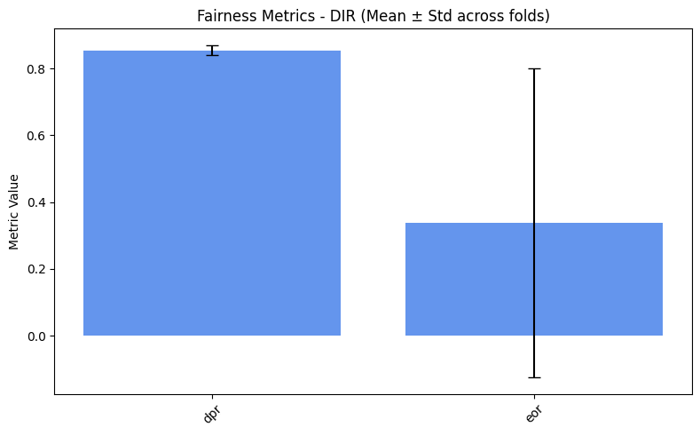
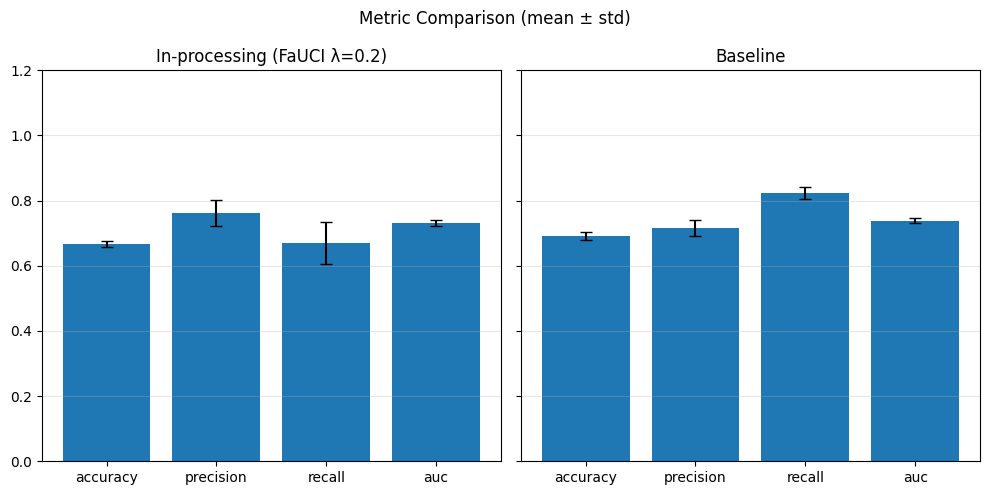
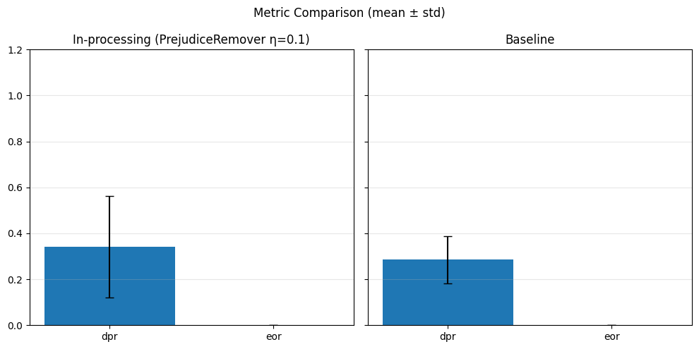
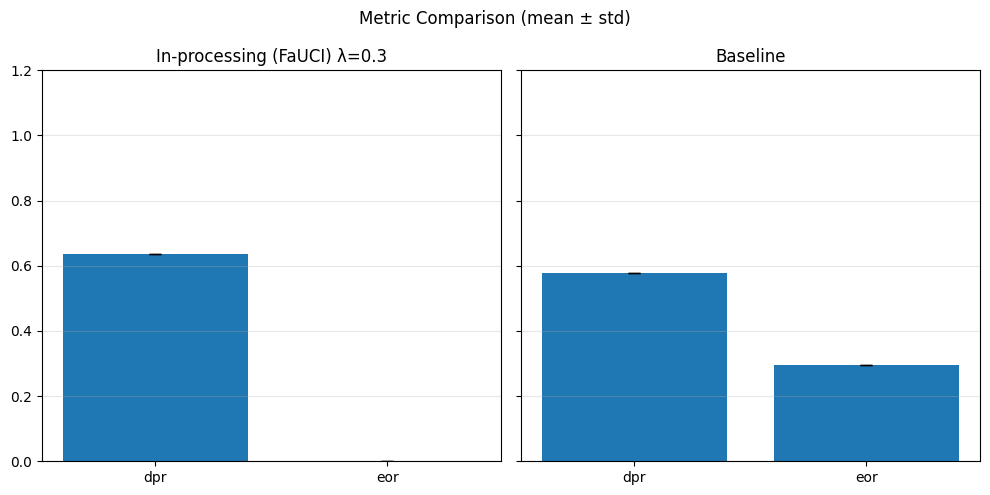
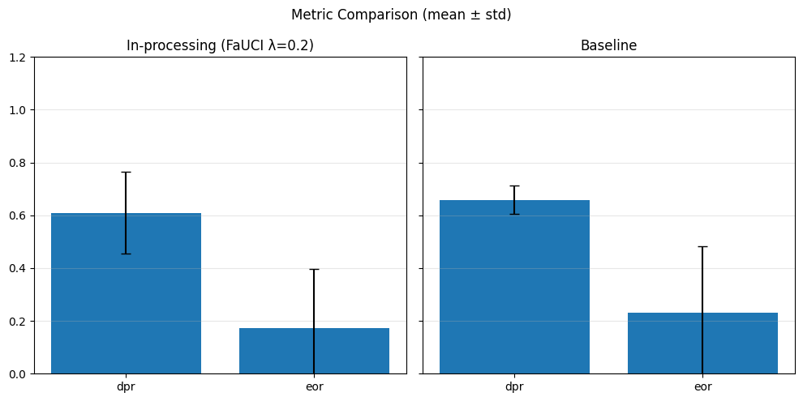
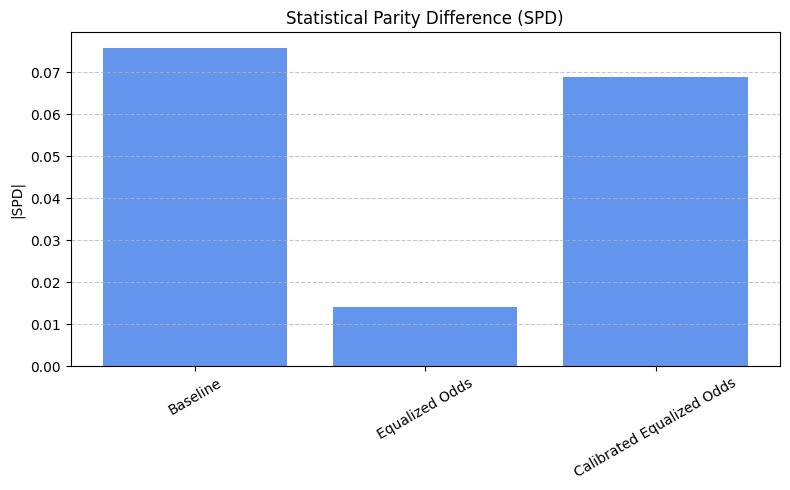

Fair Candidate Screening System
===============================

Setup
-----

.. code:: ipython3

    #!git clone https://github.com/pikalab-unibo-students/master-thesis-dizio-ay2324.git

.. code:: ipython3

    import utils
    import pandas as pd
    import numpy as np
    from enum import Enum
    
    # Fairlib
    import chardet
    import fairlib as fl
    from fairlearn.metrics import demographic_parity_ratio, equalized_odds_ratio
    from fairlib.preprocessing import LFR, DisparateImpactRemover, Reweighing
    from fairlib.inprocessing import AdversarialDebiasing
    
    # Statistics
    from matplotlib import pyplot as plt
    import seaborn as sns
    
    # Preprocessing 
    from sklearn.preprocessing import OrdinalEncoder
    from sklearn.preprocessing import StandardScaler
    from sklearn.model_selection import train_test_split
    
    # Classification
    from sklearn.model_selection import StratifiedKFold
    from sklearn.linear_model import LogisticRegression
    from sklearn.metrics import accuracy_score, precision_score, recall_score, f1_score, roc_auc_score
    import torch
    import torch.nn as nn
    
    # Post-processing
    from aif360.algorithms.postprocessing import CalibratedEqOddsPostprocessing, EqOddsPostprocessing, RejectOptionClassification, DeterministicReranking
    from aif360.datasets import StandardDataset

.. code:: ipython3

    # Allowing reproducibility
    random_seed = 42
    np.random.seed(random_seed)

Dataset Loading
---------------

.. code:: ipython3

    dataset_path = 'direct_matching_20240213.csv'

.. code:: ipython3

    with open(dataset_path, 'rb') as f:
        result = chardet.detect(f.read())
        encoding = result['encoding']
    

.. code:: ipython3

    df = fl.DataFrame(pd.read_csv(dataset_path, delimiter=';', encoding=encoding))

Data Preparation
----------------

.. code:: ipython3

    df.head(11)

.. raw:: html

    

    
    <table border="1" class="dataframe">
      <thead>
        <tr style="text-align: right;">
          <th></th>
          <th>cand_id</th>
          <th>job_id</th>
          <th>distance_km</th>
          <th>match_score</th>
          <th>match_rank</th>
          <th>cand_gender</th>
          <th>cand_age_bucket</th>
          <th>cand_domicile_province</th>
          <th>cand_domicile_region</th>
          <th>cand_education</th>
          <th>job_contract_type</th>
          <th>job_professional_category</th>
          <th>job_sector</th>
          <th>job_work_province</th>
        </tr>
      </thead>
      <tbody>
        <tr>
          <th>0</th>
          <td>5,664,912</td>
          <td>OFF_1011_1427</td>
          <td>32.327042</td>
          <td>99.573387</td>
          <td>1</td>
          <td>Male</td>
          <td>45-54</td>
          <td>UD</td>
          <td>FRIULI VENEZIA GIULIA</td>
          <td>NaN</td>
          <td>Lavoro subordinato</td>
          <td>Geometra e tecnico di costruzioni civili e ind...</td>
          <td>Progettisti / Design / Grafici</td>
          <td>UD</td>
        </tr>
        <tr>
          <th>1</th>
          <td>4,999,120</td>
          <td>OFF_1011_1427</td>
          <td>15.595593</td>
          <td>99.210564</td>
          <td>2</td>
          <td>Male</td>
          <td>35-44</td>
          <td>UD</td>
          <td>FRIULI VENEZIA GIULIA</td>
          <td>NaN</td>
          <td>Lavoro subordinato</td>
          <td>Geometra e tecnico di costruzioni civili e ind...</td>
          <td>Progettisti / Design / Grafici</td>
          <td>UD</td>
        </tr>
        <tr>
          <th>2</th>
          <td>5,413,671</td>
          <td>OFF_1011_1427</td>
          <td>31.348877</td>
          <td>99.118614</td>
          <td>3</td>
          <td>Female</td>
          <td>45-54</td>
          <td>UD</td>
          <td>FRIULI VENEZIA GIULIA</td>
          <td>NaN</td>
          <td>Lavoro subordinato</td>
          <td>Geometra e tecnico di costruzioni civili e ind...</td>
          <td>Progettisti / Design / Grafici</td>
          <td>UD</td>
        </tr>
        <tr>
          <th>3</th>
          <td>5,965,090</td>
          <td>OFF_1011_1427</td>
          <td>66.315598</td>
          <td>97.409767</td>
          <td>4</td>
          <td>Male</td>
          <td>15-24</td>
          <td>TS</td>
          <td>FRIULI VENEZIA GIULIA</td>
          <td>NaN</td>
          <td>Lavoro subordinato</td>
          <td>Geometra e tecnico di costruzioni civili e ind...</td>
          <td>Progettisti / Design / Grafici</td>
          <td>UD</td>
        </tr>
        <tr>
          <th>4</th>
          <td>5,771,219</td>
          <td>OFF_1011_1427</td>
          <td>15.595593</td>
          <td>97.323875</td>
          <td>5</td>
          <td>Female</td>
          <td>35-44</td>
          <td>UD</td>
          <td>FRIULI VENEZIA GIULIA</td>
          <td>NaN</td>
          <td>Lavoro subordinato</td>
          <td>Geometra e tecnico di costruzioni civili e ind...</td>
          <td>Progettisti / Design / Grafici</td>
          <td>UD</td>
        </tr>
        <tr>
          <th>5</th>
          <td>2,216,205</td>
          <td>OFF_1011_1427</td>
          <td>24.946939</td>
          <td>96.922318</td>
          <td>6</td>
          <td>Male</td>
          <td>55-74</td>
          <td>UD</td>
          <td>FRIULI VENEZIA GIULIA</td>
          <td>Diploma / Accademia : Geometra</td>
          <td>Lavoro subordinato</td>
          <td>Geometra e tecnico di costruzioni civili e ind...</td>
          <td>Progettisti / Design / Grafici</td>
          <td>UD</td>
        </tr>
        <tr>
          <th>6</th>
          <td>4,594,051</td>
          <td>OFF_1011_1427</td>
          <td>27.959969</td>
          <td>96.245216</td>
          <td>7</td>
          <td>Male</td>
          <td>55-74</td>
          <td>UD</td>
          <td>FRIULI VENEZIA GIULIA</td>
          <td>NaN</td>
          <td>Lavoro subordinato</td>
          <td>Geometra e tecnico di costruzioni civili e ind...</td>
          <td>Progettisti / Design / Grafici</td>
          <td>UD</td>
        </tr>
        <tr>
          <th>7</th>
          <td>5,148,878</td>
          <td>OFF_1011_1427</td>
          <td>25.512180</td>
          <td>96.235245</td>
          <td>8</td>
          <td>Male</td>
          <td>25-34</td>
          <td>UD</td>
          <td>FRIULI VENEZIA GIULIA</td>
          <td>NaN</td>
          <td>Lavoro subordinato</td>
          <td>Geometra e tecnico di costruzioni civili e ind...</td>
          <td>Progettisti / Design / Grafici</td>
          <td>UD</td>
        </tr>
        <tr>
          <th>8</th>
          <td>5,933,345</td>
          <td>OFF_1011_1427</td>
          <td>28.856832</td>
          <td>96.009712</td>
          <td>9</td>
          <td>Female</td>
          <td>45-54</td>
          <td>GO</td>
          <td>FRIULI VENEZIA GIULIA</td>
          <td>NaN</td>
          <td>Lavoro subordinato</td>
          <td>Geometra e tecnico di costruzioni civili e ind...</td>
          <td>Progettisti / Design / Grafici</td>
          <td>UD</td>
        </tr>
        <tr>
          <th>9</th>
          <td>7,204,128</td>
          <td>OFF_1011_1427</td>
          <td>31.348877</td>
          <td>95.802277</td>
          <td>10</td>
          <td>Female</td>
          <td>35-44</td>
          <td>UD</td>
          <td>FRIULI VENEZIA GIULIA</td>
          <td>NaN</td>
          <td>Lavoro subordinato</td>
          <td>Geometra e tecnico di costruzioni civili e ind...</td>
          <td>Progettisti / Design / Grafici</td>
          <td>UD</td>
        </tr>
        <tr>
          <th>10</th>
          <td>5,025,089</td>
          <td>OFF_1038_1739</td>
          <td>17.786076</td>
          <td>99.949821</td>
          <td>1</td>
          <td>Male</td>
          <td>25-34</td>
          <td>MI</td>
          <td>LOMBARDIA</td>
          <td>Diploma / Accademia : Liceo scientifico</td>
          <td>Ricerca e selezione</td>
          <td>Macellaio (m/f)</td>
          <td>GDO / Retail / Commessi / Scaffalisti</td>
          <td>MI</td>
        </tr>
      </tbody>
    </table>
    

.. code:: ipython3

    plt.figure(figsize=(10, 6))
    sns.countplot(data=df, x='match_rank', hue='cand_gender', order=range(1, 11))
    plt.title('Gender Distribution over Match Ranks')
    plt.xlabel('Match Rank')
    plt.ylabel('Count')
    plt.legend(title='Gender')
    plt.tight_layout()
    plt.show()
    

.. code:: ipython3

    plt.figure(figsize=(8, 5))
    plt.hist(df[df['match_score'] > 99.3]['match_score'], bins=120, color='skyblue', edgecolor='black')
    plt.title('Distribution of Match Score')
    plt.xlabel('Match Score')
    plt.ylabel('Frequency')
    plt.grid(True)
    plt.tight_layout()
    plt.show()

We can assume that a candidate is hired if its match score is greater
than a significant threshold, for instance, th=99.8

.. code:: ipython3

    hired_threshold = 99.8

.. code:: ipython3

    df1 = df.copy()

.. code:: ipython3

    df1['hired'] = (df1['match_score'] >= hired_threshold).astype(int)

.. code:: ipython3

    df1.shape

.. parsed-literal::

    (8647, 15)

.. code:: ipython3

    len(df1[df1['hired'] == 1])

.. parsed-literal::

    5297

.. code:: ipython3

    df1.targets = {'hired'}

.. code:: ipython3

    plt.figure(figsize=(5, 5))
    df1['hired'].value_counts().plot(kind='bar')
    plt.xlabel('Hired')
    plt.ylabel('Counts')
    plt.title('Hired Distribution')
    plt.tight_layout()
    plt.show()

.. image:: main_files/main_20_0.png

Both the match rank and the match score are useless now that we extract
the label, so we can drop them.

.. code:: ipython3

    df1.drop(['match_score','match_rank'], axis=1, inplace=True)

.. code:: ipython3

    df1.head()

.. raw:: html

    

    
    <table border="1" class="dataframe">
      <thead>
        <tr style="text-align: right;">
          <th></th>
          <th>cand_id</th>
          <th>job_id</th>
          <th>distance_km</th>
          <th>cand_gender</th>
          <th>cand_age_bucket</th>
          <th>cand_domicile_province</th>
          <th>cand_domicile_region</th>
          <th>cand_education</th>
          <th>job_contract_type</th>
          <th>job_professional_category</th>
          <th>job_sector</th>
          <th>job_work_province</th>
          <th>hired</th>
        </tr>
      </thead>
      <tbody>
        <tr>
          <th>0</th>
          <td>5,664,912</td>
          <td>OFF_1011_1427</td>
          <td>32.327042</td>
          <td>Male</td>
          <td>45-54</td>
          <td>UD</td>
          <td>FRIULI VENEZIA GIULIA</td>
          <td>NaN</td>
          <td>Lavoro subordinato</td>
          <td>Geometra e tecnico di costruzioni civili e ind...</td>
          <td>Progettisti / Design / Grafici</td>
          <td>UD</td>
          <td>0</td>
        </tr>
        <tr>
          <th>1</th>
          <td>4,999,120</td>
          <td>OFF_1011_1427</td>
          <td>15.595593</td>
          <td>Male</td>
          <td>35-44</td>
          <td>UD</td>
          <td>FRIULI VENEZIA GIULIA</td>
          <td>NaN</td>
          <td>Lavoro subordinato</td>
          <td>Geometra e tecnico di costruzioni civili e ind...</td>
          <td>Progettisti / Design / Grafici</td>
          <td>UD</td>
          <td>0</td>
        </tr>
        <tr>
          <th>2</th>
          <td>5,413,671</td>
          <td>OFF_1011_1427</td>
          <td>31.348877</td>
          <td>Female</td>
          <td>45-54</td>
          <td>UD</td>
          <td>FRIULI VENEZIA GIULIA</td>
          <td>NaN</td>
          <td>Lavoro subordinato</td>
          <td>Geometra e tecnico di costruzioni civili e ind...</td>
          <td>Progettisti / Design / Grafici</td>
          <td>UD</td>
          <td>0</td>
        </tr>
        <tr>
          <th>3</th>
          <td>5,965,090</td>
          <td>OFF_1011_1427</td>
          <td>66.315598</td>
          <td>Male</td>
          <td>15-24</td>
          <td>TS</td>
          <td>FRIULI VENEZIA GIULIA</td>
          <td>NaN</td>
          <td>Lavoro subordinato</td>
          <td>Geometra e tecnico di costruzioni civili e ind...</td>
          <td>Progettisti / Design / Grafici</td>
          <td>UD</td>
          <td>0</td>
        </tr>
        <tr>
          <th>4</th>
          <td>5,771,219</td>
          <td>OFF_1011_1427</td>
          <td>15.595593</td>
          <td>Female</td>
          <td>35-44</td>
          <td>UD</td>
          <td>FRIULI VENEZIA GIULIA</td>
          <td>NaN</td>
          <td>Lavoro subordinato</td>
          <td>Geometra e tecnico di costruzioni civili e ind...</td>
          <td>Progettisti / Design / Grafici</td>
          <td>UD</td>
          <td>0</td>
        </tr>
      </tbody>
    </table>
    

Data Preprocessing
------------------

Before continuing with the data analysis we want to ensure that missing
values are handled correctly and the data are ready to be feed in a
classifier. Let’s inspect some of their statistics.

.. code:: ipython3

    print(f'Examples in the dataset: {df1.shape[0]}')

.. parsed-literal::

    Examples in the dataset: 8647
    

.. code:: ipython3

    df1.describe(include='all')

.. raw:: html

    

    
    <table border="1" class="dataframe">
      <thead>
        <tr style="text-align: right;">
          <th></th>
          <th>cand_id</th>
          <th>job_id</th>
          <th>distance_km</th>
          <th>cand_gender</th>
          <th>cand_age_bucket</th>
          <th>cand_domicile_province</th>
          <th>cand_domicile_region</th>
          <th>cand_education</th>
          <th>job_contract_type</th>
          <th>job_professional_category</th>
          <th>job_sector</th>
          <th>job_work_province</th>
          <th>hired</th>
        </tr>
      </thead>
      <tbody>
        <tr>
          <th>count</th>
          <td>8647</td>
          <td>8647</td>
          <td>8647.000000</td>
          <td>8647</td>
          <td>8646</td>
          <td>8644</td>
          <td>8642</td>
          <td>2341</td>
          <td>8647</td>
          <td>8647</td>
          <td>8647</td>
          <td>8647</td>
          <td>8647.000000</td>
        </tr>
        <tr>
          <th>unique</th>
          <td>6798</td>
          <td>865</td>
          <td>NaN</td>
          <td>2</td>
          <td>5</td>
          <td>79</td>
          <td>18</td>
          <td>433</td>
          <td>3</td>
          <td>247</td>
          <td>26</td>
          <td>53</td>
          <td>NaN</td>
        </tr>
        <tr>
          <th>top</th>
          <td>6,550,205</td>
          <td>OFF_1011_1427</td>
          <td>NaN</td>
          <td>Male</td>
          <td>25-34</td>
          <td>MI</td>
          <td>LOMBARDIA</td>
          <td>Licenza media</td>
          <td>Lavoro subordinato</td>
          <td>Operaio Generico Metalmeccanico</td>
          <td>Operai Generici</td>
          <td>MI</td>
          <td>NaN</td>
        </tr>
        <tr>
          <th>freq</th>
          <td>18</td>
          <td>10</td>
          <td>NaN</td>
          <td>4766</td>
          <td>2936</td>
          <td>1341</td>
          <td>3989</td>
          <td>433</td>
          <td>5658</td>
          <td>770</td>
          <td>2829</td>
          <td>1689</td>
          <td>NaN</td>
        </tr>
        <tr>
          <th>mean</th>
          <td>NaN</td>
          <td>NaN</td>
          <td>29.769432</td>
          <td>NaN</td>
          <td>NaN</td>
          <td>NaN</td>
          <td>NaN</td>
          <td>NaN</td>
          <td>NaN</td>
          <td>NaN</td>
          <td>NaN</td>
          <td>NaN</td>
          <td>0.612582</td>
        </tr>
        <tr>
          <th>std</th>
          <td>NaN</td>
          <td>NaN</td>
          <td>23.493063</td>
          <td>NaN</td>
          <td>NaN</td>
          <td>NaN</td>
          <td>NaN</td>
          <td>NaN</td>
          <td>NaN</td>
          <td>NaN</td>
          <td>NaN</td>
          <td>NaN</td>
          <td>0.487189</td>
        </tr>
        <tr>
          <th>min</th>
          <td>NaN</td>
          <td>NaN</td>
          <td>0.000000</td>
          <td>NaN</td>
          <td>NaN</td>
          <td>NaN</td>
          <td>NaN</td>
          <td>NaN</td>
          <td>NaN</td>
          <td>NaN</td>
          <td>NaN</td>
          <td>NaN</td>
          <td>0.000000</td>
        </tr>
        <tr>
          <th>25%</th>
          <td>NaN</td>
          <td>NaN</td>
          <td>12.253924</td>
          <td>NaN</td>
          <td>NaN</td>
          <td>NaN</td>
          <td>NaN</td>
          <td>NaN</td>
          <td>NaN</td>
          <td>NaN</td>
          <td>NaN</td>
          <td>NaN</td>
          <td>0.000000</td>
        </tr>
        <tr>
          <th>50%</th>
          <td>NaN</td>
          <td>NaN</td>
          <td>23.447361</td>
          <td>NaN</td>
          <td>NaN</td>
          <td>NaN</td>
          <td>NaN</td>
          <td>NaN</td>
          <td>NaN</td>
          <td>NaN</td>
          <td>NaN</td>
          <td>NaN</td>
          <td>1.000000</td>
        </tr>
        <tr>
          <th>75%</th>
          <td>NaN</td>
          <td>NaN</td>
          <td>41.754654</td>
          <td>NaN</td>
          <td>NaN</td>
          <td>NaN</td>
          <td>NaN</td>
          <td>NaN</td>
          <td>NaN</td>
          <td>NaN</td>
          <td>NaN</td>
          <td>NaN</td>
          <td>1.000000</td>
        </tr>
        <tr>
          <th>max</th>
          <td>NaN</td>
          <td>NaN</td>
          <td>99.966797</td>
          <td>NaN</td>
          <td>NaN</td>
          <td>NaN</td>
          <td>NaN</td>
          <td>NaN</td>
          <td>NaN</td>
          <td>NaN</td>
          <td>NaN</td>
          <td>NaN</td>
          <td>1.000000</td>
        </tr>
      </tbody>
    </table>
    

Most of the variables doen’t miss any value, except for the candidate
domicile province which misses just 3 values, the candidate domicile
region which misses only 5 values, the candidate age which misses only 1
value and the candidate education, which instead misses way more values.
We can account for the 3 missing values by simply drop the related rows,
but we must find a default value for the education since the rows
containing missing values are too much.

.. code:: ipython3

    df1 = df1[~df1['cand_domicile_province'].isnull()]
    df1 = df1[~df1['cand_domicile_region'].isnull()]
    df1 = df1[~df1['cand_age_bucket'].isnull()]

In general, we can keep all the numerical values, but we have to account
for the categorical ones in order to feed a classifier. In the next
paragraphs we will focus on the features that require our attention.

IDs
~~~

Candidate id and job id are meaningless for the task of bias detection,
hence we can easily drop them.

.. code:: ipython3

    df1.drop(['cand_id','job_id'], axis=1, inplace=True)

Distance Km
~~~~~~~~~~~

.. code:: ipython3

    df1['distance_km'].describe()

.. parsed-literal::

    count    8639.000000
    mean       29.754485
    std        23.484031
    min         0.000000
    25%        12.252331
    50%        23.437698
    75%        41.751572
    max        99.966797
    Name: distance_km, dtype: float64

We can approximate the distance by rounding it.

.. code:: ipython3

    df1['distance_km'] = df1['distance_km'].apply(lambda d : round(d)).astype(int)

.. code:: ipython3

    df1['distance_km'].describe()

.. parsed-literal::

    count    8639.000000
    mean       29.746846
    std        23.475636
    min         0.000000
    25%        12.000000
    50%        23.000000
    75%        42.000000
    max       100.000000
    Name: distance_km, dtype: float64

First of all, let’s inspect the distribution.

.. code:: ipython3

    # Visualize the distribution
    plt.figure(figsize=(12, 6))
    df1['distance_km'].value_counts().plot(kind='bar')
    plt.xlabel('Km')
    plt.ylabel('Counts')
    plt.title('Distance Distribution')
    plt.tight_layout()
    plt.show()

.. image:: main_files/main_40_0.png

.. code:: ipython3

    plt.figure(figsize=(12, 6))
    sns.countplot(data=df1, x='distance_km', hue='hired', order=range(1, max(df1['distance_km'])))
    plt.title('Hirings Distribution over Distances')
    plt.xlabel('Distance Km')
    plt.ylabel('Count')
    plt.legend(title='Hired')
    plt.xticks(rotation=90)
    plt.tight_layout()
    plt.show()

From this plot we may suspect some bias related to the region of the
candidate.

Candidate Gender
~~~~~~~~~~~~~~~~

.. code:: ipython3

    # Visualize the distribution
    plt.figure(figsize=(5, 5))
    df1['cand_gender'].value_counts().plot(kind='bar')
    plt.xlabel('Gender')
    plt.ylabel('Counts')
    plt.title('Gender Distribution')
    plt.tight_layout()
    plt.show()

The dataset is imbalanced, but this tell us nothing about any possible
bias or unfairness. In order to spot any kind of unfairness we should
compare this distribution with the hirings.

.. code:: ipython3

    plt.figure(figsize=(5, 5))
    sns.countplot(data=df1, x='cand_gender', hue='hired')
    plt.title('Hirings Distribution over Gender')
    plt.xlabel('Gender')
    plt.ylabel('Count')
    plt.legend(title='Hired')
    plt.tight_layout()
    plt.show()

.. image:: main_files/main_46_0.png

.. code:: ipython3

    plt.figure(figsize=(5, 5))
    sns.countplot(data=df1, y='job_sector', hue='cand_gender')
    plt.title('Gender Distribution over Job Sectors')
    plt.xlabel('Sector')
    plt.ylabel('Count')
    plt.legend(title='Gender')
    plt.tight_layout()
    plt.show()

The difference in the distributions may be due to high demand in that
sectors

.. code:: ipython3

    sensitive_features = ['cand_gender']

Candidate Province
~~~~~~~~~~~~~~~~~~

.. code:: ipython3

    df1['cand_domicile_province'].describe()

.. parsed-literal::

    count     8639
    unique      78
    top         MI
    freq      1340
    Name: cand_domicile_province, dtype: object

.. code:: ipython3

    # Visualize the distribution
    plt.figure(figsize=(10, 4))
    df1['cand_domicile_province'].value_counts().plot(kind='bar')
    plt.xlabel('Province')
    plt.ylabel('Counts')
    plt.title('Candidate Province Distribution')
    plt.tight_layout()
    plt.show()

.. image:: main_files/main_52_0.png

.. code:: ipython3

    plt.figure(figsize=(10, 4))
    sns.countplot(data=df1, x='cand_domicile_province', hue='hired')
    plt.title('Hirings Distribution over Candidate Province')
    plt.xlabel('Province')
    plt.ylabel('Count')
    plt.legend(title='Hired')
    plt.xticks(rotation=90, ha='right')
    plt.tight_layout()
    plt.show()

Here we can spot some bias towards the candidates coming from the north
of Italy, but we need to aggregate the data in order to have a clearer
overview.

In order to preprocess this feature, we have to ensure that even the job
work province will be coherent with the candidate province, therefore we
will use the same encoder for both of them.

.. code:: ipython3

    province_encoder = OrdinalEncoder()
    df1['cand_domicile_province'] = province_encoder.fit_transform(df1[['cand_domicile_province']])

Domicile Region
~~~~~~~~~~~~~~~

.. code:: ipython3

    df1['cand_domicile_region'].describe()

.. parsed-literal::

    count          8639
    unique           18
    top       LOMBARDIA
    freq           3988
    Name: cand_domicile_region, dtype: object

.. code:: ipython3

    # Visualize the distribution
    plt.figure(figsize=(10, 5))
    df1['cand_domicile_region'].value_counts().plot(kind='bar')
    plt.xlabel('Domicile Region')
    plt.ylabel('Counts')
    plt.title('Domicile Region Distribution')
    plt.xticks(rotation=45, ha='right')
    plt.tight_layout()
    plt.show()

.. code:: ipython3

    df_copy = df1.copy()
    df_copy['gender_region'] = df_copy['cand_domicile_region'].astype(str) + ' ' + df_copy['cand_gender'].astype(str)

.. code:: ipython3

    plt.figure(figsize=(10, 6))
    sns.countplot(data=df_copy, x='gender_region', hue='hired')
    plt.title('Hirings Distribution over Candidate Region')
    plt.xlabel('Region')
    plt.ylabel('Count')
    plt.legend(title='Hired')
    plt.xticks(rotation=45, ha='right')
    plt.tight_layout()
    plt.show()

.. code:: ipython3

    df_copy['gender_region'].value_counts()

.. parsed-literal::

    gender_region
    LOMBARDIA Male                  2222
    LOMBARDIA Female                1766
    EMILIA ROMAGNA Male              673
    VENETO Male                      670
    EMILIA ROMAGNA Female            557
    VENETO Female                    545
    PIEMONTE Male                    445
    PIEMONTE Female                  366
    FRIULI VENEZIA GIULIA Male       253
    LAZIO Female                     222
    TOSCANA Female                   149
    TOSCANA Male                     118
    FRIULI VENEZIA GIULIA Female     114
    TRENTINO ALTO ADIGE Male         111
    LAZIO Male                       100
    MARCHE Male                       75
    ABRUZZO Male                      54
    MARCHE Female                     51
    TRENTINO ALTO ADIGE Female        28
    LIGURIA Female                    26
    SARDEGNA Male                     22
    ABRUZZO Female                    19
    VALLE D'AOSTA Female              18
    SARDEGNA Female                    9
    MOLISE Male                        5
    UMBRIA Male                        5
    LIGURIA Male                       4
    UMBRIA Female                      4
    MOLISE Female                      2
    VALLE D'AOSTA Male                 2
    PUGLIA Male                        1
    CALABRIA Female                    1
    CAMPANIA Female                    1
    PUGLIA Female                      1
    Name: count, dtype: int64

This last plot shows that there are no biases in the region, thus we can
assume that there are no bias in the province feature too. Note that the
regions of the south are not well represented, so any bias related to
the north-south discrimination won’t be catched.

A one-hot wencoding would be too heavy for too much regions, thus we can
group them into south, central and north regions and then one-hot encode
them.

.. code:: ipython3

    region_groups = {
        # North
        'piemonte': 'north',
        'valle d\'aosta': 'north',
        'lombardia': 'north',
        'veneto': 'north',
        'friuli venezia giulia': 'north',
        'liguria': 'north',
        'emilia romagna': 'north',
        'trentino alto adige': 'north',
    
        # Central
        'toscana': 'central',
        'umbria': 'central',
        'marche': 'central',
        'lazio': 'central',
    
        # South
        'abruzzo': 'south',
        'molise': 'south',
        'campania': 'south',
        'puglia': 'south',
        'basilicata': 'south',
        'calabria': 'south',
    
        # Islands
        'sicilia': 'south',
        'sardegna': 'south'
    }

.. code:: ipython3

    grouped_regions = df1['cand_domicile_region'].apply(lambda r : region_groups[str.lower(r)])
    df1['grouped_regions'] = grouped_regions.astype(str) + ' ' + df1['cand_gender'].astype(str)

.. code:: ipython3

    plt.figure(figsize=(7, 5))
    sns.countplot(data=df1, x=df1['grouped_regions'], hue='hired')
    plt.title('Hirings Distribution over Candidate Region')
    plt.xlabel('Region')
    plt.ylabel('Count')
    plt.legend(title='Hired')
    plt.xticks(rotation=45, ha='right')
    plt.tight_layout()
    plt.show()

.. image:: main_files/main_67_0.png

.. code:: ipython3

    df1 = df1.drop('cand_domicile_region', axis=1)
    df1 = df1.drop('cand_gender', axis=1)

.. code:: ipython3

    df1.head()

.. raw:: html

    

    
    <table border="1" class="dataframe">
      <thead>
        <tr style="text-align: right;">
          <th></th>
          <th>distance_km</th>
          <th>cand_age_bucket</th>
          <th>cand_domicile_province</th>
          <th>cand_education</th>
          <th>job_contract_type</th>
          <th>job_professional_category</th>
          <th>job_sector</th>
          <th>job_work_province</th>
          <th>hired</th>
          <th>grouped_regions</th>
        </tr>
      </thead>
      <tbody>
        <tr>
          <th>0</th>
          <td>32</td>
          <td>45-54</td>
          <td>71.0</td>
          <td>NaN</td>
          <td>Lavoro subordinato</td>
          <td>Geometra e tecnico di costruzioni civili e ind...</td>
          <td>Progettisti / Design / Grafici</td>
          <td>UD</td>
          <td>0</td>
          <td>north Male</td>
        </tr>
        <tr>
          <th>1</th>
          <td>16</td>
          <td>35-44</td>
          <td>71.0</td>
          <td>NaN</td>
          <td>Lavoro subordinato</td>
          <td>Geometra e tecnico di costruzioni civili e ind...</td>
          <td>Progettisti / Design / Grafici</td>
          <td>UD</td>
          <td>0</td>
          <td>north Male</td>
        </tr>
        <tr>
          <th>2</th>
          <td>31</td>
          <td>45-54</td>
          <td>71.0</td>
          <td>NaN</td>
          <td>Lavoro subordinato</td>
          <td>Geometra e tecnico di costruzioni civili e ind...</td>
          <td>Progettisti / Design / Grafici</td>
          <td>UD</td>
          <td>0</td>
          <td>north Female</td>
        </tr>
        <tr>
          <th>3</th>
          <td>66</td>
          <td>15-24</td>
          <td>69.0</td>
          <td>NaN</td>
          <td>Lavoro subordinato</td>
          <td>Geometra e tecnico di costruzioni civili e ind...</td>
          <td>Progettisti / Design / Grafici</td>
          <td>UD</td>
          <td>0</td>
          <td>north Male</td>
        </tr>
        <tr>
          <th>4</th>
          <td>16</td>
          <td>35-44</td>
          <td>71.0</td>
          <td>NaN</td>
          <td>Lavoro subordinato</td>
          <td>Geometra e tecnico di costruzioni civili e ind...</td>
          <td>Progettisti / Design / Grafici</td>
          <td>UD</td>
          <td>0</td>
          <td>north Female</td>
        </tr>
      </tbody>
    </table>
    

.. code:: ipython3

    df1['grouped_regions'].value_counts()

.. parsed-literal::

    grouped_regions
    north Male        4380
    north Female      3420
    central Female     426
    central Male       298
    south Male          82
    south Female        33
    Name: count, dtype: int64

Age Buckets
~~~~~~~~~~~

.. code:: ipython3

    df1['cand_age_bucket'].unique()

.. parsed-literal::

    array(['45-54', '35-44', '15-24', '55-74', '25-34'], dtype=object)

.. code:: ipython3

    print(f"Null age buckets: {df1['cand_age_bucket'].isnull().sum()}")

.. parsed-literal::

    Null age buckets: 0
    

Since it is only one we can safely drop it.

.. code:: ipython3

    df1['cand_age_bucket'].value_counts()

.. parsed-literal::

    cand_age_bucket
    25-34    2935
    35-44    2129
    45-54    1777
    55-74     956
    15-24     842
    Name: count, dtype: int64

.. code:: ipython3

    plt.figure(figsize=(7, 4))
    df1['cand_age_bucket'].value_counts().plot(kind='bar')
    plt.xlabel('Age bucket')
    plt.ylabel('Counts')
    plt.title('Age Distribution')
    plt.xticks(rotation=45, ha='right')
    plt.tight_layout()
    plt.show()

.. code:: ipython3

    plt.figure(figsize=(8, 5))
    sns.countplot(data=df1, x='cand_age_bucket', hue='hired', order=['15-24', '25-34', '35-44', '45-54', '55-74'])
    plt.title('Hirings Distribution over Candidate Age')
    plt.xlabel('Age Bucket')
    plt.ylabel('Count')
    plt.legend(title='Hired')
    plt.tight_layout()
    plt.show()

.. image:: main_files/main_77_0.png

.. code:: ipython3

    sensitive_features.append('cand_age_bucket')

We can discretize them since they are numerical but preserves the order,
thus we will use progressive enumeration.

.. code:: ipython3

    age_bucket_order = {
        '15-24': 0,
        '25-34': 1,
        '35-44': 2,
        '45-54': 3,
        '55-74': 4,
    }
    
    df1['cand_age_bucket'] = df1['cand_age_bucket'].map(age_bucket_order).astype(int)

.. code:: ipython3

    df1['cand_age_bucket'].value_counts()

.. parsed-literal::

    cand_age_bucket
    1    2935
    2    2129
    3    1777
    4     956
    0     842
    Name: count, dtype: int64

Candidate Education
~~~~~~~~~~~~~~~~~~~

.. code:: ipython3

    def map_education_level(x):
        if pd.isna(x):
            return 'Unknown'
        x = str(x).lower()
    
        # Clean common formatting inconsistencies
        x = x.replace('laurea', 'degree')
        x = x.replace('diploma', 'degree')
        
        if 'dottorato' in x or 'phd' in x or 'research doctorate' in x:
            return 'PhD'
        elif 'master' in x or 'lm-' in x:
            return 'Graduate'
        elif 'bachelor' in x or 'l-' in x:
            return 'Undergraduate'
        elif 'higher technical institute' in x or 'its' in x:
            return 'Higher Technical Institute'
        elif 'qualification' in x or 'certificate' in x or 'operator' in x:
            return 'Vocational Certificate'
        elif 'high school' in x or 'liceo' in x or 'technician' in x or 'technical' in x:
            return 'High School'
        elif 'middle school' in x or 'scuola media' in x:
            return 'Middle School'
        elif 'elementary' in x:
            return 'Elementary School'
        else:
            return 'Other'
    

.. code:: ipython3

    df1['cand_education'] = df1['cand_education'].apply(map_education_level)

.. code:: ipython3

    df1['cand_education'].value_counts()

.. parsed-literal::

    cand_education
    Unknown                       6298
    Other                         1546
    Vocational Certificate         284
    High School                    172
    Higher Technical Institute     158
    Graduate                       120
    Undergraduate                   56
    PhD                              5
    Name: count, dtype: int64

.. code:: ipython3

    # Visualize the distribution
    plt.figure(figsize=(7, 5))
    plt.bar(df1['cand_education'].unique(), df1['cand_education'].value_counts())
    plt.xlabel('Education')
    plt.ylabel('Counts')
    plt.title('Education Distribution')
    plt.xticks(rotation=45, ha='right')
    plt.tight_layout()
    plt.show()

.. code:: ipython3

    plt.figure(figsize=(8, 5))
    sns.countplot(data=df1, x='cand_education', hue='hired')
    plt.title('Hirings Distribution over Education')
    plt.xlabel('Education')
    plt.ylabel('Count')
    plt.legend(title='Hired')
    plt.xticks(rotation=45, ha='right')
    plt.tight_layout()
    plt.show()

.. image:: main_files/main_87_0.png

These results are probably not about any bias. However, we cannot say
much looking only at this feature.

.. code:: ipython3

    education_encoder = OrdinalEncoder()
    df1['cand_education'] = education_encoder.fit_transform(df1[['cand_education']])

Job Contract Type
~~~~~~~~~~~~~~~~~

.. code:: ipython3

    df1['job_contract_type'].describe()

.. parsed-literal::

    count                   8639
    unique                     3
    top       Lavoro subordinato
    freq                    5653
    Name: job_contract_type, dtype: object

.. code:: ipython3

    df1['job_contract_type'].value_counts()

.. parsed-literal::

    job_contract_type
    Lavoro subordinato     5653
    Ricerca e selezione    2966
    Other                    20
    Name: count, dtype: int64

.. code:: ipython3

    contract_encoder = OrdinalEncoder()
    df1['job_contract_type'] = contract_encoder.fit_transform(df1[['job_contract_type']])

Job Category
~~~~~~~~~~~~

.. code:: ipython3

    df1['job_professional_category'].describe()

.. parsed-literal::

    count                                8639
    unique                                247
    top       Operaio Generico Metalmeccanico
    freq                                  770
    Name: job_professional_category, dtype: object

.. code:: ipython3

    category_encoder = OrdinalEncoder()
    df1['job_professional_category'] = category_encoder.fit_transform(df1[['job_professional_category']])

Job Sector
~~~~~~~~~~

.. code:: ipython3

    df1['job_sector'].describe()

.. parsed-literal::

    count                8639
    unique                 26
    top       Operai Generici
    freq                 2827
    Name: job_sector, dtype: object

.. code:: ipython3

    # Visualize the distribution
    plt.figure(figsize=(10, 7))
    df1['job_sector'].value_counts().plot(kind='bar')
    plt.xlabel('Sector')
    plt.ylabel('Counts')
    plt.title('Job Sector Distribution')
    plt.tight_layout()
    plt.show()

.. code:: ipython3

    counts = df1['job_sector'].value_counts()
    min_count = 30 #Statistically meaningful
    
    rare = counts[counts < min_count].index
    
    df1 = df1[~df1['job_sector'].isin(rare)]

.. code:: ipython3

    plt.figure(figsize=(8, 5))
    sns.countplot(data=df1, x='job_sector', hue='hired')
    plt.title('Hirings Distribution over Job Sector')
    plt.xlabel('Sector')
    plt.ylabel('Count')
    plt.legend(title='Hired')
    plt.xticks(rotation=45, ha='right')
    plt.tight_layout()
    plt.show()

.. image:: main_files/main_101_0.png

.. code:: ipython3

    sector_encoder = OrdinalEncoder()
    df1['job_sector'] = sector_encoder.fit_transform(df1[['job_sector']])

Job Work Province
~~~~~~~~~~~~~~~~~

.. code:: ipython3

    df1['job_work_province'].describe()

.. parsed-literal::

    count     8520
    unique      53
    top        MI 
    freq      1607
    Name: job_work_province, dtype: object

.. code:: ipython3

    # Visualize the distribution
    plt.figure(figsize=(10, 5))
    df1['job_work_province'].value_counts().plot(kind='bar')
    plt.xlabel('Work Province')
    plt.ylabel('Counts')
    plt.title('Work Province Distribution')
    plt.tight_layout()
    plt.show()

.. image:: main_files/main_105_0.png

.. code:: ipython3

    df1['job_work_province'] = province_encoder.fit_transform(df1[['job_work_province']])

Considerations
~~~~~~~~~~~~~~

Let’s check the statistics of the dataset after the preprocessing

.. code:: ipython3

    df1.describe(include='all')

.. raw:: html

    

    
    <table border="1" class="dataframe">
      <thead>
        <tr style="text-align: right;">
          <th></th>
          <th>distance_km</th>
          <th>cand_age_bucket</th>
          <th>cand_domicile_province</th>
          <th>cand_education</th>
          <th>job_contract_type</th>
          <th>job_professional_category</th>
          <th>job_sector</th>
          <th>job_work_province</th>
          <th>hired</th>
          <th>grouped_regions</th>
        </tr>
      </thead>
      <tbody>
        <tr>
          <th>count</th>
          <td>8520.000000</td>
          <td>8520.000000</td>
          <td>8520.000000</td>
          <td>8520.000000</td>
          <td>8520.000000</td>
          <td>8520.000000</td>
          <td>8520.000000</td>
          <td>8520.000000</td>
          <td>8520.000000</td>
          <td>8520</td>
        </tr>
        <tr>
          <th>unique</th>
          <td>NaN</td>
          <td>NaN</td>
          <td>NaN</td>
          <td>NaN</td>
          <td>NaN</td>
          <td>NaN</td>
          <td>NaN</td>
          <td>NaN</td>
          <td>NaN</td>
          <td>6</td>
        </tr>
        <tr>
          <th>top</th>
          <td>NaN</td>
          <td>NaN</td>
          <td>NaN</td>
          <td>NaN</td>
          <td>NaN</td>
          <td>NaN</td>
          <td>NaN</td>
          <td>NaN</td>
          <td>NaN</td>
          <td>north Male</td>
        </tr>
        <tr>
          <th>freq</th>
          <td>NaN</td>
          <td>NaN</td>
          <td>NaN</td>
          <td>NaN</td>
          <td>NaN</td>
          <td>NaN</td>
          <td>NaN</td>
          <td>NaN</td>
          <td>NaN</td>
          <td>4350</td>
        </tr>
        <tr>
          <th>mean</th>
          <td>29.658803</td>
          <td>1.892019</td>
          <td>39.069131</td>
          <td>5.233685</td>
          <td>0.677465</td>
          <td>136.788615</td>
          <td>9.522183</td>
          <td>27.065258</td>
          <td>0.610681</td>
          <td>NaN</td>
        </tr>
        <tr>
          <th>std</th>
          <td>23.349403</td>
          <td>1.170752</td>
          <td>23.577801</td>
          <td>1.530368</td>
          <td>0.945372</td>
          <td>67.772409</td>
          <td>4.105599</td>
          <td>15.813288</td>
          <td>0.487625</td>
          <td>NaN</td>
        </tr>
        <tr>
          <th>min</th>
          <td>0.000000</td>
          <td>0.000000</td>
          <td>0.000000</td>
          <td>0.000000</td>
          <td>0.000000</td>
          <td>0.000000</td>
          <td>0.000000</td>
          <td>0.000000</td>
          <td>0.000000</td>
          <td>NaN</td>
        </tr>
        <tr>
          <th>25%</th>
          <td>12.000000</td>
          <td>1.000000</td>
          <td>11.000000</td>
          <td>6.000000</td>
          <td>0.000000</td>
          <td>91.000000</td>
          <td>7.000000</td>
          <td>9.000000</td>
          <td>0.000000</td>
          <td>NaN</td>
        </tr>
        <tr>
          <th>50%</th>
          <td>23.000000</td>
          <td>2.000000</td>
          <td>38.000000</td>
          <td>6.000000</td>
          <td>0.000000</td>
          <td>126.000000</td>
          <td>12.000000</td>
          <td>26.000000</td>
          <td>1.000000</td>
          <td>NaN</td>
        </tr>
        <tr>
          <th>75%</th>
          <td>42.000000</td>
          <td>3.000000</td>
          <td>59.000000</td>
          <td>6.000000</td>
          <td>2.000000</td>
          <td>203.000000</td>
          <td>12.000000</td>
          <td>44.000000</td>
          <td>1.000000</td>
          <td>NaN</td>
        </tr>
        <tr>
          <th>max</th>
          <td>100.000000</td>
          <td>4.000000</td>
          <td>77.000000</td>
          <td>7.000000</td>
          <td>2.000000</td>
          <td>246.000000</td>
          <td>17.000000</td>
          <td>52.000000</td>
          <td>1.000000</td>
          <td>NaN</td>
        </tr>
      </tbody>
    </table>
    

As we can observe, there are no more missing values, and the target
lable distribution is almosto uniform.

.. code:: ipython3

    sensitive_features = ['grouped_regions']

.. code:: ipython3

    df1.sensitive = set(sensitive_features)

Bias detection
--------------

Detecting bias on the dataset using Statistical Parity Difference

.. code:: ipython3

    spd = df1.statistical_parity_difference()

.. code:: ipython3

    print(spd)

.. parsed-literal::

    {(hired=0, grouped_regions=central Female): -0.032443228428667314, (hired=0, grouped_regions=central Male): 0.1391642128509833, (hired=0, grouped_regions=north Female): -0.03122806966815528, (hired=0, grouped_regions=north Male): 0.005383279583229983, (hired=0, grouped_regions=south Female): 0.5522135458508736, (hired=0, grouped_regions=south Male): 0.08712907347134619, (hired=1, grouped_regions=central Female): 0.032443228428667314, (hired=1, grouped_regions=central Male): -0.1391642128509833, (hired=1, grouped_regions=north Female): 0.03122806966815539, (hired=1, grouped_regions=north Male): -0.005383279583230038, (hired=1, grouped_regions=south Female): -0.5522135458508735, (hired=1, grouped_regions=south Male): -0.08712907347134624}
    

.. code:: ipython3

    labels = [f"{item}" for _,item in spd[{'hired': 1}].keys()]
    values = list(spd[{'hired': 1}].values())

.. code:: ipython3

    plt.figure(figsize=(8, 6))
    
    plt.axhline(y=0, color='green', linestyle='--', label="Perfect Fairness (0)")
    
    plt.axhline(y=0.1, color='blue', linestyle=':', label="Minimal Disparity (0.1)")
    plt.axhline(y=-0.1, color='blue', linestyle=':')
    plt.axhline(y=0.2, color='orange', linestyle=':', label="Moderate Disparity (0.2)")
    plt.axhline(y=-0.2, color='orange', linestyle=':')
    plt.axhline(y=0.3, color='red', linestyle='-', label="Significant Disparity (0.3)")
    plt.axhline(y=-0.3, color='red', linestyle='-')
    
    plt.bar(labels, values, color=['purple', 'purple'])
    
    
    plt.title("Statistical Parity Difference for hired=True")
    plt.ylabel("SPD Value")
    plt.xticks(rotation=90)
    plt.ylim([-0.5, 0.5])
    
    plt.legend()
    plt.show()

.. image:: main_files/main_117_0.png

.. code:: ipython3

    grouped_regions_encoder = OrdinalEncoder()
    df1['grouped_regions'] = grouped_regions_encoder.fit_transform(df1[['grouped_regions']])

.. code:: ipython3

    spd1 = df1.statistical_parity_difference()

.. code:: ipython3

    spd1 

.. parsed-literal::

    (hired=0, grouped_regions=0.0) -> -0.032443228428667314
    (hired=0, grouped_regions=1.0) -> 0.1391642128509833
    (hired=0, grouped_regions=2.0) -> -0.03122806966815528
    (hired=0, grouped_regions=3.0) -> 0.005383279583229983
    (hired=0, grouped_regions=4.0) -> 0.5522135458508736
    (hired=0, grouped_regions=5.0) -> 0.08712907347134619
    (hired=1, grouped_regions=0.0) -> 0.032443228428667314
    (hired=1, grouped_regions=1.0) -> -0.1391642128509833
    (hired=1, grouped_regions=2.0) -> 0.03122806966815539
    (hired=1, grouped_regions=3.0) -> -0.005383279583230038
    (hired=1, grouped_regions=4.0) -> -0.5522135458508735
    (hired=1, grouped_regions=5.0) -> -0.08712907347134624

Correlation Matrix
~~~~~~~~~~~~~~~~~~

.. code:: ipython3

    plt.figure(figsize=(8, 8))
    sns.heatmap(df1.corr(), annot=True, fmt=".2f", cmap='coolwarm', square=True)
    plt.title("Correlation Matrix")
    plt.tight_layout()
    plt.show()

.. image:: main_files/main_122_0.png

Bias mitigation techniques
--------------------------

Utils
~~~~~

.. code:: ipython3

    sensitive_feature = 'grouped_regions'
    target = df1.targets.pop()
    
    baseline_performance_metrics = []
    baseline_fairness_metrics = []
    
    preprocessing_performance_metrics = []
    preprocessing_fairness_metrics = []

.. code:: ipython3

    def compute_performance_metrics(y_true, y_pred, y_proba):
        return {
            'accuracy': accuracy_score(y_true, y_pred),
            'precision': precision_score(y_true, y_pred),
            'recall': recall_score(y_true, y_pred),
            'auc': roc_auc_score(y_true, y_proba)
        }

.. code:: ipython3

    def compute_fairness_metrics(y_true, y_pred, sensitive_features):
        return {
            'dpr': demographic_parity_ratio(y_true, y_pred, sensitive_features=sensitive_features),
            'eor': equalized_odds_ratio(y_true, y_pred, sensitive_features=sensitive_features)
        }

.. code:: ipython3

    def evaluate_spd(X_test, y_pred):
        X_test_copy = X_test.copy()
        X_test_copy[target] = y_pred
        dataset = fl.DataFrame(X_test_copy)
        dataset.targets = target
        dataset.sensitive = sensitive_feature
    
        spd = dataset.statistical_parity_difference()
        return spd

.. code:: ipython3

    def metrics_bar_plot(dict1, dict2, label1, label2, metrics, title="Metric Comparison (mean ± std)"):
        import numpy as np
        import matplotlib.pyplot as plt
    
        def summarise(fold_dicts):
            means = []
            stds = []
            for m in metrics:
                values = [fold.get(m, np.nan) for fold in fold_dicts]
                # Usa nanmean e nanstd per evitare problemi con NaN
                mean_val = np.nanmean(values)
                std_val = np.nanstd(values)
                means.append(mean_val)
                stds.append(std_val)
            return np.array(means), np.array(stds)
    
        mean1, std1 = summarise(dict1)
        mean2, std2 = summarise(dict2)
        
        fig, axes = plt.subplots(1, 2, figsize=(10, 5), sharey=True)
        for ax, mean, std, label in zip(axes, [mean1, mean2], [std1, std2], [label1, label2]):
            ax.bar(metrics, mean, yerr=std, capsize=4)
            ax.set_title(label)
            ax.set_ylim(0, 1.2)  # leggermente sopra 1 per sicurezza
            ax.grid(axis="y", alpha=0.3)
    
        fig.suptitle(title)
        plt.tight_layout()
        plt.show()

.. code:: ipython3

    class Simple_NN(nn.Module):
        def __init__(self):
            super(Simple_NN, self).__init__()
            input_dim = df1.shape[-1]-1
            self.layer1 = nn.Linear(input_dim, 64)
            self.layer2 = nn.Linear(64, 32)
            self.layer3 = nn.Linear(32, 1)
            self.relu = nn.ReLU()
            self.sigmoid = nn.Sigmoid()
    
        def forward(self, x):
            x = self.relu(self.layer1(x))
            x = self.relu(self.layer2(x))
            x = self.sigmoid(self.layer3(x))
            return x

Pre-Processing
~~~~~~~~~~~~~~

In this section, we preprocess the dataset to prepare it for fair
machine learning analysis. The preprocessing steps include handling
missing values, encoding categorical variables, and normalizing
numerical features. We also define the sensitive attribute(s) for
fairness evaluation.

**Fairness Metrics Used:** - **Demographic Parity Ratio (DPR):**
Measures the ratio of positive outcomes across sensitive groups. -
**Equalized Odds Ratio (EOR):** Compares true positive and false
positive rates across groups. - **Statistical Parity Difference (SPD):**
Assesses the difference in selection rates between groups.

**Performance Metrics Used:** - **Accuracy** - **Precision** -
**Recall** - **AUC (Area Under the ROC Curve)**

We evaluate both baseline and pre-processing fairness mitigation methods
(Reweighing, Disparate Impact Remover, LFR) using these metrics. The
results show that while some approaches can improve fairness (as
measured by DPR, EOR, and SPD), there may be trade-offs with performance
metrics. Additionally, the variance in fairness metrics highlights the
impact of data imbalance, especially for under-represented groups.

Utility functions
^^^^^^^^^^^^^^^^^

.. code:: ipython3

    def train_classifier(X_train, y_train):
        """
        Train a logistic regression classifier.
        """
        clf = LogisticRegression(random_state=42, max_iter=1000)
        clf.fit(X_train, y_train)
        return clf

.. code:: ipython3

    def prepare_set(X, y, target):
        X_with_target = X.copy()
        X_with_target[target] = y.copy()
        dataset = fl.DataFrame(X_with_target)
        dataset.targets = target
        dataset.sensitive = [sensitive_feature]
        return dataset 

.. code:: ipython3

    def compute_mean_spd(spd_values):
        '''
        Compute the mean absolute Statistical Parity Difference (SPD) across all folds and groups.
        '''
        mean_spd_values = {}
        for approach in spd_values:
            all_spds = []
            for fold_dict in spd_values[approach]:
                all_spds.extend([abs(v) for v in fold_dict.values()])
            mean_spd_values[approach] = np.mean(all_spds)
        results = pd.DataFrame({
            'Approach': list(mean_spd_values.keys()),
            'Mean |SPD|': list(mean_spd_values.values())
        })
        return results
    
    def plot_spd_results(spd_results, label="Mean"):
        plt.figure(figsize=(8, 5))
        plt.bar(spd_results['Approach'], spd_results['Mean |SPD|'], color='cornflowerblue')
        plt.title(f"{label} Absolute SPD across folds and groups")
        plt.ylabel(f"{label} |SPD|")
        plt.xticks(rotation=45)
        plt.tight_layout()
        plt.show()
    
    
    def print_mean_values(values):
        ''' Print the performance or fairness values for each approach '''
        for approach in values:
            print(f"=== {approach} ===")
            for metric, value in values[approach]['mean'].items():
                print(f"  {metric}: {value:.4f}")
            print()
    
    
    def compute_metrics_dict(metrics):
        '''
        Compute mean and standard deviation for each metric across all approaches.
        '''
        values = {}
        for approach in metrics:
            metrics_list = metrics[approach]
            df = pd.DataFrame(metrics_list)
            means = df.mean()
            stds = df.std()
            # Store both
            values[approach] = {
                'mean': means.to_dict(),
                'std': stds.to_dict()
            }
        return values
    
    
    def plot_metrics(values, preprocess_approaches, label="Performance"):
        """
        Plot the performance or fairness metrics for each approach.
        """
        for approach in ["Baseline"] + preprocess_approaches:
            means = values[approach]["mean"]
            stds = values[approach]["std"]
    
            if label == "Performance":
                metrics = ["accuracy", "precision", "recall", "auc"]
            elif label == "Fairness":
                metrics = ["dpr", "eor"]
            else :
                raise ValueError("Label must be either 'Performance' or 'Fairness'.")
            
            plt.figure(figsize=(8,5))
            plt.bar(metrics, [means[m] for m in metrics], yerr=[stds[m] for m in metrics], capsize=5, color='cornflowerblue')
            plt.title(f"{label} Metrics - {approach} (Mean ± Std across folds)")
            plt.ylabel("Metric Value")
            plt.xticks(rotation=45)
            plt.tight_layout()
            plt.show()

Naive Train-Test split
^^^^^^^^^^^^^^^^^^^^^^

Firstly, we only consider one fold:

.. code:: ipython3

    X = df1.drop(columns=target)
    y = df1[target]
    
    preprocess_approaches = ['Reweighing', 'DIR', 'LRF']
    
    performance_metrics = {approach: [] for approach in ['Baseline'] + preprocess_approaches}
    fairness_metrics = {approach: [] for approach in ['Baseline'] + preprocess_approaches}
    spd_values = {approach: [] for approach in ['Baseline'] + preprocess_approaches}
    
    # Split into training and testing sets
    X_train, X_test, y_train, y_test = train_test_split(
        X, y, test_size=0.3, random_state=42
    )
    
    # ==========================
    # BASELINE
    # ==========================
    baseline = LogisticRegression(max_iter=1000, solver='liblinear')
    baseline.fit(X_train, y_train)
    y_pred = baseline.predict(X_test)
    y_proba = baseline.predict_proba(X_test)[:, 1]
    
    performance_metrics['Baseline'].append(
        compute_performance_metrics(y_test, y_pred, y_proba)
    )
    fairness_metrics['Baseline'].append(
        compute_fairness_metrics(y_test, y_pred, X_test[sensitive_feature])
    )
    spd_values['Baseline'].append(
        evaluate_spd(X_test, y_pred)
    )
    
    # ==========================
    # PREPROCESSING METHODS
    # ==========================
    for approach in preprocess_approaches:
    
        # Wrap train/test into your special DataFrame class
        train_dataset = prepare_set(X_train, y_train, target)
        test_dataset = prepare_set(X_test, y_test, target)
    
        if approach == 'Reweighing':
            reweighing = Reweighing()
            reweighed_df = reweighing.fit_transform(train_dataset)
            weights = reweighed_df['weights'].values
            X_train_reweighed = X_train.copy()
    
            clf = LogisticRegression(random_state=42, max_iter=1000)
            clf.fit(X_train_reweighed, y_train, sample_weight=weights)
            y_pred = clf.predict(X_test)
            y_proba = clf.predict_proba(X_test)[:, 1]
    
            performance_metrics[approach].append(
                compute_performance_metrics(y_test, y_pred, y_proba)
            )
            fairness_metrics[approach].append(
                compute_fairness_metrics(y_test, y_pred, X_test[sensitive_feature])
            )
            spd_values[approach].append(
                evaluate_spd(X_test, y_pred)
            )
    
        elif approach == 'DIR':
            dir = DisparateImpactRemover(repair_level=0.9)
            X_train_repaired = dir.fit_transform(train_dataset)
            X_test_repaired = dir.fit_transform(test_dataset)
    
            clf = LogisticRegression(random_state=42, max_iter=1000)
            clf.fit(X_train_repaired, y_train)
            y_pred = clf.predict(X_test_repaired)
            y_proba = clf.predict_proba(X_test_repaired)[:, 1]
    
            performance_metrics[approach].append(
                compute_performance_metrics(y_test, y_pred, y_proba)
            )
            fairness_metrics[approach].append(
                compute_fairness_metrics(y_test, y_pred, X_test_repaired[sensitive_feature])
            )
            spd_values[approach].append(
                evaluate_spd(X_test, y_pred)
            )
    
        elif approach == 'LRF':
            lfr = LFR(
                input_dim=X_train.shape[1],
                latent_dim=8,
                output_dim=X_train.shape[1],
                alpha_z=1.0,
                alpha_x=1.0,
                alpha_y=1.0
            )
    
            lfr.fit(train_dataset, epochs=8, batch_size=32)
            X_train_transformed = lfr.transform(train_dataset)
            X_test_transformed = lfr.transform(test_dataset)
    
            clf = LogisticRegression(random_state=42, max_iter=1000)
            clf.fit(X_train_transformed, y_train)
            y_pred = clf.predict(X_test_transformed)
            y_proba = clf.predict_proba(X_test_transformed)[:, 1]
    
            performance_metrics[approach].append(
                compute_performance_metrics(y_test, y_pred, y_proba)
            )
            fairness_metrics[approach].append(
                compute_fairness_metrics(y_test, y_pred, test_dataset[sensitive_feature])
            )
            spd_values[approach].append(
                evaluate_spd(X_test, y_pred)
            )

Fairness metrics
''''''''''''''''

.. code:: ipython3

    spd_results = compute_mean_spd(spd_values)
    plot_spd_results(spd_results, label="")

.. image:: main_files/main_139_0.png

Plot DPR and EOR

.. code:: ipython3

    fairness_values = compute_metrics_dict(fairness_metrics)
    print_mean_values(fairness_values) # Print the fairness values for each approach

.. parsed-literal::

    === Baseline ===
      dpr: 0.8358
      eor: 0.7838
    
    === Reweighing ===
      dpr: 0.8411
      eor: 0.7871
    
    === DIR ===
      dpr: 0.8697
      eor: 0.8378
    
    === LRF ===
      dpr: 0.8182
      eor: 0.6667
    
    

.. code:: ipython3

    plot_metrics(fairness_values, preprocess_approaches, label="Fairness")

.. image:: main_files/main_142_1.png

.. image:: main_files/main_142_3.png

Performance metrics
'''''''''''''''''''

Our chosen metrics: Accuracy, Precision, Recall, AUC

.. code:: ipython3

    performance_values = compute_metrics_dict(performance_metrics)
    print_mean_values(performance_values) # Print the performance values for each approach

.. parsed-literal::

    === Baseline ===
      accuracy: 0.6244
      precision: 0.6382
      recall: 0.8934
      auc: 0.6117
    
    === Reweighing ===
      accuracy: 0.6232
      precision: 0.6376
      recall: 0.8921
      auc: 0.6112
    
    === DIR ===
      accuracy: 0.6138
      precision: 0.6276
      recall: 0.9093
      auc: 0.5957
    
    === LRF ===
      accuracy: 0.6162
      precision: 0.6166
      recall: 0.9879
      auc: 0.5337
    
    

.. code:: ipython3

    plot_metrics(performance_values, preprocess_approaches, label="Performance")

.. image:: main_files/main_145_1.png

.. image:: main_files/main_145_2.png

.. image:: main_files/main_145_3.png

Stratified K-fold cross-validation
^^^^^^^^^^^^^^^^^^^^^^^^^^^^^^^^^^

We test two different splitting protocols, which, as we will see,
significantly impact the results:

1. Stratification based on the *target* feature only

2. Stratification based on the *target + sensitive* feature combination

.. code:: ipython3

    def skf_cross_validation(df1, target, sensitive_feature, split_type='target'):
        """ Perform Stratified K-Fold Cross-Validation on the dataset.
        Args:
            df1 (pd.DataFrame): The input DataFrame containing the dataset.
            target (str): The target variable for classification.
            sensitive_feature (str): The sensitive feature to be considered for fairness metrics.
        Returns:
            performance_metrics (dict): A dictionary containing performance metrics for each approach.
            fairness_metrics (dict): A dictionary containing fairness metrics for each approach.
            spd_values (dict): A dictionary containing SPD values for each approach.
        """
        X = df1.drop(columns=target)
        y = df1[target]
    
        preprocess_approaches = ['Reweighing', 'DIR', 'LRF']
    
        performance_metrics = {approach: [] for approach in ['Baseline'] + preprocess_approaches}
        fairness_metrics = {approach: [] for approach in ['Baseline'] + preprocess_approaches}
        spd_values = {approach: [] for approach in ['Baseline'] + preprocess_approaches}
    
        kf = StratifiedKFold(n_splits=5, shuffle=True, random_state=42)
    
        x_split = df1
        if split_type == 'target':
            y_split = df1[target].astype(str)
        elif split_type == 'target+sensitive':
            y_split = df1[target].astype(str) + df1[sensitive_feature].astype(str)
    
        for _, (train_idx, test_idx) in enumerate(kf.split(x_split, y_split)):
            X_train, X_test = X.iloc[train_idx].copy(), X.iloc[test_idx].copy()
            y_train, y_test = y.iloc[train_idx].copy(), y.iloc[test_idx].copy()
    
            # ==========================
            # BASELINE
            # ==========================
            baseline = LogisticRegression(max_iter=1000, solver='liblinear')
            baseline.fit(X_train, y_train)
            y_pred = baseline.predict(X_test)
            y_proba = baseline.predict_proba(X_test)[:, 1]
    
            performance_metrics['Baseline'].append(
                compute_performance_metrics(y_test, y_pred, y_proba)
            )
            fairness_metrics['Baseline'].append(
                compute_fairness_metrics(y_test, y_pred, X_test[sensitive_feature])
            )
            spd_values['Baseline'].append(
                evaluate_spd(X_test, y_pred)
            )
    
            # ==========================
            # PREPROCESSING METHODS
            # ==========================
            for approach in preprocess_approaches:
    
                # Wrap train/test into your special DataFrame class
                train_dataset = prepare_set(X_train, y_train, target)
                test_dataset = prepare_set(X_test, y_test, target)
    
                if approach == 'Reweighing':
                    reweighing = Reweighing()
                    reweighed_df = reweighing.fit_transform(train_dataset)
                    weights = reweighed_df['weights'].values
                    X_train_reweighed = X_train.copy()
    
                    clf = LogisticRegression(random_state=42, max_iter=1000)
                    clf.fit(X_train_reweighed, y_train, sample_weight=weights)
                    y_pred = clf.predict(X_test)
                    y_proba = clf.predict_proba(X_test)[:, 1]
    
                    performance_metrics[approach].append(
                        compute_performance_metrics(y_test, y_pred, y_proba)
                    )
                    fairness_metrics[approach].append(
                        compute_fairness_metrics(y_test, y_pred, X_test[sensitive_feature])
                    )
                    spd_values[approach].append(
                        evaluate_spd(X_test, y_pred)
                    )
    
                elif approach == 'DIR':
                    dir = DisparateImpactRemover(repair_level=0.9)
                    X_train_repaired = dir.fit_transform(train_dataset)
                    X_test_repaired = dir.fit_transform(test_dataset)
    
                    clf = LogisticRegression(random_state=42, max_iter=1000)
                    clf.fit(X_train_repaired, y_train)
                    y_pred = clf.predict(X_test_repaired)
                    y_proba = clf.predict_proba(X_test_repaired)[:, 1]
    
                    performance_metrics[approach].append(
                        compute_performance_metrics(y_test, y_pred, y_proba)
                    )
                    fairness_metrics[approach].append(
                        compute_fairness_metrics(y_test, y_pred, X_test_repaired[sensitive_feature])
                    )
                    spd_values[approach].append(
                        evaluate_spd(X_test, y_pred)
                    )
    
                elif approach == 'LRF':
                    lfr = LFR(
                        input_dim=X_train.shape[1],
                        latent_dim=8,
                        output_dim=X_train.shape[1],
                        alpha_z=1.0,
                        alpha_x=1.0,
                        alpha_y=1.0
                    )
    
                    lfr.fit(train_dataset, epochs=8, batch_size=32)
                    X_train_transformed = lfr.transform(train_dataset)
                    X_test_transformed = lfr.transform(test_dataset)
    
                    clf = LogisticRegression(random_state=42, max_iter=1000)
                    clf.fit(X_train_transformed, y_train)
                    y_pred = clf.predict(X_test_transformed)
                    y_proba = clf.predict_proba(X_test_transformed)[:, 1]
    
                    performance_metrics[approach].append(
                        compute_performance_metrics(y_test, y_pred, y_proba)
                    )
                    fairness_metrics[approach].append(
                        compute_fairness_metrics(y_test, y_pred, test_dataset[sensitive_feature])
                    )
                    spd_values[approach].append(
                        evaluate_spd(X_test, y_pred)
                    )
    
        return performance_metrics, fairness_metrics, spd_values

1) Splitting on “target” feature
''''''''''''''''''''''''''''''''

.. code:: ipython3

    performance_metrics, fairness_metrics, spd_values = skf_cross_validation(df1, target, sensitive_feature, split_type='target')

1.1) Fairness metrics

.. code:: ipython3

    spd_results = compute_mean_spd(spd_values)
    plot_spd_results(spd_results, label="Mean")

.. code:: ipython3

    fairness_values = compute_metrics_dict(fairness_metrics)
    print_mean_values(fairness_values) # Print the fairness values for each approach

.. parsed-literal::

    === Baseline ===
      dpr: 0.7746
      eor: 0.1518
    
    === Reweighing ===
      dpr: 0.7620
      eor: 0.1429
    
    === DIR ===
      dpr: 0.7794
      eor: 0.1429
    
    === LRF ===
      dpr: 0.8673
      eor: 0.3285
    
    

.. code:: ipython3

    plot_metrics(fairness_values, preprocess_approaches, label="Fairness")

.. image:: main_files/main_153_0.png

.. image:: main_files/main_153_1.png

.. image:: main_files/main_153_2.png

.. image:: main_files/main_153_3.png

We spot a really high variance. Why is that? Let’s inspect the
metrics for each fold.

.. code:: ipython3

    for approach in fairness_metrics:
        print(f"=== {approach} ===")
        for i, metrics in enumerate(fairness_metrics[approach]):
            print(f"  Fold {i+1}: {metrics}")
        print()

.. parsed-literal::

    === Baseline ===
      Fold 1: {'dpr': np.float64(0.7767857142857143), 'eor': 0.7589285714285715}
      Fold 2: {'dpr': np.float64(0.8586326767091541), 'eor': 0.0}
      Fold 3: {'dpr': np.float64(0.8579083837510804), 'eor': 0.0}
      Fold 4: {'dpr': np.float64(0.5344827586206897), 'eor': 0.0}
      Fold 5: {'dpr': np.float64(0.8451025056947609), 'eor': 0.0}
    
    === Reweighing ===
      Fold 1: {'dpr': np.float64(0.75), 'eor': 0.7142857142857143}
      Fold 2: {'dpr': np.float64(0.8586326767091541), 'eor': 0.0}
      Fold 3: {'dpr': np.float64(0.8067415730337079), 'eor': 0.0}
      Fold 4: {'dpr': np.float64(0.5462962962962963), 'eor': 0.0}
      Fold 5: {'dpr': np.float64(0.8485193621867881), 'eor': 0.0}
    
    === DIR ===
      Fold 1: {'dpr': np.float64(0.75), 'eor': 0.7142857142857143}
      Fold 2: {'dpr': np.float64(0.8922363847045192), 'eor': 0.0}
      Fold 3: {'dpr': np.float64(0.8680555555555556), 'eor': 0.0}
      Fold 4: {'dpr': np.float64(0.5086206896551724), 'eor': 0.0}
      Fold 5: {'dpr': np.float64(0.878132118451025), 'eor': 0.0}
    
    === LRF ===
      Fold 1: {'dpr': np.float64(0.75), 'eor': 0.7142857142857143}
      Fold 2: {'dpr': np.float64(0.8846153846153846), 'eor': 0.0}
      Fold 3: {'dpr': np.float64(0.9066666666666666), 'eor': 0.0}
      Fold 4: {'dpr': np.float64(0.946236559139785), 'eor': 0.9279661016949152}
      Fold 5: {'dpr': np.float64(0.8491811938721606), 'eor': 0.0}
    
    

   From the code above, we see that most folds output an EOR of 0. This
   occurs because the “Hired South Females” group is heavily
   under-represented, resulting in too few examples for this class in
   each fold. As a result, EOR metric cannot be computed reliably across
   all folds. This also explains the extremely high variance. > A more
   exhaustive explanation will be given in the next sections.

1.2) Performance metrics

.. code:: ipython3

    performance_values = compute_metrics_dict(performance_metrics)
    print_mean_values(performance_values) # Print the fairness values for each approach

.. parsed-literal::

    === Baseline ===
      accuracy: 0.6185
      precision: 0.6336
      recall: 0.8904
      auc: 0.6123
    
    === Reweighing ===
      accuracy: 0.6192
      precision: 0.6340
      recall: 0.8910
      auc: 0.6124
    
    === DIR ===
      accuracy: 0.6170
      precision: 0.6257
      recall: 0.9293
      auc: 0.5990
    
    === LRF ===
      accuracy: 0.6195
      precision: 0.6229
      recall: 0.9554
      auc: 0.5958
    
    

.. code:: ipython3

    plot_metrics(performance_values, preprocess_approaches, label="Performance")

.. image:: main_files/main_159_1.png

.. image:: main_files/main_159_3.png

2) Splitting on “target + sensitive” feature
''''''''''''''''''''''''''''''''''''''''''''

.. code:: ipython3

    performance_metrics, fairness_metrics, spd_values = skf_cross_validation(df1, target, sensitive_feature, split_type='target+sensitive')

.. parsed-literal::

    c:\Users\follo\AppData\Local\Programs\Python\Python311\Lib\site-packages\sklearn\model_selection\_split.py:811: UserWarning: The least populated class in y has only 2 members, which is less than n_splits=5.
      warnings.warn(
    

2.1) Fairness metrics

.. code:: ipython3

    spd_results = compute_mean_spd(spd_values)
    plot_spd_results(spd_results, label="Mean")

.. code:: ipython3

    fairness_values = compute_metrics_dict(fairness_metrics)
    print_mean_values(fairness_values) # Print the fairness values for each approach

.. parsed-literal::

    === Baseline ===
      dpr: 0.8156
      eor: 0.2787
    
    === Reweighing ===
      dpr: 0.8266
      eor: 0.3099
    
    === DIR ===
      dpr: 0.8547
      eor: 0.3382
    
    === LRF ===
      dpr: 0.6389
      eor: 0.2591
    
    

.. code:: ipython3

    plot_metrics(fairness_values, preprocess_approaches, label="Fairness")

.. image:: main_files/main_165_0.png

.. image:: main_files/main_165_3.png

We can clearly see that the second protocol leads to better fairness
metrics. Specifically, SPD is lower, while EOR and DPR are higher.
This is because stratifying on the target + sensitive combination
ensures a slightly more balanced representation of all groups and
labels in each fold, making the evaluation of fairness metrics more
reliable and stable.

2.2) Performance metrics

.. code:: ipython3

    performance_values = compute_metrics_dict(performance_metrics)
    print_mean_values(performance_values) # Print the fairness values for each approach

.. parsed-literal::

    === Baseline ===
      accuracy: 0.6185
      precision: 0.6334
      recall: 0.8908
      auc: 0.6117
    
    === Reweighing ===
      accuracy: 0.6190
      precision: 0.6337
      recall: 0.8912
      auc: 0.6116
    
    === DIR ===
      accuracy: 0.6127
      precision: 0.6246
      recall: 0.9164
      auc: 0.5997
    
    === LRF ===
      accuracy: 0.6182
      precision: 0.6217
      recall: 0.9575
      auc: 0.5889
    
    

.. code:: ipython3

    plot_metrics(performance_values, preprocess_approaches, label="Performance")

.. image:: main_files/main_169_0.png

.. image:: main_files/main_169_1.png

.. image:: main_files/main_169_3.png

Data rebalancing: checking the robustness of our pipeline
^^^^^^^^^^^^^^^^^^^^^^^^^^^^^^^^^^^^^^^^^^^^^^^^^^^^^^^^^

The dataset is imbalanced, which prevents us from obtaining meaningful
results even when following a correct pipeline. To ensure that each fold
contains at least one example from underrepresented (unfair) groups, we
artificially augment the data. This allows us to test whether our
approach remains valid and robust under these conditions.

.. code:: ipython3

    print(df1.groupby([target, sensitive_feature]).size())

.. parsed-literal::

    hired  grouped_regions
    0      0.0                 152
           1.0                 155
           2.0                1235
           3.0                1705
           4.0                  31
           5.0                  39
    1      0.0                 272
           1.0                 141
           2.0                2100
           3.0                2645
           4.0                   2
           5.0                  43
    dtype: int64
    

.. code:: ipython3

    # Sampling under-represented classes
    pos = df1[(df1[sensitive_feature] == 4) & df1[target] == 1].copy()
    
    for i in range(6):
        df1.loc[-1] = pos.sample().iloc[0]      
        df1.index = df1.index + 1 
        df1 = df1.sort_index() 

.. parsed-literal::

    1.03.0    2645
    1.02.0    2100
    0.03.0    1705
    0.02.0    1235
    1.00.0     272
    0.01.0     155
    0.00.0     152
    1.01.0     141
    1.05.0      43
    0.05.0      39
    0.04.0      31
    1.04.0       8
    Name: count, dtype: int64

.. code:: ipython3

    print(df1.groupby([target, sensitive_feature]).size())

.. parsed-literal::

    hired  grouped_regions
    0      0.0                 152
           1.0                 155
           2.0                1235
           3.0                1705
           4.0                  31
           5.0                  39
    1      0.0                 272
           1.0                 141
           2.0                2100
           3.0                2645
           4.0                   2
           5.0                  43
    dtype: int64
    

As we can see, the number of examples for “hired south females” has
increased to 8. This makes the k-fold split feasible, and we can now
expect more reliable results. We will perform the split using the
“target + sensitive” feature combination.

.. code:: ipython3

    performance_metrics, fairness_metrics, spd_values = skf_cross_validation(df1, target, sensitive_feature, split_type='target')

Fairness metrics
''''''''''''''''

.. code:: ipython3

    spd_results = compute_mean_spd(spd_values)
    plot_spd_results(spd_results, label="Mean")

.. image:: main_files/main_177_0.png

.. code:: ipython3

    fairness_values = compute_metrics_dict(fairness_metrics)
    print_mean_values(fairness_values) # Print the fairness values for each approach

.. parsed-literal::

    === Baseline ===
      dpr: 0.7957
      eor: 0.5959
    
    === Reweighing ===
      dpr: 0.7932
      eor: 0.5983
    
    === DIR ===
      dpr: 0.8381
      eor: 0.6207
    
    === LRF ===
      dpr: 0.8931
      eor: 0.6129
    
    

.. code:: ipython3

    plot_metrics(fairness_values, preprocess_approaches, label="Fairness")

.. image:: main_files/main_179_0.png

.. image:: main_files/main_179_2.png

.. image:: main_files/main_179_3.png

Performance metrics
'''''''''''''''''''

.. code:: ipython3

    performance_values = compute_metrics_dict(performance_metrics)
    print_mean_values(performance_values) # Print the fairness values for each approach

.. parsed-literal::

    === Baseline ===
      accuracy: 0.6188
      precision: 0.6335
      recall: 0.8921
      auc: 0.6130
    
    === Reweighing ===
      accuracy: 0.6194
      precision: 0.6337
      recall: 0.8935
      auc: 0.6131
    
    === DIR ===
      accuracy: 0.6158
      precision: 0.6250
      recall: 0.9292
      auc: 0.5987
    
    === LRF ===
      accuracy: 0.6141
      precision: 0.6159
      recall: 0.9798
      auc: 0.5981
    
    

.. code:: ipython3

    plot_metrics(performance_values, preprocess_approaches, label="Performance")

.. image:: main_files/main_182_0.png

.. image:: main_files/main_182_2.png

Considerations
''''''''''''''

As expected, we obtain slightly better results for the fairness metrics.
The improvement is especially noticeable for DPR and EOR, which now show
reasonable variance and effectively increase compared to the baseline.

.. code:: ipython3

    baseline_performance_metrics = []
    baseline_fairness_metrics = []
    
    inprocessing_performance_metrics = []
    inprocessing_fairness_metrics = []

.. code:: ipython3

    X = df1.drop(columns=target)
    y = df1[target]
    
    # Split into training and testing sets
    X_train, X_test, y_train, y_test = train_test_split(
        X, y, test_size=0.3, random_state=42
    )
    
    scaler = StandardScaler()
    numerical_cols = ['distance_km', 'cand_domicile_province', 'cand_education', 'job_professional_category', 'job_sector', 'job_work_province']
    X_train[numerical_cols] = scaler.fit_transform(X_train[numerical_cols])
    X_test[numerical_cols] = scaler.transform(X_test[numerical_cols])
    
    print(f"Training set shape: {X_train.shape}")
    print(f"Testing set shape: {X_test.shape}")

.. parsed-literal::

    Training set shape: (5964, 9)
    Testing set shape: (2556, 9)
    

.. code:: ipython3

    X_train_dataframe = fl.DataFrame(X_train.copy())
    X_train_dataframe.sensitive = sensitive_feature
    
    baseline_model = AdversarialDebiasing(
        input_dim=X_train.shape[1],
        hidden_dim=8,
        output_dim=1,
        sensitive_dim=1,
        lambda_adv=0,  
    )
    
    baseline_model.fit(X_train, y_train)
    
    X_test_dataframe = fl.DataFrame(X_test.copy())
    X_test_dataframe.sensitive = sensitive_feature
    
    y_pred_tensor = baseline_model.predict(X_test)
    y_pred = y_pred_tensor.detach().cpu().numpy().flatten()
    y_pred_labels = (y_pred > 0.5).astype(int)
    
    y_proba = y_pred  
    perf_metrics = compute_performance_metrics(y_test, y_pred_labels, y_proba)
    baseline_performance_metrics.append(perf_metrics)
    
    # Fairness metrics
    fair_metrics = compute_fairness_metrics(y_test, y_pred_labels, X_test[sensitive_feature])
    baseline_fairness_metrics.append(fair_metrics)
    
    # SPD aggiuntivo (usando metodo fairlib)
    spd = evaluate_spd(X_test.copy(), y_pred_labels)
    baseline_spd_val = sum(abs(v) for v in spd.values()) / len(spd)
    print(f"Baseline SPD (AdversarialDebiasing λ=0): {spd}")

.. parsed-literal::

    Baseline SPD (AdversarialDebiasing λ=0): {(hired=0, grouped_regions=0.0): -0.0646026772453311, (hired=0, grouped_regions=1.0): -0.051445249976461715, (hired=0, grouped_regions=2.0): -0.06738347917830323, (hired=0, grouped_regions=3.0): 0.07855362819355599, (hired=0, grouped_regions=4.0): -0.03485960881017766, (hired=0, grouped_regions=5.0): 0.141780871062639, (hired=1, grouped_regions=0.0): 0.06460267724533109, (hired=1, grouped_regions=1.0): 0.051445249976461715, (hired=1, grouped_regions=2.0): 0.06738347917830323, (hired=1, grouped_regions=3.0): -0.07855362819355605, (hired=1, grouped_regions=4.0): 0.03485960881017758, (hired=1, grouped_regions=5.0): -0.14178087106263904}
    

.. code:: ipython3

    adv_weights = [0.1, 0.5, 1.0]
    adv_spds = []
    for lam in adv_weights:
        print(f"\n== Adversarial Debiasing con lambda_adv={lam} ==")
    
        # Prepara fairlib dataframe
        X_tr = fl.DataFrame(X_train.copy())
        X_tr.sensitive = sensitive_feature
    
        X_te = fl.DataFrame(X_test.copy())
        X_te.sensitive = sensitive_feature
    
        # Modello Adversarial Debiasing
        model = AdversarialDebiasing(
            input_dim=X_train.shape[1],
            hidden_dim=8,
            output_dim=1,
            sensitive_dim=1,
            lambda_adv=lam,
        )
    
        # Addestramento
        model.fit(X_train, y_train)
    
        # Predizione
        y_pred_tensor = model.predict(X_test)
        y_pred = y_pred_tensor.detach().cpu().numpy().flatten()
        y_pred_labels = (y_pred > 0.5).astype(int)
        y_proba = y_pred
    
        # Performance
        perf_metrics = compute_performance_metrics(y_test, y_pred_labels, y_proba)
        inprocessing_performance_metrics.append(perf_metrics)
    
        # Fairness
        fair_metrics = compute_fairness_metrics(y_test, y_pred_labels, X_test[sensitive_feature])
        inprocessing_fairness_metrics.append(fair_metrics)
    
        # SPD extra
        spd = evaluate_spd(X_test.copy(), y_pred_labels)
        spd_val = sum(abs(v) for v in spd.values()) / len(spd)
        adv_spds.append(spd_val)
        print(f"SPD (λ={lam}): {spd}")

.. parsed-literal::

    
    == Adversarial Debiasing con lambda_adv=0.1 ==
    SPD (λ=0.1): {(hired=0, grouped_regions=0.0): -0.00041203131437989287, (hired=0, grouped_regions=1.0): -0.0004048582995951417, (hired=0, grouped_regions=2.0): -0.0006361323155216285, (hired=0, grouped_regions=3.0): 0.0007530120481927711, (hired=0, grouped_regions=4.0): -0.00039231071008238524, (hired=0, grouped_regions=5.0): -0.0003946329913180742, (hired=1, grouped_regions=0.0): 0.0004120313143799459, (hired=1, grouped_regions=1.0): 0.0004048582995951344, (hired=1, grouped_regions=2.0): 0.0006361323155216203, (hired=1, grouped_regions=3.0): -0.0007530120481927804, (hired=1, grouped_regions=4.0): 0.0003923107100823886, (hired=1, grouped_regions=5.0): 0.00039463299131803353}
    
    == Adversarial Debiasing con lambda_adv=0.5 ==
    SPD (λ=0.5): {(hired=0, grouped_regions=0.0): 0.01295503109399105, (hired=0, grouped_regions=1.0): -0.011336032388663968, (hired=0, grouped_regions=2.0): 0.00697418233724322, (hired=0, grouped_regions=3.0): -0.007127859974098347, (hired=0, grouped_regions=4.0): -0.010984699882306787, (hired=0, grouped_regions=5.0): -0.011049723756906077, (hired=1, grouped_regions=0.0): -0.012955031093991098, (hired=1, grouped_regions=1.0): 0.011336032388663986, (hired=1, grouped_regions=2.0): -0.006974182337243229, (hired=1, grouped_regions=3.0): 0.007127859974098372, (hired=1, grouped_regions=4.0): 0.01098469988230677, (hired=1, grouped_regions=5.0): 0.011049723756906049}
    
    == Adversarial Debiasing con lambda_adv=1.0 ==
    SPD (λ=1.0): {(hired=1, grouped_regions=0.0): 0.0, (hired=1, grouped_regions=1.0): 0.0, (hired=1, grouped_regions=2.0): 0.0, (hired=1, grouped_regions=3.0): 0.0, (hired=1, grouped_regions=4.0): 0.0, (hired=1, grouped_regions=5.0): 0.0}
    

In-Processing
~~~~~~~~~~~~~

.. code:: ipython3

    sensitive_feature = 'grouped_regions'
    target = df1.targets.pop()

.. code:: ipython3

    def compute_performance_metrics(y_true, y_pred, y_proba):
        return {
            'accuracy': accuracy_score(y_true, y_pred),
            'precision': precision_score(y_true, y_pred, zero_division=0),
            'recall': recall_score(y_true, y_pred, zero_division=0),
            'auc': roc_auc_score(y_true, y_proba)
        }

.. code:: ipython3

    def compute_fairness_metrics(y_true, y_pred, sensitive_features):
        return {
            'dpr': demographic_parity_ratio(y_true, y_pred, sensitive_features=sensitive_features),
            'eor': equalized_odds_ratio(y_true, y_pred, sensitive_features=sensitive_features)
        }

.. code:: ipython3

    def evaluate_spd(X_test, y_pred):
        X_test_copy = X_test.copy()
        X_test_copy[target] = y_pred
        dataset = fl.DataFrame(X_test_copy)
        dataset.targets = target
        dataset.sensitive = sensitive_feature
    
        spd = dataset.statistical_parity_difference()
        return spd

.. code:: ipython3

    def metrics_bar_plot(dict1, dict2, label1, label2, metrics, title="Metric Comparison (mean ± std)"):
        def summarise(metric_dict):
            means = []
            stds = []
            for m in metrics:
                values = metric_dict.get(m, [])
                mean_val = np.nanmean(values)
                std_val = np.nanstd(values)
                means.append(mean_val)
                stds.append(std_val)
            return np.array(means), np.array(stds)
    
        mean1, std1 = summarise(dict1)
        mean2, std2 = summarise(dict2)
        
        fig, axes = plt.subplots(1, 2, figsize=(10, 5), sharey=True)
        for ax, mean, std, label in zip(axes, [mean1, mean2], [std1, std2], [label1, label2]):
            ax.bar(metrics, mean, yerr=std, capsize=4)
            ax.set_title(label)
            ax.set_ylim(0, 1.2)  
            ax.grid(axis="y", alpha=0.3)
    
        fig.suptitle(title)
        plt.tight_layout()
        plt.show()
    

.. code:: ipython3

    class Simple_NN(nn.Module):
        def __init__(self, input_dim: int, return_representation: bool = False):
            super(Simple_NN, self).__init__()
            self.return_representation = return_representation
    
            self.bn1 = nn.BatchNorm1d(input_dim)
            self.fc1 = nn.Linear(input_dim, 64)
            self.bn2 = nn.BatchNorm1d(64)
            self.fc2 = nn.Linear(64, 32)
            self.bn3 = nn.BatchNorm1d(32)
            self.fc3 = nn.Linear(32, 1)
    
            self.dropout = nn.Dropout(0.3)
            self.relu = nn.ReLU()
            self.sigmoid = nn.Sigmoid()
    
        def forward(self, x):
            x = self.bn1(x)
            x = self.relu(self.fc1(x))
            x = self.bn2(x)
            x = self.dropout(x)
            rep = self.relu(self.fc2(x))
            rep = self.bn3(rep)
            rep = self.dropout(rep)
            out = self.fc3(rep)  
    
            if self.return_representation:
                return self.sigmoid(out), rep  
            else:
                return self.sigmoid(out) 

.. code:: ipython3

    def aggregate_metrics(metric_list):
        metrics_dict = {}
        for fold_metrics in metric_list:
            for key, value in fold_metrics.items():
                if key not in metrics_dict:
                    metrics_dict[key] = []
                metrics_dict[key].append(value)
        return metrics_dict

1) Adversarial Debiasing
^^^^^^^^^^^^^^^^^^^^^^^^

.. code:: ipython3

    baseline_performance_metrics = []
    baseline_fairness_metrics = []
    
    inprocessing_performance_metrics = []
    inprocessing_fairness_metrics = []
    
    X = df1.drop(columns=target)
    y = df1[target]
    
    scaler = StandardScaler()
    numerical_cols = ['distance_km']
    X[numerical_cols] = scaler.fit_transform(X[numerical_cols])
    
    

Baseline
''''''''

.. code:: ipython3

    from fairlib.inprocessing import AdversarialDebiasing
    
    k = 5
    skf = StratifiedKFold(n_splits=k, shuffle=True, random_state=42)
    
    for fold, (train_index, test_index) in enumerate(skf.split(X, df1[sensitive_feature].astype(str))):
        print(f"\nFold {fold + 1}/{k}")
    
        # Suddivisione in training e test set
        X_train, X_test = X.iloc[train_index], X.iloc[test_index]
        y_train, y_test = y.iloc[train_index], y.iloc[test_index]
        sensitive_train = X.iloc[train_index][sensitive_feature]
        sensitive_test = X.iloc[test_index][sensitive_feature]
    
        # Aggiungi la colonna 'sensitive' per fairlib
        X_train_copy = X_train.copy()
        X_train_copy["sensitive"] = sensitive_train.values
        X_train_dataframe = fl.DataFrame(X_train_copy)
        X_train_dataframe.sensitive = "sensitive"
    
        X_test_copy = X_test.copy()
        X_test_copy["sensitive"] = sensitive_test.values
        X_test_dataframe = fl.DataFrame(X_test_copy)
        X_test_dataframe.sensitive = "sensitive"
    
        # Modello AdversarialDebiasing
        baseline_model = AdversarialDebiasing(
            input_dim=X_train.shape[1],
            hidden_dim=8,
            output_dim=1,
            sensitive_dim=1,
            lambda_adv=0,  
        )
    
        # Training
        baseline_model.fit(X_train, y_train)
    
        # Prediction
        y_pred_tensor = baseline_model.predict(X_test)
        y_pred = y_pred_tensor.detach().cpu().numpy().flatten()
        y_pred_labels = (y_pred > 0.5).astype(int)
        y_proba = y_pred
    
        # Performance metrics
        perf_metrics = compute_performance_metrics(y_test, y_pred_labels, y_proba)
        baseline_performance_metrics.append(perf_metrics)
    
        # Fairness metrics
        fair_metrics = compute_fairness_metrics(y_test, y_pred_labels, sensitive_test)
        baseline_fairness_metrics.append(fair_metrics)
    
        # SPD evaluation
        spd = evaluate_spd(X_test.copy(), y_pred_labels)
        baseline_spd_val = sum(abs(v) for v in spd.values()) / len(spd)
    
        print(f"SPD Fold {fold + 1}: {spd}")
    

.. parsed-literal::

    
    Fold 1/5
    SPD Fold 1: {(hired=0, grouped_regions=0.0): 0.04162708833882772, (hired=0, grouped_regions=1.0): 0.11578748900155028, (hired=0, grouped_regions=2.0): -0.09149740728688097, (hired=0, grouped_regions=3.0): 0.06439560923999296, (hired=0, grouped_regions=4.0): 0.14268867924528303, (hired=0, grouped_regions=5.0): -0.033175914994096806, (hired=1, grouped_regions=0.0): -0.04162708833882767, (hired=1, grouped_regions=1.0): -0.11578748900155023, (hired=1, grouped_regions=2.0): 0.09149740728688105, (hired=1, grouped_regions=3.0): -0.06439560923999299, (hired=1, grouped_regions=4.0): -0.14268867924528306, (hired=1, grouped_regions=5.0): 0.03317591499409689}
    
    Fold 2/5
    SPD Fold 2: {(hired=0, grouped_regions=0.0): -0.1717296962182269, (hired=0, grouped_regions=1.0): -0.16686746987951806, (hired=0, grouped_regions=2.0): -0.060912891835098903, (hired=0, grouped_regions=3.0): 0.08619242941760828, (hired=0, grouped_regions=4.0): 0.4768834237233528, (hired=0, grouped_regions=5.0): 0.18643990098102137, (hired=1, grouped_regions=0.0): 0.17172969621822687, (hired=1, grouped_regions=1.0): 0.16686746987951806, (hired=1, grouped_regions=2.0): 0.06091289183509885, (hired=1, grouped_regions=3.0): -0.0861924294176083, (hired=1, grouped_regions=4.0): -0.4768834237233528, (hired=1, grouped_regions=5.0): -0.18643990098102137}
    
    Fold 3/5
    SPD Fold 3: {(hired=0, grouped_regions=0.0): 0.054364640883977855, (hired=0, grouped_regions=1.0): 0.0034969156418215297, (hired=0, grouped_regions=2.0): -0.07514402969126838, (hired=0, grouped_regions=3.0): 0.06661513403086436, (hired=0, grouped_regions=4.0): 0.07891637220259129, (hired=0, grouped_regions=5.0): -0.18478444632290789, (hired=1, grouped_regions=0.0): -0.054364640883977855, (hired=1, grouped_regions=1.0): -0.0034969156418215297, (hired=1, grouped_regions=2.0): 0.07514402969126832, (hired=1, grouped_regions=3.0): -0.06661513403086439, (hired=1, grouped_regions=4.0): -0.07891637220259129, (hired=1, grouped_regions=5.0): 0.1847844463229079}
    
    Fold 4/5
    SPD Fold 4: {(hired=0, grouped_regions=0.0): -0.07785186520093709, (hired=0, grouped_regions=1.0): 0.010221008706403578, (hired=0, grouped_regions=2.0): -0.08846349446451159, (hired=0, grouped_regions=3.0): 0.09856342077588784, (hired=0, grouped_regions=4.0): 0.3407755581668625, (hired=0, grouped_regions=5.0): -0.034952606635071076, (hired=1, grouped_regions=0.0): 0.07785186520093712, (hired=1, grouped_regions=1.0): -0.010221008706403523, (hired=1, grouped_regions=2.0): 0.08846349446451163, (hired=1, grouped_regions=3.0): -0.09856342077588787, (hired=1, grouped_regions=4.0): -0.34077555816686256, (hired=1, grouped_regions=5.0): 0.03495260663507105}
    
    Fold 5/5
    SPD Fold 5: {(hired=0, grouped_regions=0.0): -0.1203870387038704, (hired=0, grouped_regions=1.0): 0.04790741036258114, (hired=0, grouped_regions=2.0): -0.04905140987624282, (hired=0, grouped_regions=3.0): 0.05133833773654631, (hired=0, grouped_regions=4.0): 0.007067137809187274, (hired=0, grouped_regions=5.0): 0.2805094786729858, (hired=1, grouped_regions=0.0): 0.12038703870387046, (hired=1, grouped_regions=1.0): -0.04790741036258117, (hired=1, grouped_regions=2.0): 0.04905140987624279, (hired=1, grouped_regions=3.0): -0.05133833773654639, (hired=1, grouped_regions=4.0): -0.007067137809187218, (hired=1, grouped_regions=5.0): -0.2805094786729858}
    

With different adversary weights
''''''''''''''''''''''''''''''''

.. code:: ipython3

    # In-processing con Adversarial Debiasing su diversi lambda_adv
    adv_weights = [0.1, 0.5, 1.0]
    adv_spds = []
    
    for i, lam in enumerate(adv_weights):
        print(f"\n== Adversarial Debiasing con lambda_adv={lam} ==")
    
        # Crea liste per ciascun lambda
        perf_list = []
        fair_list = []
        spd_list = []
    
        for fold, (train_index, test_index) in enumerate(skf.split(X, df1[sensitive_feature].astype(str))):
            print(f"\nFold {fold + 1}/{k} - lambda_adv={lam}")
    
            # Split dei dati
            X_train, X_test = X.iloc[train_index], X.iloc[test_index]
            y_train, y_test = y.iloc[train_index], y.iloc[test_index]
            sensitive_train = X.iloc[train_index][sensitive_feature]
            sensitive_test = X.iloc[test_index][sensitive_feature]
    
            # Prepara fairlib dataframe
            X_train_copy = X_train.copy()
            X_train_copy["sensitive"] = sensitive_train.values
            X_tr = fl.DataFrame(X_train_copy)
            X_tr.sensitive = "sensitive"
    
            X_test_copy = X_test.copy()
            X_test_copy["sensitive"] = sensitive_test.values
            X_te = fl.DataFrame(X_test_copy)
            X_te.sensitive = "sensitive"
    
            # Modello Adversarial Debiasing
            model = AdversarialDebiasing(
                input_dim=X_train.shape[1],
                hidden_dim=8,
                output_dim=1,
                sensitive_dim=1,
                lambda_adv=lam,
            )
    
            # Addestramento
            model.fit(X_train, y_train)
    
            # Predizione
            y_pred_tensor = model.predict(X_test)
            y_pred = y_pred_tensor.detach().cpu().numpy().flatten()
            y_pred_labels = (y_pred > 0.5).astype(int)
            y_proba = y_pred
    
            # Performance
            perf_metrics = compute_performance_metrics(y_test, y_pred_labels, y_proba)
            perf_list.append(perf_metrics)
    
            # Fairness
            fair_metrics = compute_fairness_metrics(y_test, y_pred_labels, sensitive_test)
            fair_list.append(fair_metrics)
    
            # SPD
            spd = evaluate_spd(X_test.copy(), y_pred_labels)
            spd_val = sum(abs(v) for v in spd.values()) / len(spd)
            spd_list.append(spd_val)
    
            print(f"SPD Fold {fold + 1} (λ={lam}): {spd}")
    
        # Salva i risultati complessivi del lambda
        inprocessing_performance_metrics.append(perf_list)
        inprocessing_fairness_metrics.append(fair_list)
        adv_spds.append(spd_list)

.. parsed-literal::

    
    == Adversarial Debiasing con lambda_adv=0.1 ==
    
    Fold 1/5 - lambda_adv=0.1
    SPD Fold 1 (λ=0.1): {(hired=0, grouped_regions=0.0): 0.06618826778630098, (hired=0, grouped_regions=1.0): -0.03796036368207148, (hired=0, grouped_regions=2.0): 0.011476432529064107, (hired=0, grouped_regions=3.0): -0.013092928936695461, (hired=0, grouped_regions=4.0): -0.10613207547169812, (hired=0, grouped_regions=5.0): -0.10625737898465171, (hired=1, grouped_regions=0.0): -0.06618826778630094, (hired=1, grouped_regions=1.0): 0.03796036368207145, (hired=1, grouped_regions=2.0): -0.011476432529064051, (hired=1, grouped_regions=3.0): 0.013092928936695447, (hired=1, grouped_regions=4.0): 0.10613207547169812, (hired=1, grouped_regions=5.0): 0.10625737898465171}
    
    Fold 2/5 - lambda_adv=0.1
    SPD Fold 2 (λ=0.1): {(hired=0, grouped_regions=0.0): -0.06002738736774694, (hired=0, grouped_regions=1.0): -0.06883899233296822, (hired=0, grouped_regions=2.0): -0.007551829466432708, (hired=0, grouped_regions=3.0): 0.03172435838260197, (hired=0, grouped_regions=4.0): -0.09037212049616067, (hired=0, grouped_regions=5.0): -0.05212249014394425, (hired=1, grouped_regions=0.0): 0.06002738736774693, (hired=1, grouped_regions=1.0): 0.06883899233296831, (hired=1, grouped_regions=2.0): 0.007551829466432625, (hired=1, grouped_regions=3.0): -0.031724358382602014, (hired=1, grouped_regions=4.0): 0.09037212049616061, (hired=1, grouped_regions=5.0): 0.05212249014394432}
    
    Fold 3/5 - lambda_adv=0.1
    SPD Fold 3 (λ=0.1): {(hired=0, grouped_regions=0.0): 0.06448127685696747, (hired=0, grouped_regions=1.0): 0.03406545911751994, (hired=0, grouped_regions=2.0): 0.04503408302913739, (hired=0, grouped_regions=3.0): -0.056930679402589515, (hired=0, grouped_regions=4.0): -0.03180212014134275, (hired=0, grouped_regions=5.0): -0.03195266272189349, (hired=1, grouped_regions=0.0): -0.06448127685696747, (hired=1, grouped_regions=1.0): -0.034065459117520014, (hired=1, grouped_regions=2.0): -0.04503408302913747, (hired=1, grouped_regions=3.0): 0.05693067940258956, (hired=1, grouped_regions=4.0): 0.03180212014134276, (hired=1, grouped_regions=5.0): 0.031952662721893454}
    
    Fold 4/5 - lambda_adv=0.1
    SPD Fold 4 (λ=0.1): {(hired=0, grouped_regions=0.0): 0.21397248753529166, (hired=0, grouped_regions=1.0): 0.10194219772294061, (hired=0, grouped_regions=2.0): 0.05342061453266743, (hired=0, grouped_regions=3.0): -0.1049172826421039, (hired=0, grouped_regions=4.0): -0.0881316098707403, (hired=0, grouped_regions=5.0): -0.08886255924170616, (hired=1, grouped_regions=0.0): -0.21397248753529163, (hired=1, grouped_regions=1.0): -0.10194219772294055, (hired=1, grouped_regions=2.0): -0.05342061453266744, (hired=1, grouped_regions=3.0): 0.10491728264210398, (hired=1, grouped_regions=4.0): 0.08813160987074031, (hired=1, grouped_regions=5.0): 0.08886255924170616}
    
    Fold 5/5 - lambda_adv=0.1
    SPD Fold 5 (λ=0.1): {(hired=0, grouped_regions=0.0): 0.006300630063006296, (hired=0, grouped_regions=1.0): 0.0065679514206764475, (hired=0, grouped_regions=2.0): 0.012491516703482593, (hired=0, grouped_regions=3.0): -0.010849001969035946, (hired=0, grouped_regions=4.0): -0.0624263839811543, (hired=0, grouped_regions=5.0): -0.06279620853080568, (hired=1, grouped_regions=0.0): -0.006300630063006296, (hired=1, grouped_regions=1.0): -0.006567951420676454, (hired=1, grouped_regions=2.0): -0.012491516703482586, (hired=1, grouped_regions=3.0): 0.010849001969035932, (hired=1, grouped_regions=4.0): 0.0624263839811543, (hired=1, grouped_regions=5.0): 0.0627962085308057}
    
    == Adversarial Debiasing con lambda_adv=0.5 ==
    
    Fold 1/5 - lambda_adv=0.5
    SPD Fold 1 (λ=0.5): {(hired=1, grouped_regions=0.0): 0.0, (hired=1, grouped_regions=1.0): 0.0, (hired=1, grouped_regions=2.0): 0.0, (hired=1, grouped_regions=3.0): 0.0, (hired=1, grouped_regions=4.0): 0.0, (hired=1, grouped_regions=5.0): 0.0}
    
    Fold 2/5 - lambda_adv=0.5
    SPD Fold 2 (λ=0.5): {(hired=0, grouped_regions=0.0): -0.02169869807811531, (hired=0, grouped_regions=1.0): -0.02108433734939759, (hired=0, grouped_regions=2.0): -0.02643356946339984, (hired=0, grouped_regions=3.0): 0.014730298174523239, (hired=0, grouped_regions=4.0): 0.16232615582881382, (hired=0, grouped_regions=5.0): 0.21348675162739528, (hired=1, grouped_regions=0.0): 0.021698698078115308, (hired=1, grouped_regions=1.0): 0.02108433734939763, (hired=1, grouped_regions=2.0): 0.02643356946339981, (hired=1, grouped_regions=3.0): -0.014730298174523204, (hired=1, grouped_regions=4.0): -0.16232615582881382, (hired=1, grouped_regions=5.0): -0.21348675162739517}
    
    Fold 3/5 - lambda_adv=0.5
    SPD Fold 3 (λ=0.5): {(hired=1, grouped_regions=0.0): 0.0, (hired=1, grouped_regions=1.0): 0.0, (hired=1, grouped_regions=2.0): 0.0, (hired=1, grouped_regions=3.0): 0.0, (hired=1, grouped_regions=4.0): 0.0, (hired=1, grouped_regions=5.0): 0.0}
    
    Fold 4/5 - lambda_adv=0.5
    SPD Fold 4 (λ=0.5): {(hired=1, grouped_regions=0.0): 0.0, (hired=1, grouped_regions=1.0): 0.0, (hired=1, grouped_regions=2.0): 0.0, (hired=1, grouped_regions=3.0): 0.0, (hired=1, grouped_regions=4.0): 0.0, (hired=1, grouped_regions=5.0): 0.0}
    
    Fold 5/5 - lambda_adv=0.5
    SPD Fold 5 (λ=0.5): {(hired=0, grouped_regions=0.0): -0.0006188118811881188, (hired=0, grouped_regions=1.0): -0.0006131207847946045, (hired=0, grouped_regions=2.0): 0.0015552099533437014, (hired=0, grouped_regions=3.0): -0.0012106537530266344, (hired=0, grouped_regions=4.0): -0.0005889281507656066, (hired=0, grouped_regions=5.0): -0.0005924170616113745, (hired=1, grouped_regions=0.0): 0.0006188118811880639, (hired=1, grouped_regions=1.0): 0.0006131207847945852, (hired=1, grouped_regions=2.0): -0.0015552099533436836, (hired=1, grouped_regions=3.0): 0.001210653753026647, (hired=1, grouped_regions=4.0): 0.0005889281507656108, (hired=1, grouped_regions=5.0): 0.0005924170616113944}
    
    == Adversarial Debiasing con lambda_adv=1.0 ==
    
    Fold 1/5 - lambda_adv=1.0
    SPD Fold 1 (λ=1.0): {(hired=1, grouped_regions=0.0): 0.0, (hired=1, grouped_regions=1.0): 0.0, (hired=1, grouped_regions=2.0): 0.0, (hired=1, grouped_regions=3.0): 0.0, (hired=1, grouped_regions=4.0): 0.0, (hired=1, grouped_regions=5.0): 0.0}
    
    Fold 2/5 - lambda_adv=1.0
    SPD Fold 2 (λ=1.0): {(hired=1, grouped_regions=0.0): 0.0, (hired=1, grouped_regions=1.0): 0.0, (hired=1, grouped_regions=2.0): 0.0, (hired=1, grouped_regions=3.0): 0.0, (hired=1, grouped_regions=4.0): 0.0, (hired=1, grouped_regions=5.0): 0.0}
    
    Fold 3/5 - lambda_adv=1.0
    SPD Fold 3 (λ=1.0): {(hired=0, grouped_regions=0.0): -0.003683241252302026, (hired=0, grouped_regions=1.0): -0.0036540803897685747, (hired=0, grouped_regions=2.0): 0.0017008805327681175, (hired=0, grouped_regions=3.0): -0.00031471716864975297, (hired=0, grouped_regions=4.0): -0.0035335689045936395, (hired=0, grouped_regions=5.0): -0.0035502958579881655, (hired=1, grouped_regions=0.0): 0.0036832412523020164, (hired=1, grouped_regions=1.0): 0.0036540803897685548, (hired=1, grouped_regions=2.0): -0.0017008805327681786, (hired=1, grouped_regions=3.0): 0.0003147171686497252, (hired=1, grouped_regions=4.0): 0.0035335689045936647, (hired=1, grouped_regions=5.0): 0.0035502958579881616}
    
    Fold 4/5 - lambda_adv=1.0
    SPD Fold 4 (λ=1.0): {(hired=0, grouped_regions=0.0): -0.015518311607697082, (hired=0, grouped_regions=1.0): -0.015197568389057751, (hired=0, grouped_regions=2.0): -0.014139728159053469, (hired=0, grouped_regions=3.0): 0.016959711553967166, (hired=0, grouped_regions=4.0): -0.014688601645123384, (hired=0, grouped_regions=5.0): 0.04828199052132701, (hired=1, grouped_regions=0.0): 0.015518311607697122, (hired=1, grouped_regions=1.0): 0.015197568389057725, (hired=1, grouped_regions=2.0): 0.01413972815905351, (hired=1, grouped_regions=3.0): -0.01695971155396714, (hired=1, grouped_regions=4.0): 0.014688601645123422, (hired=1, grouped_regions=5.0): -0.04828199052132698}
    
    Fold 5/5 - lambda_adv=1.0
    SPD Fold 5 (λ=1.0): {(hired=1, grouped_regions=0.0): 0.0, (hired=1, grouped_regions=1.0): 0.0, (hired=1, grouped_regions=2.0): 0.0, (hired=1, grouped_regions=3.0): 0.0, (hired=1, grouped_regions=4.0): 0.0, (hired=1, grouped_regions=5.0): 0.0}
    

.. code:: ipython3

    model_names = ['Baseline'] + [f'AdvDebias λ={lam}' for lam in adv_weights]
    
    # Calcola la media degli SPD per ogni lambda
    mean_adv_spds = [np.mean(spd_list) for spd_list in adv_spds]
    spds = [baseline_spd_val] + mean_adv_spds
    
    results = pd.DataFrame({
        'Model': model_names,
        'SPD': spds
    })
    
    # Plot a barre
    plt.figure(figsize=(8, 5))
    plt.bar(results['Model'], results['SPD'], color='cornflowerblue')
    plt.title('Statistical Parity Difference (SPD)')
    plt.ylabel('|SPD|')
    plt.xticks(rotation=30)
    plt.grid(axis='y', linestyle='--', alpha=0.7)
    plt.tight_layout()
    plt.show()
    

.. image:: main_files/main_202_0.png

.. code:: ipython3

    for i, lam in enumerate(adv_weights):
        print(f"== Bar plot per λ = {lam} ==")
    
        # Performance
        inproc_perf_dict = aggregate_metrics(inprocessing_performance_metrics[i])
        base_perf_dict = aggregate_metrics(baseline_performance_metrics)
    
        metrics_bar_plot(
            inproc_perf_dict,
            base_perf_dict,
            f"In-processing (Adversarial λ={lam})",
            "Baseline",
            ["accuracy", "precision", "recall", "auc"]
        )
    
        # Fairness
        inproc_fair_dict = aggregate_metrics(inprocessing_fairness_metrics[i])
        base_fair_dict = aggregate_metrics(baseline_fairness_metrics)
    
        metrics_bar_plot(
            inproc_fair_dict,
            base_fair_dict,
            f"In-processing (Adversarial λ={lam})",
            "Baseline",
            ["dpr", "eor"]
        )

.. parsed-literal::

    == Bar plot per λ = 0.1 ==
    

.. image:: main_files/main_203_2.png

.. parsed-literal::

    == Bar plot per λ = 0.5 ==
    

.. image:: main_files/main_203_4.png

.. parsed-literal::

    == Bar plot per λ = 1.0 ==
    

.. image:: main_files/main_203_8.png

.. code:: ipython3

    lambda_vals = [0.1, 0.5, 1.0]
    
    accuracies = []
    precisions = []
    recalls = []
    aucs = []
    
    for metrics_list in inprocessing_performance_metrics:
        aggregated = aggregate_metrics(metrics_list)
        accuracies.append(np.mean(aggregated['accuracy']))
        precisions.append(np.mean(aggregated['precision']))
        recalls.append(np.mean(aggregated['recall']))
        aucs.append(np.mean(aggregated['auc']))
    
    plt.figure(figsize=(10, 6))
    plt.plot(lambda_vals, accuracies, marker='o', label='Accuracy')
    plt.plot(lambda_vals, precisions, marker='o', label='Precision')
    plt.plot(lambda_vals, recalls, marker='o', label='Recall')
    plt.plot(lambda_vals, aucs, marker='o', label='AUC')
    plt.xlabel('lambda_adv')
    plt.ylabel('Metric value')
    plt.title('Performance Metrics vs lambda_adv')
    plt.legend()
    plt.grid(True)
    plt.show()
    

.. image:: main_files/main_204_0.png

.. code:: ipython3

    dprs = []
    eors = []
    
    for metrics_list in inprocessing_fairness_metrics:
        aggregated = aggregate_metrics(metrics_list)
        dprs.append(np.mean(aggregated['dpr']))
        eors.append(np.mean(aggregated['eor']))
    
    
    plt.figure(figsize=(8, 5))
    plt.plot(lambda_vals, dprs, marker='o', label='DPR')
    plt.plot(lambda_vals, eors, marker='o', label='EOR')
    plt.xlabel('lambda_adv')
    plt.ylabel('Fairness metric')
    plt.title('Fairness Metrics vs lambda_adv')
    plt.legend()
    plt.grid(True)
    plt.show()
    

.. image:: main_files/main_205_0.png

2) FaUCI
^^^^^^^^

.. code:: ipython3

    k = 5  
    reg_weights = [0.0, 0.1, 0.2, 0.3, 0.4]
    epochs = 100
    batch_size = 128
    fauci_spd_vals = []
    
    baseline_performance_metrics = []
    baseline_fairness_metrics = []
    inprocessing_performance_metrics = [[] for _ in reg_weights if _ != 0.0]
    inprocessing_fairness_metrics = [[] for _ in reg_weights if _ != 0.0]
    
    
    X = df1.drop(columns=target)
    y = df1[target]
    
    scaler = StandardScaler()
    numerical_cols = ['distance_km']
    X[numerical_cols] = scaler.fit_transform(X[numerical_cols])

.. code:: ipython3

    skf = StratifiedKFold(n_splits=k, shuffle=True, random_state=42)
    
    for i, weight in enumerate(reg_weights):
        print(f"\n== FaUCI training with regularization weight: {weight} ==")
        fold_spds = []
    
        for fold, (train_index, test_index) in enumerate(skf.split(X, df1[sensitive_feature].astype(str))):
            print(f"  Fold {fold + 1}/{k}")
    
            X_train_fold = X.iloc[train_index]
            X_test_fold = X.iloc[test_index]
            y_train_fold = y.iloc[train_index]
            y_test_fold = y.iloc[test_index]
    
            input_dim = X.shape[1]
            X_test_tensor = torch.tensor(X_test_fold.values, dtype=torch.float32)
    
            model = Simple_NN(input_dim)
            optimizer = torch.optim.Adam(model.parameters(), lr=0.001)
    
            fauci_model = fl.Fauci(
                torchModel=model,
                optimizer=optimizer,
                loss=nn.BCELoss(),
                fairness_regularization="spd",
                regularization_weight=weight
            )
    
            # Prepara dati fairlib
            train_data = fl.DataFrame(X_train_fold)
            train_data[target] = y_train_fold.values
            train_data.targets = target
            train_data.sensitive = sensitive_feature
    
            # Fit
            fauci_model.fit(train_data, epochs=epochs, batch_size=batch_size, verbose=False)
    
            # Predict
            model.eval()
            with torch.no_grad():
                y_pred_tensor = fauci_model.predict(X_test_tensor)
                y_pred = y_pred_tensor.cpu().numpy().flatten()
                y_pred_labels = (y_pred > 0.5).astype(int)
    
            # Metrics
            perf_metrics = compute_performance_metrics(y_test_fold, y_pred_labels, y_pred)
            fair_metrics = compute_fairness_metrics(y_test_fold, y_pred_labels, X_test_fold[sensitive_feature])
            spd = evaluate_spd(X_test_fold.copy(), y_pred_labels)
            spd_val = sum(abs(v) for v in spd.values()) / len(spd)
    
            # Salva
            if weight == 0.0:
                baseline_performance_metrics.append(perf_metrics)
                baseline_fairness_metrics.append(fair_metrics)
                if fold == 0:
                    baseline_spd_val = spd_val
            else:
                inprocessing_performance_metrics[i - 1].append(perf_metrics)
                inprocessing_fairness_metrics[i - 1].append(fair_metrics)
                fold_spds.append(spd_val)
    
        if weight != 0.0:
            mean_spd = np.mean(fold_spds)
            fauci_spd_vals.append(mean_spd)
            print(f"[λ={weight}] Mean SPD: {mean_spd:.4f}")

.. parsed-literal::

    
    == FaUCI training with regularization weight: 0.0 ==
      Fold 1/5
      Fold 2/5
      Fold 3/5
      Fold 4/5
      Fold 5/5
    
    == FaUCI training with regularization weight: 0.1 ==
      Fold 1/5
      Fold 2/5
      Fold 3/5
      Fold 4/5
      Fold 5/5
    [λ=0.1] Mean SPD: 0.0836
    
    == FaUCI training with regularization weight: 0.2 ==
      Fold 1/5
      Fold 2/5
      Fold 3/5
      Fold 4/5
      Fold 5/5
    [λ=0.2] Mean SPD: 0.0796
    
    == FaUCI training with regularization weight: 0.3 ==
      Fold 1/5
      Fold 2/5
      Fold 3/5
      Fold 4/5
      Fold 5/5
    [λ=0.3] Mean SPD: 0.0851
    
    == FaUCI training with regularization weight: 0.4 ==
      Fold 1/5
      Fold 2/5
      Fold 3/5
      Fold 4/5
      Fold 5/5
    [λ=0.4] Mean SPD: 0.0804
    

.. code:: ipython3

    model_names = ['Baseline'] + [f'FaUCI λ={w}' for w in reg_weights if w != 0.0]
    spds = [baseline_spd_val] + fauci_spd_vals
    
    results = pd.DataFrame({
        'Model': model_names,
        'SPD': spds
    })
    
    plt.figure(figsize=(8, 5))
    plt.bar(results['Model'], results['SPD'], color='mediumseagreen')
    plt.title('Statistical Parity Difference (SPD) - FaUCI')
    plt.ylabel('|SPD|')
    plt.xticks(rotation=30)
    plt.grid(axis='y', linestyle='--', alpha=0.7)
    plt.tight_layout()
    plt.show()
    

.. image:: main_files/main_209_0.png

.. code:: ipython3

    for i, lam in enumerate(reg_weights[1:]):  # Salta λ=0.0 perché è il baseline
        print(f"== Bar plot per λ = {lam} ==")
    
        # Performance metrics
        inproc_perf_dict = aggregate_metrics(inprocessing_performance_metrics[i])
        base_perf_dict = aggregate_metrics(baseline_performance_metrics)
    
        metrics_bar_plot(
            inproc_perf_dict,
            base_perf_dict,
            f"In-processing (FaUCI λ={lam})",
            "Baseline",
            ["accuracy", "precision", "recall", "auc"]
        )
    
        # Fairness metrics
        inproc_fair_dict = aggregate_metrics(inprocessing_fairness_metrics[i])
        base_fair_dict = aggregate_metrics(baseline_fairness_metrics)
    
        metrics_bar_plot(
            inproc_fair_dict,
            base_fair_dict,
            f"In-processing (FaUCI λ={lam})",
            "Baseline",
            ["dpr", "eor"]
        )
    

.. parsed-literal::

    == Bar plot per λ = 0.1 ==
    

.. image:: main_files/main_210_1.png

.. parsed-literal::

    == Bar plot per λ = 0.2 ==
    

.. image:: main_files/main_210_5.png

.. parsed-literal::

    == Bar plot per λ = 0.3 ==
    

.. image:: main_files/main_210_8.png

.. parsed-literal::

    == Bar plot per λ = 0.4 ==
    

.. image:: main_files/main_210_10.png

.. image:: main_files/main_210_11.png

.. code:: ipython3

    fauci_lambdas = [w for w in reg_weights if w != 0.0]
    
    accuracies = []
    precisions = []
    recalls = []
    aucs = []
    
    for metrics_list in inprocessing_performance_metrics:
        aggregated = aggregate_metrics(metrics_list)
        accuracies.append(np.mean(aggregated['accuracy']))
        precisions.append(np.mean(aggregated['precision']))
        recalls.append(np.mean(aggregated['recall']))
        aucs.append(np.mean(aggregated['auc']))
    
    # Plot
    plt.figure(figsize=(10, 6))
    plt.plot(fauci_lambdas, accuracies, marker='o', label='Accuracy')
    plt.plot(fauci_lambdas, precisions, marker='o', label='Precision')
    plt.plot(fauci_lambdas, recalls, marker='o', label='Recall')
    plt.plot(fauci_lambdas, aucs, marker='o', label='AUC')
    plt.xlabel('λ (FaUCI)')
    plt.ylabel('Metric Value')
    plt.title('Performance Metrics vs Regularization Weight (FaUCI)')
    plt.legend()
    plt.grid(True)
    plt.tight_layout()
    plt.show()
    

.. image:: main_files/main_211_0.png

.. code:: ipython3

    fauci_lambdas = [w for w in reg_weights if w != 0.0]
    
    dprs = []
    eors = []
    
    for metrics_list in inprocessing_fairness_metrics:
        aggregated = aggregate_metrics(metrics_list)
        dprs.append(np.mean(aggregated['dpr']))
        eors.append(np.mean(aggregated['eor']))
    
    # Plot
    plt.figure(figsize=(8, 5))
    plt.plot(fauci_lambdas, dprs, marker='o', label='DPR')
    plt.plot(fauci_lambdas, eors, marker='o', label='EOR')
    plt.xlabel('λ (FaUCI)')
    plt.ylabel('Fairness Metric')
    plt.title('Fairness Metrics vs Regularization Weight (FaUCI)')
    plt.legend()
    plt.grid(True)
    plt.tight_layout()
    plt.show()
    

.. image:: main_files/main_212_0.png

3) Prejudice Remover
^^^^^^^^^^^^^^^^^^^^

.. code:: ipython3

    k = 5  
    etas = [0.0, 0.1, 0.2, 0.3, 0.4]
    epochs = 100
    batch_size = 128
    pr_spd_vals = []
    
    baseline_performance_metrics = []
    baseline_fairness_metrics = []
    inprocessing_performance_metrics = [[] for _ in etas if _ != 0.0]
    inprocessing_fairness_metrics = [[] for _ in etas if _ != 0.0]
    
    
    X = df1.drop(columns=target)
    y = df1[target]
    
    scaler = StandardScaler()
    numerical_cols = ['distance_km']
    X[numerical_cols] = scaler.fit_transform(X[numerical_cols])

.. code:: ipython3

    skf = StratifiedKFold(n_splits=k, shuffle=True, random_state=42)
    
    for i, eta in enumerate(etas):
        print(f"\n== PrejudiceRemover training with eta: {eta} ==")
        fold_spds = []
    
        for fold, (train_index, test_index) in enumerate(skf.split(X, df1[sensitive_feature].astype(str))):
            print(f"  Fold {fold + 1}/{k}")
    
            X_train_fold = X.iloc[train_index]
            X_test_fold = X.iloc[test_index]
            y_train_fold = y.iloc[train_index]
            y_test_fold = y.iloc[test_index]
    
            input_dim = X.shape[1]
    
            model = Simple_NN(input_dim)
            pr_model = fl.PrejudiceRemover(model, loss=nn.BCELoss(), eta=eta)
    
            # Prepara dati fairlib
            train_data = fl.DataFrame(X_train_fold)
            train_data[target] = y_train_fold.values
            train_data.targets = target
            train_data.sensitive = sensitive_feature
    
            test_data = fl.DataFrame(X_test_fold)
            test_data[target] = y_test_fold.values
            test_data.targets = target
            test_data.sensitive = sensitive_feature
    
            # Fit
            pr_model.fit(train_data, epochs=epochs, batch_size=batch_size, verbose=False)
    
            # Predict
            target_col = list(test_data.targets)[0]
            sensitive_col = list(test_data.sensitive)[0]
            X_test_df = test_data.drop(columns=target_col)
            y_true = test_data[target_col].to_numpy()
    
            y_pred_tensor = pr_model.predict(X_test_df)
            y_pred = y_pred_tensor.detach().cpu().numpy().flatten()
            y_pred_bin = (y_pred > 0.5).astype(int)
    
            # Metrics
            perf_metrics = compute_performance_metrics(y_true, y_pred_bin, y_pred)
            fair_metrics = compute_fairness_metrics(y_true, y_pred_bin, X_test_df[sensitive_col])
            spd = evaluate_spd(X_test_df.copy(), y_pred_bin)
            spd_val = sum(abs(v) for v in spd.values()) / len(spd)
    
            # Salva
            if eta == 0.0:
                baseline_performance_metrics.append(perf_metrics)
                baseline_fairness_metrics.append(fair_metrics)
                if fold == 0:
                    baseline_spd_val = spd_val
                print(f"[Baseline] Accuracy: {perf_metrics['accuracy']:.4f}, SPD: {spd_val:.4f}")
            else:
                inprocessing_performance_metrics[i - 1].append(perf_metrics)
                inprocessing_fairness_metrics[i - 1].append(fair_metrics)
                fold_spds.append(spd_val)
    
        if eta != 0.0:
            mean_spd = np.mean(fold_spds)
            pr_spd_vals.append(mean_spd)
            print(f"[η={eta}] Mean SPD: {mean_spd:.4f}")

.. parsed-literal::

    
    == PrejudiceRemover training with eta: 0.0 ==
      Fold 1/5
    [Baseline] Accuracy: 0.6770, SPD: 0.1216
      Fold 2/5
    [Baseline] Accuracy: 0.6729, SPD: 0.0896
      Fold 3/5
    [Baseline] Accuracy: 0.6829, SPD: 0.0912
      Fold 4/5
    [Baseline] Accuracy: 0.6981, SPD: 0.0845
      Fold 5/5
    [Baseline] Accuracy: 0.7020, SPD: 0.0834
    
    == PrejudiceRemover training with eta: 0.1 ==
      Fold 1/5
      Fold 2/5
      Fold 3/5
      Fold 4/5
      Fold 5/5
    [η=0.1] Mean SPD: 0.0975
    
    == PrejudiceRemover training with eta: 0.2 ==
      Fold 1/5
      Fold 2/5
      Fold 3/5
      Fold 4/5
      Fold 5/5
    [η=0.2] Mean SPD: 0.0995
    
    == PrejudiceRemover training with eta: 0.3 ==
      Fold 1/5
      Fold 2/5
      Fold 3/5
      Fold 4/5
      Fold 5/5
    [η=0.3] Mean SPD: 0.0881
    
    == PrejudiceRemover training with eta: 0.4 ==
      Fold 1/5
      Fold 2/5
      Fold 3/5
      Fold 4/5
      Fold 5/5
    [η=0.4] Mean SPD: 0.0994
    

.. code:: ipython3

    model_names = ['Baseline'] + [f'PrejudiceRemover η={eta}' for eta in etas if eta != 0.0]
    spds = [baseline_spd_val] + pr_spd_vals
    
    results_df = pd.DataFrame({
        'Model': model_names,
        'SPD': spds
    })
    
    # Plot SPD
    plt.figure(figsize=(8, 5))
    plt.bar(results_df['Model'], results_df['SPD'], color='mediumseagreen')
    plt.title('Statistical Parity Difference (SPD) - PrejudiceRemover')
    plt.ylabel('|SPD|')
    plt.xticks(rotation=30)
    plt.grid(axis='y', linestyle='--', alpha=0.7)
    plt.tight_layout()
    plt.show()

.. code:: ipython3

    for i, eta in enumerate(etas[1:]):  
        print(f"== Bar plot per η = {eta} ==")
    
        # Performance metrics
        inproc_perf_dict = aggregate_metrics(inprocessing_performance_metrics[i])
        base_perf_dict = aggregate_metrics(baseline_performance_metrics)
    
        metrics_bar_plot(
            inproc_perf_dict,
            base_perf_dict,
            f"In-processing (PrejudiceRemover η={eta})",
            "Baseline",
            ["accuracy", "precision", "recall", "auc"]
        )
    
        # Fairness metrics
        inproc_fair_dict = aggregate_metrics(inprocessing_fairness_metrics[i])
        base_fair_dict = aggregate_metrics(baseline_fairness_metrics)
    
        metrics_bar_plot(
            inproc_fair_dict,
            base_fair_dict,
            f"In-processing (PrejudiceRemover η={eta})",
            "Baseline",
            ["dpr", "eor"]
        )
    

.. parsed-literal::

    == Bar plot per η = 0.1 ==
    

.. image:: main_files/main_217_1.png

.. image:: main_files/main_217_2.png

.. parsed-literal::

    == Bar plot per η = 0.2 ==
    

.. image:: main_files/main_217_4.png

.. parsed-literal::

    == Bar plot per η = 0.3 ==
    

.. image:: main_files/main_217_8.png

.. parsed-literal::

    == Bar plot per η = 0.4 ==
    

.. image:: main_files/main_217_10.png

.. image:: main_files/main_217_11.png

.. code:: ipython3

    etas_inprocessing = [eta for eta in etas if eta != 0.0]
    
    accuracies = []
    precisions = []
    recalls = []
    aucs = []
    
    for metrics_list in inprocessing_performance_metrics:
        aggregated = aggregate_metrics(metrics_list)
        accuracies.append(np.mean(aggregated['accuracy']))
        precisions.append(np.mean(aggregated['precision']))
        recalls.append(np.mean(aggregated['recall']))
        aucs.append(np.mean(aggregated['auc']))
    
    # Plot
    plt.figure(figsize=(10, 6))
    plt.plot(etas_inprocessing, accuracies, marker='o', label='Accuracy')
    plt.plot(etas_inprocessing, precisions, marker='o', label='Precision')
    plt.plot(etas_inprocessing, recalls, marker='o', label='Recall')
    plt.plot(etas_inprocessing, aucs, marker='o', label='AUC')
    plt.xlabel('Regularization Strength η (PrejudiceRemover)')
    plt.ylabel('Metric Value')
    plt.title('Performance Metrics vs η (PrejudiceRemover)')
    plt.legend()
    plt.grid(True)
    plt.tight_layout()
    plt.show()
    

.. code:: ipython3

    etas_inprocessing = [eta for eta in etas if eta != 0.0]
    
    dprs = []
    eors = []
    
    for metrics_list in inprocessing_fairness_metrics:
        aggregated = aggregate_metrics(metrics_list)
        dprs.append(np.mean(aggregated['dpr']))
        eors.append(np.mean(aggregated['eor']))
    
    # Plot
    plt.figure(figsize=(8, 5))
    plt.plot(etas_inprocessing, dprs, marker='o', label='DPR')
    plt.plot(etas_inprocessing, eors, marker='o', label='EOR')
    plt.xlabel('Regularization Strength η (PrejudiceRemover)')
    plt.ylabel('Fairness Metric')
    plt.title('Fairness Metrics vs η (PrejudiceRemover)')
    plt.legend()
    plt.grid(True)
    plt.tight_layout()
    plt.show()
    

Results using different stratification
^^^^^^^^^^^^^^^^^^^^^^^^^^^^^^^^^^^^^^

Adversarial Debiasing
'''''''''''''''''''''

.. code:: ipython3

    baseline_performance_metrics = []
    baseline_fairness_metrics = []
    
    inprocessing_performance_metrics = []
    inprocessing_fairness_metrics = []
    
    X = df1.drop(columns=target)
    y = df1[target]
    
    scaler = StandardScaler()
    numerical_cols = ['distance_km']
    X[numerical_cols] = scaler.fit_transform(X[numerical_cols])
    
    

.. code:: ipython3

    from fairlib.inprocessing import AdversarialDebiasing
    
    k = 5
    skf = StratifiedKFold(n_splits=k, shuffle=True, random_state=42)
    
    for fold, (train_index, test_index) in enumerate(skf.split(X, df1[target].astype(str) + df1[sensitive_feature].astype(str))):
        print(f"\nFold {fold + 1}/{k}")
    
        # Suddivisione in training e test set
        X_train, X_test = X.iloc[train_index], X.iloc[test_index]
        y_train, y_test = y.iloc[train_index], y.iloc[test_index]
        sensitive_train = X.iloc[train_index][sensitive_feature]
        sensitive_test = X.iloc[test_index][sensitive_feature]
    
        # Aggiungi la colonna 'sensitive' per fairlib
        X_train_copy = X_train.copy()
        X_train_copy["sensitive"] = sensitive_train.values
        X_train_dataframe = fl.DataFrame(X_train_copy)
        X_train_dataframe.sensitive = "sensitive"
    
        X_test_copy = X_test.copy()
        X_test_copy["sensitive"] = sensitive_test.values
        X_test_dataframe = fl.DataFrame(X_test_copy)
        X_test_dataframe.sensitive = "sensitive"
    
        # Modello AdversarialDebiasing
        baseline_model = AdversarialDebiasing(
            input_dim=X_train.shape[1],
            hidden_dim=8,
            output_dim=1,
            sensitive_dim=1,
            lambda_adv=0,  
        )
    
        # Training
        baseline_model.fit(X_train, y_train)
    
        # Prediction
        y_pred_tensor = baseline_model.predict(X_test)
        y_pred = y_pred_tensor.detach().cpu().numpy().flatten()
        y_pred_labels = (y_pred > 0.5).astype(int)
        y_proba = y_pred
    
        # Performance metrics
        perf_metrics = compute_performance_metrics(y_test, y_pred_labels, y_proba)
        baseline_performance_metrics.append(perf_metrics)
    
        # Fairness metrics
        fair_metrics = compute_fairness_metrics(y_test, y_pred_labels, sensitive_test)
        baseline_fairness_metrics.append(fair_metrics)
    
        # SPD evaluation
        spd = evaluate_spd(X_test.copy(), y_pred_labels)
        baseline_spd_val = sum(abs(v) for v in spd.values()) / len(spd)
    
        print(f"SPD Fold {fold + 1}: {spd}")
    

.. parsed-literal::

    /Library/Frameworks/Python.framework/Versions/3.13/lib/python3.13/site-packages/sklearn/model_selection/_split.py:811: UserWarning: The least populated class in y has only 2 members, which is less than n_splits=5.
      warnings.warn(
    

.. parsed-literal::

    
    Fold 1/5
    SPD Fold 1: {(hired=0, grouped_regions=0.0): -0.16671147767321876, (hired=0, grouped_regions=1.0): -0.13577868219051054, (hired=0, grouped_regions=2.0): -0.08214504126914363, (hired=0, grouped_regions=3.0): 0.12147523360621848, (hired=0, grouped_regions=4.0): 0.31919905771495877, (hired=0, grouped_regions=5.0): 0.05390703999442101, (hired=1, grouped_regions=0.0): 0.1667114776732187, (hired=1, grouped_regions=1.0): 0.1357786821905106, (hired=1, grouped_regions=2.0): 0.08214504126914368, (hired=1, grouped_regions=3.0): -0.12147523360621848, (hired=1, grouped_regions=4.0): -0.3191990577149588, (hired=1, grouped_regions=5.0): -0.053907039994421035}
    
    Fold 2/5
    SPD Fold 2: {(hired=0, grouped_regions=0.0): -0.09359444827962068, (hired=0, grouped_regions=1.0): -0.03841121013858123, (hired=0, grouped_regions=2.0): -0.04134866028894907, (hired=0, grouped_regions=3.0): 0.06407012321177541, (hired=0, grouped_regions=4.0): -0.040047114252061256, (hired=0, grouped_regions=5.0): -0.03040552320513265, (hired=1, grouped_regions=0.0): 0.0935944482796206, (hired=1, grouped_regions=1.0): 0.038411210138581175, (hired=1, grouped_regions=2.0): 0.04134866028894901, (hired=1, grouped_regions=3.0): -0.06407012321177541, (hired=1, grouped_regions=4.0): 0.04004711425206131, (hired=1, grouped_regions=5.0): 0.03040552320513268}
    
    Fold 3/5
    SPD Fold 3: {(hired=0, grouped_regions=0.0): -0.20874177960251428, (hired=0, grouped_regions=1.0): -0.11228684766369584, (hired=0, grouped_regions=2.0): -0.1284324086751224, (hired=0, grouped_regions=3.0): 0.17429918134457953, (hired=0, grouped_regions=4.0): -0.06751410051351125, (hired=0, grouped_regions=5.0): 0.10337677725118483, (hired=1, grouped_regions=0.0): 0.20874177960251428, (hired=1, grouped_regions=1.0): 0.1122868476636959, (hired=1, grouped_regions=2.0): 0.1284324086751224, (hired=1, grouped_regions=3.0): -0.17429918134457945, (hired=1, grouped_regions=4.0): 0.06751410051351114, (hired=1, grouped_regions=5.0): -0.10337677725118488}
    
    Fold 4/5
    SPD Fold 4: {(hired=0, grouped_regions=0.0): -0.1142857142857143, (hired=0, grouped_regions=1.0): 0.04038929440389294, (hired=0, grouped_regions=2.0): -0.058819192139706405, (hired=0, grouped_regions=3.0): 0.053783180352269894, (hired=0, grouped_regions=4.0): 0.34514689788702746, (hired=0, grouped_regions=5.0): 0.33797393364928907, (hired=1, grouped_regions=0.0): 0.11428571428571421, (hired=1, grouped_regions=1.0): -0.04038929440389305, (hired=1, grouped_regions=2.0): 0.05881919213970643, (hired=1, grouped_regions=3.0): -0.05378318035226992, (hired=1, grouped_regions=4.0): -0.3451468978870275, (hired=1, grouped_regions=5.0): -0.33797393364928907}
    
    Fold 5/5
    SPD Fold 5: {(hired=0, grouped_regions=0.0): -0.167975874722959, (hired=0, grouped_regions=1.0): -0.12483643295038896, (hired=0, grouped_regions=2.0): -0.05000585531727869, (hired=0, grouped_regions=3.0): 0.09374018026957744, (hired=0, grouped_regions=4.0): -0.02862193787355838, (hired=0, grouped_regions=5.0): 0.07938388625592416, (hired=1, grouped_regions=0.0): 0.16797587472295905, (hired=1, grouped_regions=1.0): 0.12483643295038893, (hired=1, grouped_regions=2.0): 0.050005855317278636, (hired=1, grouped_regions=3.0): -0.09374018026957742, (hired=1, grouped_regions=4.0): 0.02862193787355838, (hired=1, grouped_regions=5.0): -0.07938388625592419}
    

.. code:: ipython3

    # In-processing con Adversarial Debiasing su diversi lambda_adv
    adv_weights = [0.1, 0.5, 1.0]
    adv_spds = []
    
    for i, lam in enumerate(adv_weights):
        print(f"\n== Adversarial Debiasing con lambda_adv={lam} ==")
    
        # Crea liste per ciascun lambda
        perf_list = []
        fair_list = []
        spd_list = []
    
        for fold, (train_index, test_index) in enumerate(skf.split(X, df1[target].astype(str) + df1[sensitive_feature].astype(str))):
            print(f"\nFold {fold + 1}/{k} - lambda_adv={lam}")
    
            # Split dei dati
            X_train, X_test = X.iloc[train_index], X.iloc[test_index]
            y_train, y_test = y.iloc[train_index], y.iloc[test_index]
            sensitive_train = X.iloc[train_index][sensitive_feature]
            sensitive_test = X.iloc[test_index][sensitive_feature]
    
            # Prepara fairlib dataframe
            X_train_copy = X_train.copy()
            X_train_copy["sensitive"] = sensitive_train.values
            X_tr = fl.DataFrame(X_train_copy)
            X_tr.sensitive = "sensitive"
    
            X_test_copy = X_test.copy()
            X_test_copy["sensitive"] = sensitive_test.values
            X_te = fl.DataFrame(X_test_copy)
            X_te.sensitive = "sensitive"
    
            # Modello Adversarial Debiasing
            model = AdversarialDebiasing(
                input_dim=X_train.shape[1],
                hidden_dim=8,
                output_dim=1,
                sensitive_dim=1,
                lambda_adv=lam,
            )
    
            # Addestramento
            model.fit(X_train, y_train)
    
            # Predizione
            y_pred_tensor = model.predict(X_test)
            y_pred = y_pred_tensor.detach().cpu().numpy().flatten()
            y_pred_labels = (y_pred > 0.5).astype(int)
            y_proba = y_pred
    
            # Performance
            perf_metrics = compute_performance_metrics(y_test, y_pred_labels, y_proba)
            perf_list.append(perf_metrics)
    
            # Fairness
            fair_metrics = compute_fairness_metrics(y_test, y_pred_labels, sensitive_test)
            fair_list.append(fair_metrics)
    
            # SPD
            spd = evaluate_spd(X_test.copy(), y_pred_labels)
            spd_val = sum(abs(v) for v in spd.values()) / len(spd)
            spd_list.append(spd_val)
    
            print(f"SPD Fold {fold + 1} (λ={lam}): {spd}")
    
        # Salva i risultati complessivi del lambda
        inprocessing_performance_metrics.append(perf_list)
        inprocessing_fairness_metrics.append(fair_list)
        adv_spds.append(spd_list)

.. parsed-literal::

    
    == Adversarial Debiasing con lambda_adv=0.1 ==
    
    Fold 1/5 - lambda_adv=0.1
    

.. parsed-literal::

    /Library/Frameworks/Python.framework/Versions/3.13/lib/python3.13/site-packages/sklearn/model_selection/_split.py:811: UserWarning: The least populated class in y has only 2 members, which is less than n_splits=5.
      warnings.warn(
    

.. parsed-literal::

    SPD Fold 1 (λ=0.1): {(hired=0, grouped_regions=0.0): -0.0059441194637212535, (hired=0, grouped_regions=1.0): -0.015558188655916752, (hired=0, grouped_regions=2.0): -0.016120194483279088, (hired=0, grouped_regions=3.0): 0.01926734474489375, (hired=0, grouped_regions=4.0): 0.23439340400471143, (hired=0, grouped_regions=5.0): -0.1007705986959099, (hired=1, grouped_regions=0.0): 0.005944119463721198, (hired=1, grouped_regions=1.0): 0.015558188655916738, (hired=1, grouped_regions=2.0): 0.01612019448327906, (hired=1, grouped_regions=3.0): -0.019267344744893777, (hired=1, grouped_regions=4.0): -0.23439340400471143, (hired=1, grouped_regions=5.0): 0.10077059869590987}
    
    Fold 2/5 - lambda_adv=0.1
    SPD Fold 2 (λ=0.1): {(hired=0, grouped_regions=0.0): 0.0901427896668241, (hired=0, grouped_regions=1.0): -0.0672299211787131, (hired=0, grouped_regions=2.0): -0.03649814437043772, (hired=0, grouped_regions=3.0): 0.02537831803522697, (hired=0, grouped_regions=4.0): 0.35159010600706714, (hired=0, grouped_regions=5.0): -0.09173960040447714, (hired=1, grouped_regions=0.0): -0.09014278966682421, (hired=1, grouped_regions=1.0): 0.06722992117871307, (hired=1, grouped_regions=2.0): 0.036498144370437746, (hired=1, grouped_regions=3.0): -0.025378318035226943, (hired=1, grouped_regions=4.0): -0.3515901060070671, (hired=1, grouped_regions=5.0): 0.09173960040447715}
    
    Fold 3/5 - lambda_adv=0.1
    SPD Fold 3 (λ=0.1): {(hired=0, grouped_regions=0.0): -0.07215056498201504, (hired=0, grouped_regions=1.0): -0.04952861779403431, (hired=0, grouped_regions=2.0): -0.07418325552749179, (hired=0, grouped_regions=3.0): 0.09492268254362027, (hired=0, grouped_regions=4.0): -0.11608721272834413, (hired=0, grouped_regions=5.0): -0.05361374407582939, (hired=1, grouped_regions=0.0): 0.072150564982015, (hired=1, grouped_regions=1.0): 0.04952861779403428, (hired=1, grouped_regions=2.0): 0.07418325552749183, (hired=1, grouped_regions=3.0): -0.09492268254362024, (hired=1, grouped_regions=4.0): 0.1160872127283441, (hired=1, grouped_regions=5.0): 0.05361374407582942}
    
    Fold 4/5 - lambda_adv=0.1
    SPD Fold 4 (λ=0.1): {(hired=0, grouped_regions=0.0): 0.01737213403880071, (hired=0, grouped_regions=1.0): 0.002311435523114358, (hired=0, grouped_regions=2.0): -0.008201781462210067, (hired=0, grouped_regions=3.0): 0.003382121888695952, (hired=0, grouped_regions=4.0): 0.17198417375199931, (hired=0, grouped_regions=5.0): -0.05242890995260663, (hired=1, grouped_regions=0.0): -0.01737213403880067, (hired=1, grouped_regions=1.0): -0.0023114355231144135, (hired=1, grouped_regions=2.0): 0.008201781462210067, (hired=1, grouped_regions=3.0): -0.0033821218886960214, (hired=1, grouped_regions=4.0): -0.17198417375199926, (hired=1, grouped_regions=5.0): 0.05242890995260663}
    
    Fold 5/5 - lambda_adv=0.1
    SPD Fold 5 (λ=0.1): {(hired=0, grouped_regions=0.0): -0.09820877084620136, (hired=0, grouped_regions=1.0): -0.09665653495440729, (hired=0, grouped_regions=2.0): -0.030148378077113805, (hired=0, grouped_regions=3.0): 0.0629868518977921, (hired=0, grouped_regions=4.0): 0.04975166259786176, (hired=0, grouped_regions=5.0): -0.09419431279620853, (hired=1, grouped_regions=0.0): 0.09820877084620139, (hired=1, grouped_regions=1.0): 0.09665653495440729, (hired=1, grouped_regions=2.0): 0.03014837807711379, (hired=1, grouped_regions=3.0): -0.06298685189779218, (hired=1, grouped_regions=4.0): -0.04975166259786179, (hired=1, grouped_regions=5.0): 0.09419431279620849}
    
    == Adversarial Debiasing con lambda_adv=0.5 ==
    
    Fold 1/5 - lambda_adv=0.5
    

.. parsed-literal::

    /Library/Frameworks/Python.framework/Versions/3.13/lib/python3.13/site-packages/sklearn/model_selection/_split.py:811: UserWarning: The least populated class in y has only 2 members, which is less than n_splits=5.
      warnings.warn(
    

.. parsed-literal::

    SPD Fold 1 (λ=0.5): {(hired=1, grouped_regions=0.0): 0.0, (hired=1, grouped_regions=1.0): 0.0, (hired=1, grouped_regions=2.0): 0.0, (hired=1, grouped_regions=3.0): 0.0, (hired=1, grouped_regions=4.0): 0.0, (hired=1, grouped_regions=5.0): 0.0}
    
    Fold 2/5 - lambda_adv=0.5
    SPD Fold 2 (λ=0.5): {(hired=0, grouped_regions=0.0): -0.020971551066380843, (hired=0, grouped_regions=1.0): -0.03282674772036474, (hired=0, grouped_regions=2.0): -0.032364724098895584, (hired=0, grouped_regions=3.0): 0.04093277102455966, (hired=0, grouped_regions=4.0): -0.03180212014134275, (hired=0, grouped_regions=5.0): -0.032009484291641965, (hired=1, grouped_regions=0.0): 0.020971551066380933, (hired=1, grouped_regions=1.0): 0.03282674772036476, (hired=1, grouped_regions=2.0): 0.03236472409889557, (hired=1, grouped_regions=3.0): -0.04093277102455961, (hired=1, grouped_regions=4.0): 0.03180212014134276, (hired=1, grouped_regions=5.0): 0.032009484291641965}
    
    Fold 3/5 - lambda_adv=0.5
    SPD Fold 3 (λ=0.5): {(hired=1, grouped_regions=0.0): 0.0, (hired=1, grouped_regions=1.0): 0.0, (hired=1, grouped_regions=2.0): 0.0, (hired=1, grouped_regions=3.0): 0.0, (hired=1, grouped_regions=4.0): 0.0, (hired=1, grouped_regions=5.0): 0.0}
    
    Fold 4/5 - lambda_adv=0.5
    SPD Fold 4 (λ=0.5): {(hired=0, grouped_regions=0.0): 0.010846560846560846, (hired=0, grouped_regions=1.0): -0.013990267639902677, (hired=0, grouped_regions=2.0): 0.017237764916962925, (hired=0, grouped_regions=3.0): -0.015835607376168032, (hired=0, grouped_regions=4.0): -0.013553329404832056, (hired=0, grouped_regions=5.0): -0.013625592417061612, (hired=1, grouped_regions=0.0): -0.010846560846560882, (hired=1, grouped_regions=1.0): 0.013990267639902632, (hired=1, grouped_regions=2.0): -0.01723776491696294, (hired=1, grouped_regions=3.0): 0.01583560737616796, (hired=1, grouped_regions=4.0): 0.013553329404832004, (hired=1, grouped_regions=5.0): 0.013625592417061627}
    
    Fold 5/5 - lambda_adv=0.5
    SPD Fold 5 (λ=0.5): {(hired=1, grouped_regions=0.0): 0.0, (hired=1, grouped_regions=1.0): 0.0, (hired=1, grouped_regions=2.0): 0.0, (hired=1, grouped_regions=3.0): 0.0, (hired=1, grouped_regions=4.0): 0.0, (hired=1, grouped_regions=5.0): 0.0}
    
    == Adversarial Debiasing con lambda_adv=1.0 ==
    
    Fold 1/5 - lambda_adv=1.0
    

.. parsed-literal::

    /Library/Frameworks/Python.framework/Versions/3.13/lib/python3.13/site-packages/sklearn/model_selection/_split.py:811: UserWarning: The least populated class in y has only 2 members, which is less than n_splits=5.
      warnings.warn(
    

.. parsed-literal::

    SPD Fold 1 (λ=1.0): {(hired=1, grouped_regions=0.0): 0.0, (hired=1, grouped_regions=1.0): 0.0, (hired=1, grouped_regions=2.0): 0.0, (hired=1, grouped_regions=3.0): 0.0, (hired=1, grouped_regions=4.0): 0.0, (hired=1, grouped_regions=5.0): 0.0}
    
    Fold 2/5 - lambda_adv=1.0
    SPD Fold 2 (λ=1.0): {(hired=1, grouped_regions=0.0): 0.0, (hired=1, grouped_regions=1.0): 0.0, (hired=1, grouped_regions=2.0): 0.0, (hired=1, grouped_regions=3.0): 0.0, (hired=1, grouped_regions=4.0): 0.0, (hired=1, grouped_regions=5.0): 0.0}
    
    Fold 3/5 - lambda_adv=1.0
    SPD Fold 3 (λ=1.0): {(hired=1, grouped_regions=0.0): 0.0, (hired=1, grouped_regions=1.0): 0.0, (hired=1, grouped_regions=2.0): 0.0, (hired=1, grouped_regions=3.0): 0.0, (hired=1, grouped_regions=4.0): 0.0, (hired=1, grouped_regions=5.0): 0.0}
    
    Fold 4/5 - lambda_adv=1.0
    SPD Fold 4 (λ=1.0): {(hired=0, grouped_regions=0.0): -0.0006172839506172839, (hired=0, grouped_regions=1.0): -0.0006082725060827251, (hired=0, grouped_regions=2.0): 0.0014992503748125937, (hired=0, grouped_regions=3.0): -0.001199040767386091, (hired=0, grouped_regions=4.0): -0.0005892751915144372, (hired=0, grouped_regions=5.0): -0.0005924170616113745, (hired=1, grouped_regions=0.0): 0.0006172839506173311, (hired=1, grouped_regions=1.0): 0.0006082725060827521, (hired=1, grouped_regions=2.0): -0.0014992503748125774, (hired=1, grouped_regions=3.0): 0.0011990407673860837, (hired=1, grouped_regions=4.0): 0.0005892751915144157, (hired=1, grouped_regions=5.0): 0.0005924170616113944}
    
    Fold 5/5 - lambda_adv=1.0
    SPD Fold 5 (λ=1.0): {(hired=1, grouped_regions=0.0): 0.0, (hired=1, grouped_regions=1.0): 0.0, (hired=1, grouped_regions=2.0): 0.0, (hired=1, grouped_regions=3.0): 0.0, (hired=1, grouped_regions=4.0): 0.0, (hired=1, grouped_regions=5.0): 0.0}
    

.. code:: ipython3

    for i, lam in enumerate(adv_weights):
        print(f"== Bar plot per λ = {lam} ==")
    
        # Performance
        inproc_perf_dict = aggregate_metrics(inprocessing_performance_metrics[i])
        base_perf_dict = aggregate_metrics(baseline_performance_metrics)
    
        metrics_bar_plot(
            inproc_perf_dict,
            base_perf_dict,
            f"In-processing (Adversarial λ={lam})",
            "Baseline",
            ["accuracy", "precision", "recall", "auc"]
        )
    
        # Fairness
        inproc_fair_dict = aggregate_metrics(inprocessing_fairness_metrics[i])
        base_fair_dict = aggregate_metrics(baseline_fairness_metrics)
    
        metrics_bar_plot(
            inproc_fair_dict,
            base_fair_dict,
            f"In-processing (Adversarial λ={lam})",
            "Baseline",
            ["dpr", "eor"]
        )

.. parsed-literal::

    == Bar plot per λ = 0.1 ==
    

.. image:: main_files/main_225_1.png

.. image:: main_files/main_225_2.png

.. parsed-literal::

    == Bar plot per λ = 0.5 ==
    

.. image:: main_files/main_225_5.png

.. parsed-literal::

    == Bar plot per λ = 1.0 ==
    

.. image:: main_files/main_225_7.png

FaUCI
'''''

.. code:: ipython3

    k = 5  
    reg_weights = [0.0, 0.1, 0.2, 0.3, 0.4]
    epochs = 100
    batch_size = 128
    fauci_spd_vals = []
    
    baseline_performance_metrics = []
    baseline_fairness_metrics = []
    inprocessing_performance_metrics = [[] for _ in reg_weights if _ != 0.0]
    inprocessing_fairness_metrics = [[] for _ in reg_weights if _ != 0.0]
    
    
    X = df1.drop(columns=target)
    y = df1[target]
    
    scaler = StandardScaler()
    numerical_cols = ['distance_km']
    X[numerical_cols] = scaler.fit_transform(X[numerical_cols])

.. code:: ipython3

    skf = StratifiedKFold(n_splits=k, shuffle=True, random_state=42)
    
    for i, weight in enumerate(reg_weights):
        print(f"\n== FaUCI training with regularization weight: {weight} ==")
        fold_spds = []
    
        for fold, (train_index, test_index) in enumerate(skf.split(X, df1[target].astype(str) + df1[sensitive_feature].astype(str))):
            print(f"  Fold {fold + 1}/{k}")
    
            X_train_fold = X.iloc[train_index]
            X_test_fold = X.iloc[test_index]
            y_train_fold = y.iloc[train_index]
            y_test_fold = y.iloc[test_index]
    
            input_dim = X.shape[1]
            X_test_tensor = torch.tensor(X_test_fold.values, dtype=torch.float32)
    
            model = Simple_NN(input_dim)
            optimizer = torch.optim.Adam(model.parameters(), lr=0.001)
    
            fauci_model = fl.Fauci(
                torchModel=model,
                optimizer=optimizer,
                loss=nn.BCELoss(),
                fairness_regularization="spd",
                regularization_weight=weight
            )
    
            # Prepara dati fairlib
            train_data = fl.DataFrame(X_train_fold)
            train_data[target] = y_train_fold.values
            train_data.targets = target
            train_data.sensitive = sensitive_feature
    
            # Fit
            fauci_model.fit(train_data, epochs=epochs, batch_size=batch_size, verbose=False)
    
            # Predict
            model.eval()
            with torch.no_grad():
                y_pred_tensor = fauci_model.predict(X_test_tensor)
                y_pred = y_pred_tensor.cpu().numpy().flatten()
                y_pred_labels = (y_pred > 0.5).astype(int)
    
            # Metrics
            perf_metrics = compute_performance_metrics(y_test_fold, y_pred_labels, y_pred)
            fair_metrics = compute_fairness_metrics(y_test_fold, y_pred_labels, X_test_fold[sensitive_feature])
            spd = evaluate_spd(X_test_fold.copy(), y_pred_labels)
            spd_val = sum(abs(v) for v in spd.values()) / len(spd)
    
            # Salva
            if weight == 0.0:
                baseline_performance_metrics.append(perf_metrics)
                baseline_fairness_metrics.append(fair_metrics)
                if fold == 0:
                    baseline_spd_val = spd_val
            else:
                inprocessing_performance_metrics[i - 1].append(perf_metrics)
                inprocessing_fairness_metrics[i - 1].append(fair_metrics)
                fold_spds.append(spd_val)
    
        if weight != 0.0:
            mean_spd = np.mean(fold_spds)
            fauci_spd_vals.append(mean_spd)
            print(f"[λ={weight}] Mean SPD: {mean_spd:.4f}")

.. parsed-literal::

    
    == FaUCI training with regularization weight: 0.0 ==
      Fold 1/5
    

.. parsed-literal::

    /Library/Frameworks/Python.framework/Versions/3.13/lib/python3.13/site-packages/sklearn/model_selection/_split.py:811: UserWarning: The least populated class in y has only 2 members, which is less than n_splits=5.
      warnings.warn(
    

.. parsed-literal::

      Fold 2/5
      Fold 3/5
      Fold 4/5
      Fold 5/5
    
    == FaUCI training with regularization weight: 0.1 ==
      Fold 1/5
    

.. parsed-literal::

    /Library/Frameworks/Python.framework/Versions/3.13/lib/python3.13/site-packages/sklearn/model_selection/_split.py:811: UserWarning: The least populated class in y has only 2 members, which is less than n_splits=5.
      warnings.warn(
    

.. parsed-literal::

      Fold 2/5
      Fold 3/5
      Fold 4/5
      Fold 5/5
    [λ=0.1] Mean SPD: 0.1674
    
    == FaUCI training with regularization weight: 0.2 ==
      Fold 1/5
    

.. parsed-literal::

    /Library/Frameworks/Python.framework/Versions/3.13/lib/python3.13/site-packages/sklearn/model_selection/_split.py:811: UserWarning: The least populated class in y has only 2 members, which is less than n_splits=5.
      warnings.warn(
    

.. parsed-literal::

      Fold 2/5
      Fold 3/5
      Fold 4/5
      Fold 5/5
    [λ=0.2] Mean SPD: 0.1362
    
    == FaUCI training with regularization weight: 0.3 ==
      Fold 1/5
    

.. parsed-literal::

    /Library/Frameworks/Python.framework/Versions/3.13/lib/python3.13/site-packages/sklearn/model_selection/_split.py:811: UserWarning: The least populated class in y has only 2 members, which is less than n_splits=5.
      warnings.warn(
    

.. parsed-literal::

      Fold 2/5
      Fold 3/5
      Fold 4/5
      Fold 5/5
    [λ=0.3] Mean SPD: 0.1405
    
    == FaUCI training with regularization weight: 0.4 ==
      Fold 1/5
    

.. parsed-literal::

    /Library/Frameworks/Python.framework/Versions/3.13/lib/python3.13/site-packages/sklearn/model_selection/_split.py:811: UserWarning: The least populated class in y has only 2 members, which is less than n_splits=5.
      warnings.warn(
    

.. parsed-literal::

      Fold 2/5
      Fold 3/5
      Fold 4/5
      Fold 5/5
    [λ=0.4] Mean SPD: 0.0827
    

.. code:: ipython3

    for i, lam in enumerate(reg_weights[1:]):  # Salta λ=0.0 perché è il baseline
        print(f"== Bar plot per λ = {lam} ==")
    
        # Performance metrics
        inproc_perf_dict = aggregate_metrics(inprocessing_performance_metrics[i])
        base_perf_dict = aggregate_metrics(baseline_performance_metrics)
    
        metrics_bar_plot(
            inproc_perf_dict,
            base_perf_dict,
            f"In-processing (FaUCI λ={lam})",
            "Baseline",
            ["accuracy", "precision", "recall", "auc"]
        )
    
        # Fairness metrics
        inproc_fair_dict = aggregate_metrics(inprocessing_fairness_metrics[i])
        base_fair_dict = aggregate_metrics(baseline_fairness_metrics)
    
        metrics_bar_plot(
            inproc_fair_dict,
            base_fair_dict,
            f"In-processing (FaUCI λ={lam})",
            "Baseline",
            ["dpr", "eor"]
        )
    

.. parsed-literal::

    == Bar plot per λ = 0.1 ==
    

.. image:: main_files/main_229_2.png

.. parsed-literal::

    == Bar plot per λ = 0.2 ==
    

.. image:: main_files/main_229_4.png

.. image:: main_files/main_229_5.png

.. parsed-literal::

    == Bar plot per λ = 0.3 ==
    

.. parsed-literal::

    == Bar plot per λ = 0.4 ==
    

.. image:: main_files/main_229_10.png

Prejudice Remover
'''''''''''''''''

.. code:: ipython3

    k = 5  
    etas = [0.0, 0.1, 0.2, 0.3, 0.4]
    epochs = 100
    batch_size = 128
    pr_spd_vals = []
    
    baseline_performance_metrics = []
    baseline_fairness_metrics = []
    inprocessing_performance_metrics = [[] for _ in etas if _ != 0.0]
    inprocessing_fairness_metrics = [[] for _ in etas if _ != 0.0]
    
    
    X = df1.drop(columns=target)
    y = df1[target]
    
    scaler = StandardScaler()
    numerical_cols = ['distance_km']
    X[numerical_cols] = scaler.fit_transform(X[numerical_cols])

.. code:: ipython3

    skf = StratifiedKFold(n_splits=k, shuffle=True, random_state=42)
    
    for i, eta in enumerate(etas):
        print(f"\n== PrejudiceRemover training with eta: {eta} ==")
        fold_spds = []
    
        for fold, (train_index, test_index) in enumerate(skf.split(X, df1[target].astype(str) + df1[sensitive_feature].astype(str))):
            print(f"  Fold {fold + 1}/{k}")
    
            X_train_fold = X.iloc[train_index]
            X_test_fold = X.iloc[test_index]
            y_train_fold = y.iloc[train_index]
            y_test_fold = y.iloc[test_index]
    
            input_dim = X.shape[1]
    
            model = Simple_NN(input_dim)
            pr_model = fl.PrejudiceRemover(model, loss=nn.BCELoss(), eta=eta)
    
            # Prepara dati fairlib
            train_data = fl.DataFrame(X_train_fold)
            train_data[target] = y_train_fold.values
            train_data.targets = target
            train_data.sensitive = sensitive_feature
    
            test_data = fl.DataFrame(X_test_fold)
            test_data[target] = y_test_fold.values
            test_data.targets = target
            test_data.sensitive = sensitive_feature
    
            # Fit
            pr_model.fit(train_data, epochs=epochs, batch_size=batch_size, verbose=False)
    
            # Predict
            target_col = list(test_data.targets)[0]
            sensitive_col = list(test_data.sensitive)[0]
            X_test_df = test_data.drop(columns=target_col)
            y_true = test_data[target_col].to_numpy()
    
            y_pred_tensor = pr_model.predict(X_test_df)
            y_pred = y_pred_tensor.detach().cpu().numpy().flatten()
            y_pred_bin = (y_pred > 0.5).astype(int)
    
            # Metrics
            perf_metrics = compute_performance_metrics(y_true, y_pred_bin, y_pred)
            fair_metrics = compute_fairness_metrics(y_true, y_pred_bin, X_test_df[sensitive_col])
            spd = evaluate_spd(X_test_df.copy(), y_pred_bin)
            spd_val = sum(abs(v) for v in spd.values()) / len(spd)
    
            # Salva
            if eta == 0.0:
                baseline_performance_metrics.append(perf_metrics)
                baseline_fairness_metrics.append(fair_metrics)
                if fold == 0:
                    baseline_spd_val = spd_val
                print(f"[Baseline] Accuracy: {perf_metrics['accuracy']:.4f}, SPD: {spd_val:.4f}")
            else:
                inprocessing_performance_metrics[i - 1].append(perf_metrics)
                inprocessing_fairness_metrics[i - 1].append(fair_metrics)
                fold_spds.append(spd_val)
    
        if eta != 0.0:
            mean_spd = np.mean(fold_spds)
            pr_spd_vals.append(mean_spd)
            print(f"[η={eta}] Mean SPD: {mean_spd:.4f}")

.. parsed-literal::

    
    == PrejudiceRemover training with eta: 0.0 ==
      Fold 1/5
    

.. parsed-literal::

    /Library/Frameworks/Python.framework/Versions/3.13/lib/python3.13/site-packages/sklearn/model_selection/_split.py:811: UserWarning: The least populated class in y has only 2 members, which is less than n_splits=5.
      warnings.warn(
    

.. parsed-literal::

    [Baseline] Accuracy: 0.6819, SPD: 0.1488
      Fold 2/5
    [Baseline] Accuracy: 0.6960, SPD: 0.1410
      Fold 3/5
    [Baseline] Accuracy: 0.6907, SPD: 0.1611
      Fold 4/5
    [Baseline] Accuracy: 0.6954, SPD: 0.1986
      Fold 5/5
    [Baseline] Accuracy: 0.7042, SPD: 0.1477
    
    == PrejudiceRemover training with eta: 0.1 ==
      Fold 1/5
    

.. parsed-literal::

    /Library/Frameworks/Python.framework/Versions/3.13/lib/python3.13/site-packages/sklearn/model_selection/_split.py:811: UserWarning: The least populated class in y has only 2 members, which is less than n_splits=5.
      warnings.warn(
    

.. parsed-literal::

      Fold 2/5
      Fold 3/5
      Fold 4/5
      Fold 5/5
    [η=0.1] Mean SPD: 0.1480
    
    == PrejudiceRemover training with eta: 0.2 ==
      Fold 1/5
    

.. parsed-literal::

    /Library/Frameworks/Python.framework/Versions/3.13/lib/python3.13/site-packages/sklearn/model_selection/_split.py:811: UserWarning: The least populated class in y has only 2 members, which is less than n_splits=5.
      warnings.warn(
    

.. parsed-literal::

      Fold 2/5
      Fold 3/5
      Fold 4/5
      Fold 5/5
    [η=0.2] Mean SPD: 0.1611
    
    == PrejudiceRemover training with eta: 0.3 ==
      Fold 1/5
    

.. parsed-literal::

    /Library/Frameworks/Python.framework/Versions/3.13/lib/python3.13/site-packages/sklearn/model_selection/_split.py:811: UserWarning: The least populated class in y has only 2 members, which is less than n_splits=5.
      warnings.warn(
    

.. parsed-literal::

      Fold 2/5
      Fold 3/5
      Fold 4/5
      Fold 5/5
    [η=0.3] Mean SPD: 0.1572
    
    == PrejudiceRemover training with eta: 0.4 ==
      Fold 1/5
    

.. parsed-literal::

    /Library/Frameworks/Python.framework/Versions/3.13/lib/python3.13/site-packages/sklearn/model_selection/_split.py:811: UserWarning: The least populated class in y has only 2 members, which is less than n_splits=5.
      warnings.warn(
    

.. parsed-literal::

      Fold 2/5
      Fold 3/5
      Fold 4/5
      Fold 5/5
    [η=0.4] Mean SPD: 0.1680
    

.. code:: ipython3

    for i, eta in enumerate(etas[1:]):  
        print(f"== Bar plot per η = {eta} ==")
    
        # Performance metrics
        inproc_perf_dict = aggregate_metrics(inprocessing_performance_metrics[i])
        base_perf_dict = aggregate_metrics(baseline_performance_metrics)
    
        metrics_bar_plot(
            inproc_perf_dict,
            base_perf_dict,
            f"In-processing (PrejudiceRemover η={eta})",
            "Baseline",
            ["accuracy", "precision", "recall", "auc"]
        )
    
        # Fairness metrics
        inproc_fair_dict = aggregate_metrics(inprocessing_fairness_metrics[i])
        base_fair_dict = aggregate_metrics(baseline_fairness_metrics)
    
        metrics_bar_plot(
            inproc_fair_dict,
            base_fair_dict,
            f"In-processing (PrejudiceRemover η={eta})",
            "Baseline",
            ["dpr", "eor"]
        )
    

.. parsed-literal::

    == Bar plot per η = 0.1 ==
    

.. image:: main_files/main_233_1.png

.. parsed-literal::

    == Bar plot per η = 0.2 ==
    

.. image:: main_files/main_233_4.png

.. parsed-literal::

    == Bar plot per η = 0.3 ==
    

.. image:: main_files/main_233_8.png

.. parsed-literal::

    == Bar plot per η = 0.4 ==
    

.. image:: main_files/main_233_10.png

.. image:: main_files/main_233_11.png

Results without using Cross-validation
^^^^^^^^^^^^^^^^^^^^^^^^^^^^^^^^^^^^^^

.. code:: ipython3

    def metrics_bar_plot(dict1, dict2, label1, label2, metrics, title="Metric Comparison (mean ± std)"):
    
        def summarise(fold_dicts):
            means = []
            stds = []
            for m in metrics:
                values = [fold.get(m, np.nan) for fold in fold_dicts]
                mean_val = np.nanmean(values)
                std_val = np.nanstd(values)
                means.append(mean_val)
                stds.append(std_val)
            return np.array(means), np.array(stds)
    
        mean1, std1 = summarise(dict1)
        mean2, std2 = summarise(dict2)
        
        fig, axes = plt.subplots(1, 2, figsize=(10, 5), sharey=True)
        for ax, mean, std, label in zip(axes, [mean1, mean2], [std1, std2], [label1, label2]):
            ax.bar(metrics, mean, yerr=std, capsize=4)
            ax.set_title(label)
            ax.set_ylim(0, 1.2)  
            ax.grid(axis="y", alpha=0.3)
    
        fig.suptitle(title)
        plt.tight_layout()
        plt.show()
    

Adversarial Debiasing
'''''''''''''''''''''

.. code:: ipython3

    baseline_performance_metrics = []
    baseline_fairness_metrics = []
    
    inprocessing_performance_metrics = []
    inprocessing_fairness_metrics = []
    
    X = df1.drop(columns=target)
    y = df1[target]
    
    # Split into training and testing sets
    X_train, X_test, y_train, y_test = train_test_split(
        X, y, test_size=0.3, random_state=42
    )
    
    scaler = StandardScaler()
    numerical_cols = ['distance_km']
    X_train[numerical_cols] = scaler.fit_transform(X_train[numerical_cols])
    X_test[numerical_cols] = scaler.transform(X_test[numerical_cols])
    
    print(f"Training set shape: {X_train.shape}")
    print(f"Testing set shape: {X_test.shape}")

.. parsed-literal::

    Training set shape: (5964, 9)
    Testing set shape: (2556, 9)
    

.. code:: ipython3

    X_train_dataframe = fl.DataFrame(X_train.copy())
    X_train_dataframe.sensitive = sensitive_feature
    
    baseline_model = AdversarialDebiasing(
        input_dim=X_train.shape[1],
        hidden_dim=8,
        output_dim=1,
        sensitive_dim=1,
        lambda_adv=0,  
    )
    
    baseline_model.fit(X_train, y_train)
    
    X_test_dataframe = fl.DataFrame(X_test.copy())
    X_test_dataframe.sensitive = sensitive_feature
    
    y_pred_tensor = baseline_model.predict(X_test)
    y_pred = y_pred_tensor.detach().cpu().numpy().flatten()
    y_pred_labels = (y_pred > 0.5).astype(int)
    
    y_proba = y_pred  
    perf_metrics = compute_performance_metrics(y_test, y_pred_labels, y_proba)
    baseline_performance_metrics.append(perf_metrics)
    
    # Fairness metrics
    fair_metrics = compute_fairness_metrics(y_test, y_pred_labels, X_test[sensitive_feature])
    baseline_fairness_metrics.append(fair_metrics)
    
    # SPD aggiuntivo (usando metodo fairlib)
    spd = evaluate_spd(X_test.copy(), y_pred_labels)
    baseline_spd_val = sum(abs(v) for v in spd.values()) / len(spd)
    print(f"Baseline SPD (AdversarialDebiasing λ=0): {spd}")

.. parsed-literal::

    Baseline SPD (AdversarialDebiasing λ=0): {(hired=0, grouped_regions=0.0): -0.06509136554843284, (hired=0, grouped_regions=1.0): -0.15620939647867432, (hired=0, grouped_regions=2.0): -0.04108483832929932, (hired=0, grouped_regions=3.0): 0.06928937247360778, (hired=0, grouped_regions=4.0): 0.10015131984531747, (hired=0, grouped_regions=5.0): 0.04179522135323241, (hired=1, grouped_regions=0.0): 0.06509136554843287, (hired=1, grouped_regions=1.0): 0.15620939647867438, (hired=1, grouped_regions=2.0): 0.04108483832929932, (hired=1, grouped_regions=3.0): -0.06928937247360778, (hired=1, grouped_regions=4.0): -0.10015131984531744, (hired=1, grouped_regions=5.0): -0.04179522135323244}
    

.. code:: ipython3

    adv_weights = [0.1, 0.5, 1.0]
    adv_spds = []
    for lam in adv_weights:
        print(f"\n== Adversarial Debiasing con lambda_adv={lam} ==")
    
        X_tr = fl.DataFrame(X_train.copy())
        X_tr.sensitive = sensitive_feature
    
        X_te = fl.DataFrame(X_test.copy())
        X_te.sensitive = sensitive_feature
    
        model = AdversarialDebiasing(
            input_dim=X_train.shape[1],
            hidden_dim=8,
            output_dim=1,
            sensitive_dim=1,
            lambda_adv=lam,
        )
    
        model.fit(X_train, y_train)
    
        y_pred_tensor = model.predict(X_test)
        y_pred = y_pred_tensor.detach().cpu().numpy().flatten()
        y_pred_labels = (y_pred > 0.5).astype(int)
        y_proba = y_pred
    
        perf_metrics = compute_performance_metrics(y_test, y_pred_labels, y_proba)
        inprocessing_performance_metrics.append(perf_metrics)
    
        fair_metrics = compute_fairness_metrics(y_test, y_pred_labels, X_test[sensitive_feature])
        inprocessing_fairness_metrics.append(fair_metrics)
    
        spd = evaluate_spd(X_test.copy(), y_pred_labels)
        spd_val = sum(abs(v) for v in spd.values()) / len(spd)
        adv_spds.append(spd_val)
        print(f"SPD (λ={lam}): {spd}")

.. parsed-literal::

    
    == Adversarial Debiasing con lambda_adv=0.1 ==
    SPD (λ=0.1): {(hired=0, grouped_regions=0.0): 0.07181801630877435, (hired=0, grouped_regions=1.0): 0.1668298653610771, (hired=0, grouped_regions=2.0): -0.00909203748526033, (hired=0, grouped_regions=3.0): -0.020444154468034992, (hired=0, grouped_regions=4.0): -0.21145547273440565, (hired=0, grouped_regions=5.0): -0.12100882542871494, (hired=1, grouped_regions=0.0): -0.07181801630877438, (hired=1, grouped_regions=1.0): -0.16682986536107713, (hired=1, grouped_regions=2.0): 0.00909203748526033, (hired=1, grouped_regions=3.0): 0.020444154468035047, (hired=1, grouped_regions=4.0): 0.21145547273440568, (hired=1, grouped_regions=5.0): 0.12100882542871494}
    
    == Adversarial Debiasing con lambda_adv=0.5 ==
    SPD (λ=0.5): {(hired=1, grouped_regions=0.0): 0.0, (hired=1, grouped_regions=1.0): 0.0, (hired=1, grouped_regions=2.0): 0.0, (hired=1, grouped_regions=3.0): 0.0, (hired=1, grouped_regions=4.0): 0.0, (hired=1, grouped_regions=5.0): 0.0}
    
    == Adversarial Debiasing con lambda_adv=1.0 ==
    SPD (λ=1.0): {(hired=1, grouped_regions=0.0): 0.0, (hired=1, grouped_regions=1.0): 0.0, (hired=1, grouped_regions=2.0): 0.0, (hired=1, grouped_regions=3.0): 0.0, (hired=1, grouped_regions=4.0): 0.0, (hired=1, grouped_regions=5.0): 0.0}
    

.. code:: ipython3

    metrics_bar_plot(
        inprocessing_performance_metrics, 
        baseline_performance_metrics, 
        "In-processing (Adversarial Debiasing)", 
        "Baseline", 
        ["accuracy", "precision", "recall", "auc"]
    )
    
    metrics_bar_plot(
        inprocessing_fairness_metrics, 
        baseline_fairness_metrics, 
        "In-processing (Adversarial Debiasing)", 
        "Baseline", 
        ["dpr", "eor"]
    )

.. image:: main_files/main_240_0.png

.. image:: main_files/main_240_1.png

FaUCI
'''''

.. code:: ipython3

    X = df1.drop(columns=target)
    y = df1[target]
    
    # Split into training and testing sets
    X_train, X_test, y_train, y_test = train_test_split(
        X, y, test_size=0.3, random_state=42
    )
    
    scaler = StandardScaler()
    numerical_cols = ['distance_km']
    X_train[numerical_cols] = scaler.fit_transform(X_train[numerical_cols])
    X_test[numerical_cols] = scaler.transform(X_test[numerical_cols])
    
    print(f"Training set shape: {X_train.shape}")
    print(f"Testing set shape: {X_test.shape}")

.. parsed-literal::

    Training set shape: (5964, 9)
    Testing set shape: (2556, 9)
    

.. code:: ipython3

    lambdas = [0.0, 0.1, 0.2, 0.3, 0.4]
    baseline_performance_metrics = []
    baseline_fairness_metrics = []
    inprocessing_performance_metrics = [[] for _ in lambdas[1:]]
    inprocessing_fairness_metrics = [[] for _ in lambdas[1:]]
    fauci_spd_vals = []
    
    epochs = 100
    batch_size = 128
    input_dim = X_train.shape[1]
    
    for lam in lambdas:
        print(f"\n== FaUCI training with λ = {lam} ==")
    
        model = Simple_NN(input_dim=input_dim)
        optimizer = torch.optim.Adam(model.parameters(), lr=0.001)
    
        fauci_model = fl.Fauci(
            torchModel=model,
            optimizer=optimizer,
            loss=nn.BCELoss(),
            fairness_regularization="spd",
            regularization_weight=lam
        )
    
        # Prepara fairlib DataFrame
        train_data = fl.DataFrame(X_train.copy())
        train_data[target] = y_train.values
        train_data.targets = target
        train_data.sensitive = sensitive_feature
    
        test_data = fl.DataFrame(X_test.copy())
        test_data[target] = y_test.values
        test_data.targets = target
        test_data.sensitive = sensitive_feature
    
        # Training
        fauci_model.fit(train_data, epochs=epochs, batch_size=batch_size, verbose=False)
    
        # Predizione
        model.eval()
        with torch.no_grad():
            y_pred_tensor = fauci_model.predict(torch.tensor(X_test.values, dtype=torch.float32))
            y_pred = y_pred_tensor.cpu().numpy().flatten()
            y_pred_bin = (y_pred > 0.5).astype(int)
    
        # Valutazione
        perf_metrics = compute_performance_metrics(y_test, y_pred_bin, y_pred)
        fair_metrics = compute_fairness_metrics(y_test, y_pred_bin, X_test[sensitive_feature])
        spd = evaluate_spd(X_test.copy(), y_pred_bin)
        spd_val = sum(abs(v) for v in spd.values()) / len(spd)
    
        if lam == 0.0:
            baseline_performance_metrics.append(perf_metrics)
            baseline_fairness_metrics.append(fair_metrics)
            baseline_spd_val = spd_val
            print(f"[Baseline] Accuracy: {perf_metrics['accuracy']:.4f}, SPD: {spd_val:.4f}")
        else:
            idx = lambdas.index(lam) - 1  
            inprocessing_performance_metrics[idx].append(perf_metrics)
            inprocessing_fairness_metrics[idx].append(fair_metrics)
            fauci_spd_vals.append(spd_val)
            print(f"[λ={lam}] Accuracy: {perf_metrics['accuracy']:.4f}, SPD: {spd_val:.4f}")
    

.. parsed-literal::

    
    == FaUCI training with λ = 0.0 ==
    [Baseline] Accuracy: 0.6827, SPD: 0.1008
    
    == FaUCI training with λ = 0.1 ==
    [λ=0.1] Accuracy: 0.6933, SPD: 0.0973
    
    == FaUCI training with λ = 0.2 ==
    [λ=0.2] Accuracy: 0.6608, SPD: 0.0793
    
    == FaUCI training with λ = 0.3 ==
    [λ=0.3] Accuracy: 0.6131, SPD: 0.0591
    
    == FaUCI training with λ = 0.4 ==
    [λ=0.4] Accuracy: 0.5540, SPD: 0.0458
    

.. code:: ipython3

    for i, lam in enumerate(lambdas[1:]): 
        print(f"\n== Bar plot per λ = {lam} (FaUCI) ==")
    
        metrics_bar_plot(
            inprocessing_performance_metrics[i],
            baseline_performance_metrics,
            f"In-processing (FaUCI) λ={lam}",
            "Baseline",
            ["accuracy", "precision", "recall", "auc"]
        )
    
        metrics_bar_plot(
            inprocessing_fairness_metrics[i],
            baseline_fairness_metrics,
            f"In-processing (FaUCI) λ={lam}",
            "Baseline",
            ["dpr", "eor"]
        )
    

.. parsed-literal::

    
    == Bar plot per λ = 0.1 (FaUCI) ==
    

.. image:: main_files/main_244_2.png

.. parsed-literal::

    
    == Bar plot per λ = 0.2 (FaUCI) ==
    

.. image:: main_files/main_244_5.png

.. parsed-literal::

    
    == Bar plot per λ = 0.3 (FaUCI) ==
    

.. image:: main_files/main_244_7.png

.. parsed-literal::

    
    == Bar plot per λ = 0.4 (FaUCI) ==
    

.. image:: main_files/main_244_10.png

.. image:: main_files/main_244_11.png

Prejudice Removal
'''''''''''''''''

.. code:: ipython3

    X = df1.drop(columns=target)
    y = df1[target]
    
    # Split into training and testing sets
    X_train, X_test, y_train, y_test = train_test_split(
        X, y, test_size=0.3, random_state=42
    )
    
    scaler = StandardScaler()
    numerical_cols = ['distance_km']
    X_train[numerical_cols] = scaler.fit_transform(X_train[numerical_cols])
    X_test[numerical_cols] = scaler.transform(X_test[numerical_cols])
    
    print(f"Training set shape: {X_train.shape}")
    print(f"Testing set shape: {X_test.shape}")

.. parsed-literal::

    Training set shape: (5964, 9)
    Testing set shape: (2556, 9)
    

.. code:: ipython3

    etas = [0.0, 0.1, 0.2, 0.3, 0.4]
    baseline_performance_metrics = []
    baseline_fairness_metrics = []
    inprocessing_performance_metrics = [[] for _ in etas[1:]]
    inprocessing_fairness_metrics = [[] for _ in etas[1:]]
    pr_spd_vals = []
    epochs = 100
    batch_size = 128
    input_dim = X_train.shape[1]
    
    for eta in etas:
        print(f"\n== PrejudiceRemover training with eta: {eta} ==")
    
        model = Simple_NN(input_dim)
        pr_model = fl.PrejudiceRemover(model, loss=nn.BCELoss(), eta=eta)
    
        # Prepara fairlib DataFrame
        train_data = fl.DataFrame(X_train.copy())
        train_data[target] = y_train.values
        train_data.targets = target
        train_data.sensitive = sensitive_feature
    
        test_data = fl.DataFrame(X_test.copy())
        test_data[target] = y_test.values
        test_data.targets = target
        test_data.sensitive = sensitive_feature
    
        # Training
        pr_model.fit(train_data, epochs=epochs, batch_size=batch_size)
    
        # Valutazione
        target_col = list(test_data.targets)[0]
        sensitive_col = list(test_data.sensitive)[0]
        X_test_df = test_data.drop(columns=target_col)
        y_true = test_data[target_col].to_numpy()
    
        y_pred_tensor = pr_model.predict(X_test_df)
        y_pred = y_pred_tensor.detach().cpu().numpy().flatten()
        y_pred_bin = (y_pred > 0.5).astype(int)
    
        # Performance
        perf_metrics = compute_performance_metrics(y_true, y_pred_bin, y_pred)
    
        # Fairness
        fair_metrics = compute_fairness_metrics(y_true, y_pred_bin, X_test_df[sensitive_col])
    
        # SPD
        spd = evaluate_spd(X_test_df.copy(), y_pred_bin)
        spd_val = sum(abs(v) for v in spd.values()) / len(spd)
    
        if eta == 0.0:
            baseline_performance_metrics.append(perf_metrics)
            baseline_fairness_metrics.append(fair_metrics)
            baseline_spd_val = spd_val
        else:
            idx = etas.index(eta) - 1  # Shift because baseline (eta=0) is excluded
            inprocessing_performance_metrics[idx].append(perf_metrics)
            inprocessing_fairness_metrics[idx].append(fair_metrics)
            pr_spd_vals.append(spd_val)
    

.. parsed-literal::

    
    == PrejudiceRemover training with eta: 0.0 ==
    
    == PrejudiceRemover training with eta: 0.1 ==
    
    == PrejudiceRemover training with eta: 0.2 ==
    
    == PrejudiceRemover training with eta: 0.3 ==
    
    == PrejudiceRemover training with eta: 0.4 ==
    

.. code:: ipython3

    for i, eta in enumerate(etas[1:]):
        print(f"== Bar plot per η = {eta} ==")
        metrics_bar_plot(
            inprocessing_performance_metrics[i],
            baseline_performance_metrics,
            f"PrejudiceRemover η={eta}",
            "Baseline",
            ["accuracy", "precision", "recall", "auc"]
        )
    
        metrics_bar_plot(
            inprocessing_fairness_metrics[i],
            baseline_fairness_metrics,
            f"PrejudiceRemover η={eta}",
            "Baseline",
            ["dpr", "eor"]
        )
    

.. parsed-literal::

    == Bar plot per η = 0.1 ==
    

.. parsed-literal::

    == Bar plot per η = 0.2 ==
    

.. image:: main_files/main_248_5.png

.. parsed-literal::

    == Bar plot per η = 0.3 ==
    

.. image:: main_files/main_248_7.png

.. parsed-literal::

    == Bar plot per η = 0.4 ==
    

.. image:: main_files/main_248_10.png

.. image:: main_files/main_248_11.png

Results duplicating positive samples
^^^^^^^^^^^^^^^^^^^^^^^^^^^^^^^^^^^^

.. code:: ipython3

    import random as rnd
    pos = df1[(df1[sensitive_feature] == 4) & df1[target] == 1].copy()
    for i in range(6):
        df1.loc[-1] = pos.sample().iloc[0]      
        df1.index = df1.index + 1 
        df1 = df1.sort_index() 

FaUCI
'''''

.. code:: ipython3

    k = 5  
    reg_weights = [0.0, 0.1, 0.2, 0.3, 0.4]
    epochs = 100
    batch_size = 128
    fauci_spd_vals = []
    
    baseline_performance_metrics = []
    baseline_fairness_metrics = []
    inprocessing_performance_metrics = [[] for _ in reg_weights if _ != 0.0]
    inprocessing_fairness_metrics = [[] for _ in reg_weights if _ != 0.0]
    
    
    X = df1.drop(columns=target)
    y = df1[target]
    
    scaler = StandardScaler()
    numerical_cols = ['distance_km']
    X[numerical_cols] = scaler.fit_transform(X[numerical_cols])

.. code:: ipython3

    skf = StratifiedKFold(n_splits=k, shuffle=True, random_state=42)
    
    for i, weight in enumerate(reg_weights):
        print(f"\n== FaUCI training with regularization weight: {weight} ==")
        fold_spds = []
    
        for fold, (train_index, test_index) in enumerate(skf.split(X, df1[sensitive_feature].astype(str))):
            print(f"  Fold {fold + 1}/{k}")
    
            X_train_fold = X.iloc[train_index]
            X_test_fold = X.iloc[test_index]
            y_train_fold = y.iloc[train_index]
            y_test_fold = y.iloc[test_index]
    
            input_dim = X.shape[1]
            X_test_tensor = torch.tensor(X_test_fold.values, dtype=torch.float32)
    
            model = Simple_NN(input_dim)
            optimizer = torch.optim.Adam(model.parameters(), lr=0.001)
    
            fauci_model = fl.Fauci(
                torchModel=model,
                optimizer=optimizer,
                loss=nn.BCELoss(),
                fairness_regularization="spd",
                regularization_weight=weight
            )
    
            # Prepara dati fairlib
            train_data = fl.DataFrame(X_train_fold)
            train_data[target] = y_train_fold.values
            train_data.targets = target
            train_data.sensitive = sensitive_feature
    
            # Fit
            fauci_model.fit(train_data, epochs=epochs, batch_size=batch_size, verbose=False)
    
            # Predict
            model.eval()
            with torch.no_grad():
                y_pred_tensor = fauci_model.predict(X_test_tensor)
                y_pred = y_pred_tensor.cpu().numpy().flatten()
                y_pred_labels = (y_pred > 0.5).astype(int)
    
            # Metrics
            perf_metrics = compute_performance_metrics(y_test_fold, y_pred_labels, y_pred)
            fair_metrics = compute_fairness_metrics(y_test_fold, y_pred_labels, X_test_fold[sensitive_feature])
            spd = evaluate_spd(X_test_fold.copy(), y_pred_labels)
            spd_val = sum(abs(v) for v in spd.values()) / len(spd)
    
            # Salva
            if weight == 0.0:
                baseline_performance_metrics.append(perf_metrics)
                baseline_fairness_metrics.append(fair_metrics)
                if fold == 0:
                    baseline_spd_val = spd_val
            else:
                inprocessing_performance_metrics[i - 1].append(perf_metrics)
                inprocessing_fairness_metrics[i - 1].append(fair_metrics)
                fold_spds.append(spd_val)
    
        if weight != 0.0:
            mean_spd = np.mean(fold_spds)
            fauci_spd_vals.append(mean_spd)
            print(f"[λ={weight}] Mean SPD: {mean_spd:.4f}")

.. parsed-literal::

    
    == FaUCI training with regularization weight: 0.0 ==
      Fold 1/5
      Fold 2/5
      Fold 3/5
      Fold 4/5
      Fold 5/5
    
    == FaUCI training with regularization weight: 0.1 ==
      Fold 1/5
      Fold 2/5
      Fold 3/5
      Fold 4/5
      Fold 5/5
    [λ=0.1] Mean SPD: 0.0797
    
    == FaUCI training with regularization weight: 0.2 ==
      Fold 1/5
      Fold 2/5
      Fold 3/5
      Fold 4/5
      Fold 5/5
    [λ=0.2] Mean SPD: 0.0690
    
    == FaUCI training with regularization weight: 0.3 ==
      Fold 1/5
      Fold 2/5
      Fold 3/5
      Fold 4/5
      Fold 5/5
    [λ=0.3] Mean SPD: 0.0883
    
    == FaUCI training with regularization weight: 0.4 ==
      Fold 1/5
      Fold 2/5
      Fold 3/5
      Fold 4/5
      Fold 5/5
    [λ=0.4] Mean SPD: 0.0929
    

.. code:: ipython3

    for i, lam in enumerate(reg_weights[1:]):  # Salta λ=0.0 perché è il baseline
        print(f"== Bar plot per λ = {lam} ==")
    
        # Performance metrics
        inproc_perf_dict = aggregate_metrics(inprocessing_performance_metrics[i])
        base_perf_dict = aggregate_metrics(baseline_performance_metrics)
    
        metrics_bar_plot(
            inproc_perf_dict,
            base_perf_dict,
            f"In-processing (FaUCI λ={lam})",
            "Baseline",
            ["accuracy", "precision", "recall", "auc"]
        )
    
        # Fairness metrics
        inproc_fair_dict = aggregate_metrics(inprocessing_fairness_metrics[i])
        base_fair_dict = aggregate_metrics(baseline_fairness_metrics)
    
        metrics_bar_plot(
            inproc_fair_dict,
            base_fair_dict,
            f"In-processing (FaUCI λ={lam})",
            "Baseline",
            ["dpr", "eor"]
        )
    

.. parsed-literal::

    == Bar plot per λ = 0.1 ==
    

.. image:: main_files/main_254_1.png

.. parsed-literal::

    == Bar plot per λ = 0.2 ==
    

.. parsed-literal::

    == Bar plot per λ = 0.3 ==
    

.. image:: main_files/main_254_7.png

.. parsed-literal::

    == Bar plot per λ = 0.4 ==
    

.. image:: main_files/main_254_10.png

Prejudice Removal
'''''''''''''''''

.. code:: ipython3

    k = 5  
    etas = [0.0, 0.1, 0.2, 0.3, 0.4]
    epochs = 100
    batch_size = 128
    pr_spd_vals = []
    
    baseline_performance_metrics = []
    baseline_fairness_metrics = []
    inprocessing_performance_metrics = [[] for _ in etas if _ != 0.0]
    inprocessing_fairness_metrics = [[] for _ in etas if _ != 0.0]
    
    
    X = df1.drop(columns=target)
    y = df1[target]
    
    scaler = StandardScaler()
    numerical_cols = ['distance_km']
    X[numerical_cols] = scaler.fit_transform(X[numerical_cols])

.. code:: ipython3

    skf = StratifiedKFold(n_splits=k, shuffle=True, random_state=42)
    
    for i, eta in enumerate(etas):
        print(f"\n== PrejudiceRemover training with eta: {eta} ==")
        fold_spds = []
    
        for fold, (train_index, test_index) in enumerate(skf.split(X, df1[sensitive_feature].astype(str))):
            print(f"  Fold {fold + 1}/{k}")
    
            X_train_fold = X.iloc[train_index]
            X_test_fold = X.iloc[test_index]
            y_train_fold = y.iloc[train_index]
            y_test_fold = y.iloc[test_index]
    
            input_dim = X.shape[1]
    
            model = Simple_NN(input_dim)
            pr_model = fl.PrejudiceRemover(model, loss=nn.BCELoss(), eta=eta)
    
            # Prepara dati fairlib
            train_data = fl.DataFrame(X_train_fold)
            train_data[target] = y_train_fold.values
            train_data.targets = target
            train_data.sensitive = sensitive_feature
    
            test_data = fl.DataFrame(X_test_fold)
            test_data[target] = y_test_fold.values
            test_data.targets = target
            test_data.sensitive = sensitive_feature
    
            # Fit
            pr_model.fit(train_data, epochs=epochs, batch_size=batch_size, verbose=False)
    
            # Predict
            target_col = list(test_data.targets)[0]
            sensitive_col = list(test_data.sensitive)[0]
            X_test_df = test_data.drop(columns=target_col)
            y_true = test_data[target_col].to_numpy()
    
            y_pred_tensor = pr_model.predict(X_test_df)
            y_pred = y_pred_tensor.detach().cpu().numpy().flatten()
            y_pred_bin = (y_pred > 0.5).astype(int)
    
            # Metrics
            perf_metrics = compute_performance_metrics(y_true, y_pred_bin, y_pred)
            fair_metrics = compute_fairness_metrics(y_true, y_pred_bin, X_test_df[sensitive_col])
            spd = evaluate_spd(X_test_df.copy(), y_pred_bin)
            spd_val = sum(abs(v) for v in spd.values()) / len(spd)
    
            # Salva
            if eta == 0.0:
                baseline_performance_metrics.append(perf_metrics)
                baseline_fairness_metrics.append(fair_metrics)
                if fold == 0:
                    baseline_spd_val = spd_val
                print(f"[Baseline] Accuracy: {perf_metrics['accuracy']:.4f}, SPD: {spd_val:.4f}")
            else:
                inprocessing_performance_metrics[i - 1].append(perf_metrics)
                inprocessing_fairness_metrics[i - 1].append(fair_metrics)
                fold_spds.append(spd_val)
    
        if eta != 0.0:
            mean_spd = np.mean(fold_spds)
            pr_spd_vals.append(mean_spd)
            print(f"[η={eta}] Mean SPD: {mean_spd:.4f}")

.. parsed-literal::

    
    == PrejudiceRemover training with eta: 0.0 ==
      Fold 1/5
    [Baseline] Accuracy: 0.6784, SPD: 0.0782
      Fold 2/5
    [Baseline] Accuracy: 0.6784, SPD: 0.1147
      Fold 3/5
    [Baseline] Accuracy: 0.6789, SPD: 0.0686
      Fold 4/5
    [Baseline] Accuracy: 0.7088, SPD: 0.0670
      Fold 5/5
    [Baseline] Accuracy: 0.7058, SPD: 0.1072
    
    == PrejudiceRemover training with eta: 0.1 ==
      Fold 1/5
      Fold 2/5
      Fold 3/5
      Fold 4/5
      Fold 5/5
    [η=0.1] Mean SPD: 0.0901
    
    == PrejudiceRemover training with eta: 0.2 ==
      Fold 1/5
      Fold 2/5
      Fold 3/5
      Fold 4/5
      Fold 5/5
    [η=0.2] Mean SPD: 0.0986
    
    == PrejudiceRemover training with eta: 0.3 ==
      Fold 1/5
      Fold 2/5
      Fold 3/5
      Fold 4/5
      Fold 5/5
    [η=0.3] Mean SPD: 0.0957
    
    == PrejudiceRemover training with eta: 0.4 ==
      Fold 1/5
      Fold 2/5
      Fold 3/5
      Fold 4/5
      Fold 5/5
    [η=0.4] Mean SPD: 0.0918
    

.. code:: ipython3

    for i, eta in enumerate(etas[1:]):  
        print(f"== Bar plot per η = {eta} ==")
    
        # Performance metrics
        inproc_perf_dict = aggregate_metrics(inprocessing_performance_metrics[i])
        base_perf_dict = aggregate_metrics(baseline_performance_metrics)
    
        metrics_bar_plot(
            inproc_perf_dict,
            base_perf_dict,
            f"In-processing (PrejudiceRemover η={eta})",
            "Baseline",
            ["accuracy", "precision", "recall", "auc"]
        )
    
        # Fairness metrics
        inproc_fair_dict = aggregate_metrics(inprocessing_fairness_metrics[i])
        base_fair_dict = aggregate_metrics(baseline_fairness_metrics)
    
        metrics_bar_plot(
            inproc_fair_dict,
            base_fair_dict,
            f"In-processing (PrejudiceRemover η={eta})",
            "Baseline",
            ["dpr", "eor"]
        )
    

.. parsed-literal::

    == Bar plot per η = 0.1 ==
    

.. image:: main_files/main_258_1.png

.. image:: main_files/main_258_2.png

.. parsed-literal::

    == Bar plot per η = 0.2 ==
    

.. image:: main_files/main_258_4.png

.. parsed-literal::

    == Bar plot per η = 0.3 ==
    

.. image:: main_files/main_258_7.png

.. image:: main_files/main_258_8.png

.. parsed-literal::

    == Bar plot per η = 0.4 ==
    

.. image:: main_files/main_258_10.png

The result for fairness metrics show a significant improvement

Post-Processing
~~~~~~~~~~~~~~~

.. code:: ipython3

    sensitive_feature = 'grouped_regions'
    target = 'hired'
    postproc_df = df1.copy()

.. code:: ipython3

    pd.crosstab(df1[sensitive_feature], df1[target], normalize='index')

.. raw:: html

    

    
    <table border="1" class="dataframe">
      <thead>
        <tr style="text-align: right;">
          <th>hired</th>
          <th>0</th>
          <th>1</th>
        </tr>
        <tr>
          <th>grouped_regions</th>
          <th></th>
          <th></th>
        </tr>
      </thead>
      <tbody>
        <tr>
          <th>0.0</th>
          <td>0.358491</td>
          <td>0.641509</td>
        </tr>
        <tr>
          <th>1.0</th>
          <td>0.523649</td>
          <td>0.476351</td>
        </tr>
        <tr>
          <th>2.0</th>
          <td>0.370315</td>
          <td>0.629685</td>
        </tr>
        <tr>
          <th>3.0</th>
          <td>0.391954</td>
          <td>0.608046</td>
        </tr>
        <tr>
          <th>4.0</th>
          <td>0.939394</td>
          <td>0.060606</td>
        </tr>
        <tr>
          <th>5.0</th>
          <td>0.475610</td>
          <td>0.524390</td>
        </tr>
      </tbody>
    </table>
    

The distribution of the discriminated group is extremely skewed towards
label 0, and by observing the data we can easily check that we have only
2 positive examples for that category, therefore there is a problem in
the protocol itself when we split in training and test.

.. code:: ipython3

    south_females_hired = len(postproc_df[(postproc_df[sensitive_feature] == 4) & (postproc_df[target] == 1)])
    south_females_not_hired = len(postproc_df[(postproc_df[sensitive_feature] == 4) & (postproc_df[target] == 0)])
    
    print(f'Number of females coming from the south of Italy that was hired: {south_females_hired}')
    print(f'Number of females coming from the south of Italy that was not hired: {south_females_not_hired}')

.. parsed-literal::

    Number of females coming from the south of Italy that was hired: 2
    Number of females coming from the south of Italy that was not hired: 31
    

.. code:: ipython3

    minority_encoding = [4]
    
    privileged_groups = [{sensitive_feature: v} for v in postproc_df[sensitive_feature].unique() if v not in minority_encoding]
    unprivileged_groups = [{sensitive_feature: v} for v in minority_encoding]

.. code:: ipython3

    class PostProcessingAlgorithms(Enum):
        CALIBRATED_EQ_ODDS = 1
        EQ_ODDS = 2
        REJECTED_OPTION_CLASSIFICATION = 3

.. code:: ipython3

    class aif360_PostProcessing_Wrapper():
        def __init__(self,
                     algorithm:PostProcessingAlgorithms,
                     unprivileged_groups:list[dict], 
                     privileged_groups:list[dict], 
                     **kwargs):
            
            self.priv_groups = privileged_groups
    
            if algorithm == PostProcessingAlgorithms.CALIBRATED_EQ_ODDS:
                self.algorithm = CalibratedEqOddsPostprocessing(unprivileged_groups=unprivileged_groups, privileged_groups=privileged_groups, **kwargs)
            elif algorithm == PostProcessingAlgorithms.EQ_ODDS:
                self.algorithm = EqOddsPostprocessing(unprivileged_groups=unprivileged_groups, privileged_groups=privileged_groups, **kwargs)
            elif algorithm == PostProcessingAlgorithms.REJECTED_OPTION_CLASSIFICATION:
                self.algorithm = RejectOptionClassification(unprivileged_groups=unprivileged_groups, privileged_groups=privileged_groups, **kwargs)
            else:
                raise AttributeError('The specified algorithm does not exists')
        
        def build_dataset(self, X, y_label=None, scores=None):
            df = X.copy()
            df[target] = y_label.reshape(-1, 1)
            if scores is not None:
                df['scores'] = scores.reshape(-1, 1)
    
            ds = StandardDataset(df, 
                                target, 
                                favorable_classes=[1], 
                                protected_attribute_names=[sensitive_feature], 
                                privileged_classes=[list(d.values()) for d in self.priv_groups],
                                scores_name='scores' if scores is not None else None
                            )
            
            return ds
    
        def fit(self, X, y_scores):
            y_true = X[target].values
            y_pred = (y_scores > 0.5).astype(int)
    
            ds_true = self.build_dataset(X, y_label=y_true)
            ds_pred = self.build_dataset(X, y_label=y_pred, scores=y_scores)
    
            self.algorithm.fit(dataset_true=ds_true, dataset_pred=ds_pred)
            return self
    
        def predict(self, X, y_scores):
            y_pred = (y_scores > 0.5).astype(int)
            ds_pred = self.build_dataset(X, y_label=y_pred, scores=y_scores)
    
            mitigated = self.algorithm.predict(ds_pred)
            return mitigated.labels.ravel()         
        
        def fit_predict(self, X, y_scores):
            return self.fit(X, y_scores).predict(X, y_scores)

.. code:: ipython3

    calib_eq_odds = aif360_PostProcessing_Wrapper(PostProcessingAlgorithms.CALIBRATED_EQ_ODDS, 
                                                  unprivileged_groups=unprivileged_groups, 
                                                  privileged_groups=privileged_groups
                                                )
    
    eq_odds = aif360_PostProcessing_Wrapper(PostProcessingAlgorithms.EQ_ODDS, 
                                                  unprivileged_groups=unprivileged_groups, 
                                                  privileged_groups=privileged_groups
                                                )

.. code:: ipython3

    postproc_baseline_fairness_metrics = []
    eq_odds_fairness_metrics = []
    calib_eq_odds_fairness_metrics = []
    spds = []
    
    X = fl.DataFrame(postproc_df.drop(target, axis=1).copy())
    y = postproc_df[target].copy()
    
    X_train, X_test, y_train, y_test = train_test_split(X, y, train_size=0.5, random_state=random_seed, shuffle=True)
    
    base_clf = LogisticRegression(max_iter=1000, solver='liblinear')
    base_clf.fit(X_train, y_train)
    y_scores_train = base_clf.predict_proba(X_train)[:,1]
    
    y_pred_test = base_clf.predict(X_test)
    y_scores_test = base_clf.predict_proba(X_test)[:,1]
    spd = evaluate_spd(X_test.copy(), y_pred_test)
    spds.append(sum(abs(v) for v in spd.values()) / len(spd))
    
    df_train = X_train.copy()
    df_train[target] = y_train
    df_test = X_test.copy()
    df_test[target] = y_test
    
    postproc_baseline_fairness_metrics.append(compute_fairness_metrics(y_test, y_pred_test, df_test[sensitive_feature]))
    
    calib_eq_odds = calib_eq_odds.fit(df_train, y_scores_train)
    transformed_pred = calib_eq_odds.predict(df_test, y_scores_test)
    spd = evaluate_spd(X_test.copy(), transformed_pred)
    spds.append(sum(abs(v) for v in spd.values()) / len(spd))
    
    eq_odds = eq_odds.fit(df_train, y_scores_train)
    transformed_eq_pred = eq_odds.predict(df_test, y_scores_test)
    spd = evaluate_spd(X_test.copy(), transformed_eq_pred)
    spds.append(sum(abs(v) for v in spd.values()) / len(spd))
    
    calib_eq_odds_fairness_metrics.append(compute_fairness_metrics(y_test, transformed_pred, df_test[sensitive_feature]))
    eq_odds_fairness_metrics.append(compute_fairness_metrics(y_test, transformed_eq_pred, df_test[sensitive_feature]))

.. code:: ipython3

    metrics_bar_plot(postproc_baseline_fairness_metrics, 
                     calib_eq_odds_fairness_metrics, 
                     label1='w/o post-processing', 
                     label2='with post-processing',
                     metrics=['dpr','eor'],
                     title="Baseline vs Calibrated Equalized Odds")
    
    metrics_bar_plot(postproc_baseline_fairness_metrics, 
                     eq_odds_fairness_metrics, 
                     label1='w/o post-processing', 
                     label2='with post-processing',
                     metrics=['dpr','eor'],
                     title="Baseline vs Equalized Odds")

.. image:: main_files/main_270_0.png

.. image:: main_files/main_270_1.png

.. code:: ipython3

    model_names = ['Baseline', 'Equalized Odds', 'Calibrated Equalized Odds']
    
    results = pd.DataFrame({
        'Model': model_names,
        'SPD': spds
    })
    
    plt.figure(figsize=(8, 5))
    plt.bar(results['Model'], results['SPD'], color='cornflowerblue')
    plt.title('Statistical Parity Difference (SPD)')
    plt.ylabel('|SPD|')
    plt.xticks(rotation=30)
    plt.grid(axis='y', linestyle='--', alpha=0.7)
    plt.tight_layout()
    plt.show()

.. image:: main_files/main_271_0.png

Because the protected slice has only two positive cases, hard-threshold
Equalized Odds finds no feasible adjustment and leaves the metrics
unchanged, whereas the more flexible Calibrated Equalized Odds can
re-label one borderline instance.

To obtain reliable fairness metrics, we stratify the K-fold split on the
joint distribution of the target label and the sensitive attribute,
ensuring each fold contains a proportional share of every (target,
sensitive-group) combination.

.. code:: ipython3

    (postproc_df[target].astype(str)+postproc_df[sensitive_feature].astype(str)).value_counts()

.. parsed-literal::

    13.0    2645
    12.0    2100
    03.0    1705
    02.0    1235
    10.0     272
    01.0     155
    00.0     152
    11.0     141
    15.0      43
    05.0      39
    04.0      31
    14.0       2
    Name: count, dtype: int64

.. code:: ipython3

    kf = StratifiedKFold(n_splits=5, shuffle=True, random_state=42)
    postproc_baseline_fairness_metrics = []
    eq_odds_fairness_metrics = []
    calib_eq_odds_fairness_metrics = []
    
    for fold, (train_idx, test_idx) in enumerate(kf.split(postproc_df, postproc_df[target].astype(str)+postproc_df[sensitive_feature].astype(str))):
        train_df = postproc_df.iloc[train_idx].copy()
        test_df = postproc_df.iloc[test_idx].copy()
    
    
        clf = LogisticRegression(max_iter=1000, solver='liblinear')
        clf.fit(train_df.drop(target, axis=1), train_df[target])
    
        train_scores = clf.predict_proba(train_df.drop(target, axis=1))[:, 1]
        test_scores = clf.predict_proba(test_df.drop(target, axis=1))[:, 1]
    
        y_test_pred = (test_scores > 0.5).astype(int)
        postproc_baseline_fairness_metrics.append(
            compute_fairness_metrics(test_df[target], y_test_pred, test_df[sensitive_feature]))
    
        calib_eq_odds = aif360_PostProcessing_Wrapper(PostProcessingAlgorithms.CALIBRATED_EQ_ODDS, 
                                                    unprivileged_groups=unprivileged_groups, 
                                                    privileged_groups=privileged_groups
                                                    )
    
        eq_odds = aif360_PostProcessing_Wrapper(PostProcessingAlgorithms.EQ_ODDS, 
                                                    unprivileged_groups=unprivileged_groups, 
                                                    privileged_groups=privileged_groups
                                                    )
        
    
        calib_eq_odds.fit(train_df, train_scores)
        eq_odds.fit(train_df, train_scores)
    
        calib_eq_odds_trans_pred = calib_eq_odds.predict(test_df, test_scores)
        eq_odds_trans_pred = eq_odds.predict(test_df, test_scores)
    
        calib_eq_odds_fairness_metrics.append( compute_fairness_metrics(test_df[target], calib_eq_odds_trans_pred, test_df[sensitive_feature]))
        eq_odds_fairness_metrics.append( compute_fairness_metrics(test_df[target], eq_odds_trans_pred, test_df[sensitive_feature]))

.. parsed-literal::

    /Users/kor/anaconda3/lib/python3.10/site-packages/sklearn/model_selection/_split.py:805: UserWarning: The least populated class in y has only 2 members, which is less than n_splits=5.
      warnings.warn(
    

.. code:: ipython3

    metrics_bar_plot(postproc_baseline_fairness_metrics, 
                     calib_eq_odds_fairness_metrics, 
                     label1='w/o post-processing', 
                     label2='with post-processing',
                     metrics=['dpr','eor'],
                     title="Baseline vs Calibrated Equalized Odds")
    
    metrics_bar_plot(postproc_baseline_fairness_metrics, 
                     eq_odds_fairness_metrics, 
                     label1='w/o post-processing', 
                     label2='with post-processing',
                     metrics=['dpr','eor'],
                     title="Baseline vs Equalized Odds")

.. image:: main_files/main_276_1.png

For the same reason of before, the eq_dots produces the same results as
the baseline since it leaves the predictions as they are, while the
calibrated_eq_dots improves the solution. Then, if we look at the
variance in the boxplot, we can notice that the mean+std of the baseline
metrics and the calibrated_eq_odds are the same as before (without cross
validation). This is probably because the techniques are highly
dependent on the sensitive feature distribution, that in our case is
extremely skewed and contains only two positive examples. We can test
this assumption later by duplicating (i.e. oversampling) the positive
labels and observing the behaviour of the post processing

In particular, because EOR compares true positive rates across groups,
having only 2 positive examples in the protected group means that even
one misclassification causes a large drop in $ P(:raw-latex:`\hat{Y}`=1
\| Y=1, S=s) $ (i.e. The probability that the model predicts a positive
outcome, given that the true label is positive and the individual
belongs to sensitive group s), making the ratio unstable and difficult
to improve, while the skewed label distribution limits the ability of
the model to predict positives, keeping both EOR and DPR low regardless
of post-processing.

If we oversample the positive examples with respect to the sensitive
feature:

.. code:: ipython3

    pos = postproc_df[(postproc_df[sensitive_feature] == 4) & (postproc_df[target] == 1)].copy()
    neg = postproc_df[(postproc_df[sensitive_feature] == 4) & (postproc_df[target] == 0)].copy()
    
    pos_oversamples = 6
    neg_oversamples = 0
    
    for _ in range(pos_oversamples):
        postproc_df.loc[-1] = pos.sample().iloc[0]      
        postproc_df.index = postproc_df.index + 1 
        postproc_df = postproc_df.sort_index() 
    
        for _ in range(neg_oversamples):
            postproc_df.loc[-1] = neg.sample().iloc[0]      
            postproc_df.index = postproc_df.index + 1 
            postproc_df = postproc_df.sort_index() 

.. code:: ipython3

    (postproc_df[target].astype(str)+postproc_df[sensitive_feature].astype(str)).value_counts()

.. parsed-literal::

    1.03.0    2645
    1.02.0    2100
    0.03.0    1705
    0.02.0    1235
    1.00.0     272
    0.01.0     155
    0.00.0     152
    1.01.0     141
    1.05.0      43
    0.05.0      39
    0.04.0      31
    1.04.0       8
    Name: count, dtype: int64

.. code:: ipython3

    kf = StratifiedKFold(n_splits=5, shuffle=True, random_state=42)
    postproc_baseline_fairness_metrics = []
    eq_odds_fairness_metrics = []
    calib_eq_odds_fairness_metrics = []
    
    for fold, (train_idx, test_idx) in enumerate(kf.split(postproc_df, postproc_df[target].astype(str)+postproc_df[sensitive_feature].astype(str))):
        train_df = postproc_df.iloc[train_idx].copy()
        test_df = postproc_df.iloc[test_idx].copy()
    
        clf = LogisticRegression(max_iter=1000, solver='liblinear')
        clf.fit(train_df.drop(target, axis=1), train_df[target])
    
        train_scores = clf.predict_proba(train_df.drop(target, axis=1))[:, 1]
        test_scores = clf.predict_proba(test_df.drop(target, axis=1))[:, 1]
    
        y_test_pred = (test_scores > 0.5).astype(int)
        postproc_baseline_fairness_metrics.append(
            compute_fairness_metrics(test_df[target], y_test_pred, test_df[sensitive_feature]))
    
        calib_eq_odds = aif360_PostProcessing_Wrapper(PostProcessingAlgorithms.CALIBRATED_EQ_ODDS, 
                                                    unprivileged_groups=unprivileged_groups, 
                                                    privileged_groups=privileged_groups
                                                    )
    
        eq_odds = aif360_PostProcessing_Wrapper(PostProcessingAlgorithms.EQ_ODDS, 
                                                    unprivileged_groups=unprivileged_groups, 
                                                    privileged_groups=privileged_groups
                                                    )
        
    
        calib_eq_odds.fit(train_df, train_scores)
        eq_odds.fit(train_df, train_scores)
    
        calib_eq_odds_trans_pred = calib_eq_odds.predict(test_df, test_scores)
        eq_odds_trans_pred = eq_odds.predict(test_df, test_scores)
    
        calib_eq_odds_fairness_metrics.append( compute_fairness_metrics(test_df[target], calib_eq_odds_trans_pred, test_df[sensitive_feature]))
        eq_odds_fairness_metrics.append( compute_fairness_metrics(test_df[target], eq_odds_trans_pred, test_df[sensitive_feature]))

.. code:: ipython3

    metrics_bar_plot(postproc_baseline_fairness_metrics, 
                     calib_eq_odds_fairness_metrics, 
                     label1='w/o post-processing', 
                     label2='with post-processing',
                     metrics=['dpr','eor'],
                     title="Baseline vs Calibrated Equalized Odds")
    
    metrics_bar_plot(postproc_baseline_fairness_metrics, 
                     eq_odds_fairness_metrics, 
                     label1='w/o post-processing', 
                     label2='with post-processing',
                     metrics=['dpr','eor'],
                     title="Baseline vs Equalized Odds")

.. image:: main_files/main_283_1.png

We can observe that the Calibrated Equalized Odds further improves the
metrics, but this can just give us an intuition since it is not a real
data augmentation. A possible improvement would be to use a powerful
data augmentation technique such as SMOTHE in order to produce results
according to the real distribution.
